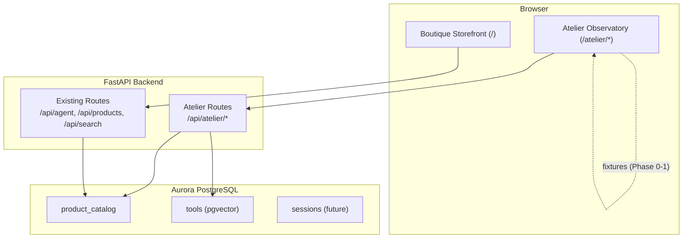
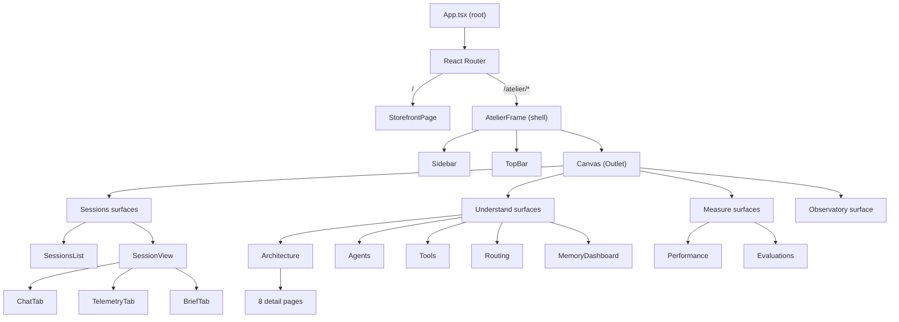
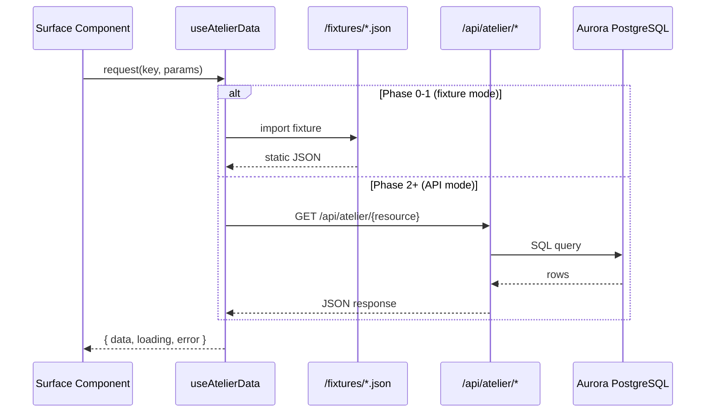

# Design Document — Atelier Observatory

## Overview

The Atelier Observatory is a read-only editorial-luxury AI observability surface layered into the existing Pellier application. It provides workshop participants and engineers with a comprehensive view of the agentic system's inner workings — 5 specialist agents, 2 skills, 3 routing patterns, 9 tools, and the memory/evaluation subsystems — all rendered in a flat editorial aesthetic using the cream/sand/espresso design system with Fraunces, Inter, and JetBrains Mono typography.

The design extends the existing `/atelier` route and its shell (AtelierPage, AtelierSidebar, AtelierTopBar) into a full multi-surface observatory. The current codebase has 8 atelier-v2 components, 7 architecture detail pages, and 9 shared primitives. This design reorganizes them under a new `/src/atelier/` directory tree while preserving backward compatibility with existing deep links and leaving the Boutique storefront untouched.

### Key Design Decisions

1. **Extend, don't replace.** The existing AtelierPage shell, sidebar, and architecture detail pages are migrated into the new directory structure. No existing Boutique code is modified.

2. **React Router for deep-linking.** Replace the current `useState`-based section routing in AtelierPage with React Router nested routes, enabling bookmarkable URLs for every surface (`/atelier/sessions/:id`, `/atelier/architecture/memory`, etc.).

3. **Fixture-first data strategy.** All surfaces render from static JSON fixtures in Phase 0-1. A thin data-fetching layer (`useAtelierData` hook) abstracts fixture vs. API, so wiring real endpoints in Phase 2+ is a one-line change per surface.

4. **pgvector discovery is real from day one.** The Tools surface discovery card hits the existing `POST /api/atelier/tool-registry` endpoint (already implemented) for live semantic search. This is the architectural punchline — everything else can be fixtures, but tool discovery must be live.

5. **Desktop-first, min 1280px.** No mobile breakpoints. The 240px sidebar + flexible canvas grid is the only layout.

6. **Flat editorial aesthetic.** No glassmorphism, blurs, or gradients. All cards use the Exp_Card pattern (cream-elev background, 1px rule-1 border, 14px border-radius, 24px burgundy accent line at top-left).

## Architecture

### System Context



### Frontend Architecture

The Atelier frontend is organized as a self-contained module under `/src/atelier/` with clear separation from the Boutique storefront:



### Data Flow



### Build Phases

| Phase | Scope               | Key Deliverables                                                                                                                                                                    |
| ----- | ------------------- | ----------------------------------------------------------------------------------------------------------------------------------------------------------------------------------- |
| 0     | Foundation          | tokens.css, fonts.css, base.css, AtelierFrame shell, React Router setup, shared components (Eyebrow, ExpCard, StatusPill, StatusDot, WorkshopProgressStrip), fixture infrastructure |
| 1     | Sessions            | SessionsList, SessionView with Chat/Telemetry/Brief tabs, session fixtures                                                                                                          |
| 2     | Understand          | Architecture index, Agents, Tools (with live pgvector), Routing, MemoryDashboard                                                                                                    |
| 3     | Architecture Detail | 8 detail pages migrated from atelier-arch/ into new structure, following Memory template                                                                                            |
| 4     | Measure             | Performance, Evaluations surfaces                                                                                                                                                   |
| 5     | Observatory         | Wide-angle dashboard with summary cards                                                                                                                                             |

## Components and Interfaces

### Shell Components (`/src/atelier/shell/`)

#### AtelierFrame

The root layout component. Renders the 240px sidebar + flexible canvas grid. Wraps React Router's `<Outlet />` for nested route rendering.

```typescript
// AtelierFrame.tsx
interface AtelierFrameProps {
  // No props — reads route state from React Router
}
// Renders: <div className="atelier-frame"> <Sidebar /> <div> <TopBar /> <Outlet /> </div> </div>
```

#### Sidebar

Espresso-colored left navigation with three sections (Observe, Understand, Measure), Settings, and persona footer. Uses `<NavLink>` from React Router for active state.

```typescript
interface SidebarProps {
  persona: Persona;
}

interface NavItem {
  label: string;
  path: string;
  icon: string;
  badge?: string | number; // e.g., "8" for Architecture, "3/5" for Agents
  liveDot?: boolean; // pulsing burgundy dot for Observatory
}
```

#### TopBar

Horizontal bar with SurfaceToggle (reuses existing component), breadcrumb trail, live status metadata, and persona avatar.

```typescript
interface TopBarProps {
  persona: Persona;
}
// Breadcrumb derived from current route via useLocation()
```

#### SessionTabs

Tab navigation for session detail views (Chat, Telemetry, Brief). Fraunces italic links with burgundy underline on active.

```typescript
interface SessionTabsProps {
  sessionId: string;
  activeTab: "chat" | "telemetry" | "brief";
}
```

### Surface Components (`/src/atelier/surfaces/`)

#### Sessions

**SessionsList** — Paginated list of session cards for the active persona.

```typescript
interface SessionsListProps {
  persona: Persona;
}
// Each session card: ExpCard with hex ID, opening query, elapsed time, agent count, routing pattern, timestamp
```

**SessionView** — Container for the three session tabs. Reads `:id` from route params.

```typescript
interface SessionViewProps {
  // Reads sessionId from useParams()
}
```

**ChatTab** — Two-column layout: chat thread (left) + context rail (360px, right).

```typescript
interface ChatTabProps {
  session: SessionDetail;
}

interface ChatMessage {
  role: "user" | "assistant";
  content: string;
  toolCalls?: ToolCall[];
  products?: ProductCard[];
  plan?: PlanRow;
  confidence?: ConfidenceRow;
  memoryPills?: MemoryPill[];
}
```

**TelemetryTab** — Two-column layout: numbered timeline (left) + context rail (right).

```typescript
interface TelemetryTabProps {
  session: SessionDetail;
}

interface TelemetryPanel {
  index: number;
  category: "both" | "managed" | "owned" | "teaching";
  title: string;
  description: string;
  status: "complete" | "running" | "queued";
  durationMs: number;
}
```

**BriefTab** — Single-column magazine layout (max-width 620px, centered).

```typescript
interface BriefTabProps {
  session: SessionDetail;
}
```

#### Understand

**Architecture** — 2-column grid of 8 architecture concept cards + legend card.

```typescript
interface ArchitectureIndexProps {
  // Data from fixture or API
}

interface ArchitectureCard {
  numeral: string; // Roman numeral (I, II, III...)
  category: "both" | "managed" | "owned" | "teaching";
  title: string;
  role: string; // Fraunces italic subtitle
  description: string;
  codeSnippet: string;
  slug: string; // URL segment for detail page
}
```

**Agents** — Workshop progress strip + 5 agent row cards.

```typescript
interface AgentsProps {
  // Data from fixture or API
}

interface AgentCard {
  numeral: string;
  name: string;
  role: string;
  status: "shipped" | "exercise";
  tools: string[];
  model: string; // e.g., "Opus 4.6 · 0.2"
  exerciseFiles?: string[];
}
```

**Tools** — Workshop progress strip + discovery demo card + 9 tool row cards.

```typescript
interface ToolsProps {
  // Data from fixture or API
}

interface ToolCard {
  numeral: number;
  functionName: string;
  description: string;
  status: "shipped" | "exercise";
  signature: string;
  usedBy: string[]; // Agent names
  invocationCount: number;
  version: string;
}

interface DiscoveryResult {
  rank: number;
  toolName: string;
  status: "shipped" | "exercise";
  distance: number;
}
```

**Routing** — 3 routing pattern cards with active indicator.

```typescript
interface RoutingProps {
  // Data from fixture or API
}

interface RoutingPattern {
  name: string; // Dispatcher, Agents-as-Tools, Graph
  description: string;
  isActive: boolean;
  agents: string[];
  codeSnippet: string;
}
```

**MemoryDashboard** — STM + LTM tiers for active persona with orbit visualization.

```typescript
interface MemoryDashboardProps {
  persona: Persona;
}
```

#### Architecture Detail Pages (`/src/atelier/surfaces/understand/architecture/`)

All 8 detail pages follow the template established by the Memory mockup:

- Detail Eyebrow (numeral + concept name + category badge)
- Hero title (Fraunces 56px italic)
- Hero prose
- Concept-specific content cards
- Cheat-sheet strip (3-column grid of takeaways)
- Live state callout

Pages: MemoryDetail, McpDetail, StateDetail, ToolRegistryDetail, SkillsDetail, RuntimeDetail, EvaluationsDetail, GroundingDetail

#### Measure

**Performance** — Stat cards, cold start histogram, latency budget table, pgvector comparison, storage bars, measure controls.

```typescript
interface PerformanceProps {
  // Data from fixture or API
}

interface PerformanceData {
  coldStartP50: number;
  warmReuseP50: number;
  sampleCount: number;
  histogram: HistogramBucket[];
  latencyBudget: LatencyRow[];
  pgvectorComparison: IndexStrategy[];
  storageUsage: StorageBar[];
}
```

**Evaluations** — Agent evaluation scorecards with accuracy, latency, citation metrics.

```typescript
interface EvaluationsProps {
  // Data from fixture or API
}
```

#### Observe

**Observatory** — Wide-angle dashboard with summary cards for active sessions, agent status, tool invocations, memory state, performance headlines.

```typescript
interface ObservatoryProps {
  // Data from fixture or API
}

interface ObservatorySummary {
  activeSessions: number;
  agentStatus: { name: string; status: "live" | "idle" }[];
  toolInvocations: number;
  memoryItems: { stm: number; ltm: number };
  performanceHeadlines: { label: string; value: string }[];
}
```

### Shared UI Components (`/src/atelier/components/`)

| Component               | Description                                        | Props                                                 |
| ----------------------- | -------------------------------------------------- | ----------------------------------------------------- |
| `Eyebrow`               | Monospace uppercase label with burgundy dot        | `label: string, variant?: 'burgundy' \| 'muted'`      |
| `ExpCard`               | Elevated cream card with accent line               | `children, className?, onClick?`                      |
| `EditorialTitle`        | Page-level title block (eyebrow + title + summary) | `eyebrow: string, title: string, summary?: string`    |
| `StatusPill`            | Shipped (sage) or exercise (burgundy) pill         | `status: 'shipped' \| 'exercise'`                     |
| `StatusDot`             | Live (pulsing burgundy), idle, or empty dot        | `status: 'live' \| 'idle' \| 'empty'`                 |
| `WorkshopProgressStrip` | Segment bar showing shipped vs exercise            | `segments: Segment[], shipped: number, total: number` |
| `TabNav`                | Session detail tab navigation                      | `tabs: Tab[], activeTab: string`                      |
| `BreadcrumbTrail`       | Dot-separated monospace breadcrumb                 | `segments: string[]`                                  |
| `CategoryBadge`         | Both/Managed/Owned/Teaching badge                  | `category: CategoryType`                              |
| `ModeStrip`             | Routing pattern pill toggles                       | `patterns: string[], active: string`                  |
| `ContextRail`           | 360px right column for session detail views        | `children`                                            |

### Data Layer

#### useAtelierData Hook

Central data-fetching abstraction that switches between fixtures and API.

```typescript
type DataSource = "fixture" | "api";

interface UseAtelierDataOptions<T> {
  key: string; // e.g., 'sessions', 'agents', 'tools'
  params?: Record<string, string>;
  source?: DataSource; // defaults to 'fixture' in Phase 0-1
}

interface UseAtelierDataResult<T> {
  data: T | null;
  loading: boolean;
  error: string | null;
  refetch: () => void;
}

function useAtelierData<T>(
  options: UseAtelierDataOptions<T>,
): UseAtelierDataResult<T>;
```

#### useToolDiscovery Hook

Dedicated hook for the pgvector tool discovery card — always hits the real API.

```typescript
interface UseToolDiscoveryOptions {
  query: string;
  limit?: number;
}

interface UseToolDiscoveryResult {
  results: DiscoveryResult[];
  loading: boolean;
  error: string | null;
  durationMs: number;
  sql: string;
}

function useToolDiscovery(
  options: UseToolDiscoveryOptions,
): UseToolDiscoveryResult;
```

### Backend API Endpoints

All new endpoints live in a new `routes/atelier_observatory.py` router mounted at `/api/atelier/`. The existing `routes/workshop.py` (mounted at `/api/atelier/`) is preserved — new endpoints are additive.

| Method | Path                           | Description                | Source                  |
| ------ | ------------------------------ | -------------------------- | ----------------------- |
| GET    | `/api/atelier/sessions`        | List sessions for persona  | Fixture → DB            |
| GET    | `/api/atelier/sessions/:id`    | Full session detail        | Fixture → DB            |
| GET    | `/api/atelier/agents`          | 5 agents with status/tools | Fixture → introspection |
| GET    | `/api/atelier/tools`           | 9 tools with signatures    | Fixture → DB            |
| POST   | `/api/atelier/tools/discover`  | pgvector semantic search   | Live (existing)         |
| GET    | `/api/atelier/routing`         | 3 routing patterns         | Fixture → config        |
| GET    | `/api/atelier/memory/:persona` | STM + LTM state            | Fixture → AgentCore     |
| GET    | `/api/atelier/performance`     | Metrics + benchmarks       | Fixture → perf_log      |
| GET    | `/api/atelier/evaluations`     | Agent scorecards           | Fixture                 |
| GET    | `/api/atelier/observatory`     | Dashboard summary          | Fixture → aggregation   |

### Routing Structure

```typescript
// In App.tsx — new nested route structure
<Route path="/atelier" element={<AtelierFrame />}>
  <Route index element={<Navigate to="sessions" replace />} />
  <Route path="sessions" element={<SessionsList />} />
  <Route path="sessions/:id" element={<SessionView />}>
    <Route index element={<Navigate to="chat" replace />} />
    <Route path="chat" element={<ChatTab />} />
    <Route path="telemetry" element={<TelemetryTab />} />
    <Route path="brief" element={<BriefTab />} />
  </Route>
  <Route path="architecture" element={<ArchitectureIndex />} />
  <Route path="architecture/:concept" element={<ArchitectureDetail />} />
  <Route path="agents" element={<Agents />} />
  <Route path="tools" element={<Tools />} />
  <Route path="routing" element={<Routing />} />
  <Route path="memory" element={<MemoryDashboard />} />
  <Route path="performance" element={<Performance />} />
  <Route path="evaluations" element={<Evaluations />} />
  <Route path="observatory" element={<Observatory />} />
  <Route path="settings" element={<Settings />} />
</Route>
```

## Data Models

### TypeScript Interfaces (`/src/atelier/types/`)

```typescript
// persona.ts
interface Persona {
  id: string; // e.g., "marco"
  name: string; // e.g., "Marco"
  role: string; // e.g., "RETURNING CUSTOMER"
  avatarColor: string; // CSS color for avatar circle
  customerId: string; // e.g., "CUST-MARCO"
  context: string; // e.g., "Returning customer, 3 prior orders"
  preferences: string[]; // e.g., ["minimal", "warm tones", "linen"]
}

// session.ts
interface Session {
  id: string; // Short hex ID, e.g., "7F5A"
  personaId: string;
  openingQuery: string;
  elapsedMs: number;
  agentCount: number;
  routingPattern: string;
  timestamp: string; // ISO 8601
  status: "complete" | "active";
}

interface SessionDetail extends Session {
  chat: ChatTurn[];
  telemetry: TelemetryPanel[];
  brief: BriefContent;
}

// chat.ts
interface ChatTurn {
  role: "user" | "assistant";
  content: string;
  timestamp: string;
  toolCalls?: ToolCall[];
  products?: ProductCard[];
  plan?: PlanRow;
  confidence?: ConfidenceRow;
  memoryPills?: MemoryPill[];
}

interface ToolCall {
  toolName: string;
  description: string;
  durationMs: number;
  sql?: string;
  resultSummary?: string;
  expanded?: boolean;
}

interface ProductCard {
  name: string;
  brand: string;
  price: number;
  imageUrl: string;
  traceRef?: string;
}

interface PlanRow {
  routingPattern: string;
  stepCount: number;
  flowSummary: string;
  traceLink?: string;
}

interface ConfidenceRow {
  percentage: number;
  reasoning: string;
}

interface MemoryPill {
  tier: "stm" | "ltm";
  content: string;
}

// telemetry.ts
interface TelemetryPanel {
  index: number;
  category: "both" | "managed" | "owned" | "teaching";
  title: string;
  description: string;
  status: "complete" | "running" | "queued";
  durationMs: number;
  agent?: string;
  sql?: string;
  rows?: Record<string, unknown>[];
  meta?: string;
}

// brief.ts
interface BriefContent {
  folioNumber: number;
  headline: string;
  filedTime: string;
  sections: BriefSection[];
  products: ProductCard[];
  confidence: {
    percentage: number;
    stats: { label: string; value: string }[];
  };
}

interface BriefSection {
  numeral: string; // "i.", "ii.", etc.
  title: string;
  paragraphs: string[];
  evidencePanel?: {
    sql: string;
    toolRanking: { name: string; distance: number }[];
  };
  memoryRows?: { tier: string; content: string }[];
  tracePills?: string[];
}

// agent.ts
interface Agent {
  numeral: string;
  name: string;
  role: string;
  status: "shipped" | "exercise";
  tools: string[];
  model: string;
  temperature: number;
  exerciseFiles?: string[];
}

// tool.ts
interface Tool {
  numeral: number;
  functionName: string;
  description: string;
  status: "shipped" | "exercise";
  signature: string;
  usedBy: string[];
  invocationCount: number;
  version: string;
}

interface ToolDiscoveryResult {
  rank: number;
  toolId: string;
  name: string;
  description: string;
  similarity: number;
  status: "shipped" | "exercise";
}

// routing.ts
interface RoutingPattern {
  name: string;
  slug: string;
  description: string;
  isActive: boolean;
  agents: string[];
  codeSnippet: string;
  diagram?: string;
}

// memory.ts
interface MemoryState {
  persona: string;
  stm: {
    turnCount: number;
    recentIntents: string[];
    items: MemoryItem[];
  };
  ltm: {
    preferences: string[];
    priorOrders: string[];
    behavioralPatterns: string[];
    items: MemoryItem[];
  };
}

interface MemoryItem {
  id: string;
  content: string;
  tier: "stm" | "ltm";
  timestamp?: string;
  similarity?: number;
}

// performance.ts
interface PerformanceData {
  coldStartP50: number;
  warmReuseP50: number;
  sampleCount: number;
  histogram: { bucket: string; count: number; type: "cold" | "warm" }[];
  latencyBudget: {
    panel: string;
    type: "llm" | "tool" | "memory";
    p50Ms: number;
    maxMs: number;
  }[];
  pgvectorComparison: {
    strategy: string;
    recall: number;
    qps: number;
    buildTime: string;
    storage: string;
    isShipped: boolean;
  }[];
  storageUsage: {
    label: string;
    sizeBytes: number;
    percentage: number;
  }[];
}

// evaluations.ts
interface EvaluationScorecard {
  agentName: string;
  accuracy: number;
  latencyP50: number;
  latencyP95: number;
  citationRate: number;
  versionTrend: { version: string; score: number }[];
}

// observatory.ts
interface ObservatorySummary {
  activeSessions: number;
  totalSessions: number;
  agentStatus: { name: string; status: "live" | "idle" }[];
  toolInvocations: number;
  memoryItems: { stm: number; ltm: number };
  performanceHeadlines: { label: string; value: string; unit?: string }[];
  lastUpdated: string;
}

// architecture.ts
interface ArchitectureConcept {
  numeral: string;
  category: "both" | "managed" | "owned" | "teaching";
  title: string;
  role: string;
  description: string;
  codeSnippet: string;
  slug: string;
}
```

### Backend Pydantic Models

```python
# models/atelier.py
from pydantic import BaseModel
from typing import Optional

class AtelierSessionSummary(BaseModel):
    id: str
    persona_id: str
    opening_query: str
    elapsed_ms: int
    agent_count: int
    routing_pattern: str
    timestamp: str
    status: str

class AtelierToolDiscoverRequest(BaseModel):
    query: str
    limit: int = 5

class AtelierToolDiscoverResult(BaseModel):
    rank: int
    tool_id: str
    name: str
    description: str
    similarity: float
    status: str

class AtelierToolDiscoverResponse(BaseModel):
    query: str
    results: list[AtelierToolDiscoverResult]
    duration_ms: int
    sql: str
    total_count: int
```

### Fixture File Structure

```
/src/atelier/fixtures/
  sessions.json          — SessionSummary[] for Marco persona
  session-7f5a.json      — Full SessionDetail for demo session
  agents.json            — Agent[] (5 specialists)
  tools.json             — Tool[] (9 functions)
  routing.json           — RoutingPattern[] (3 patterns)
  memory-marco.json      — MemoryState for Marco
  performance.json       — PerformanceData
  evaluations.json       — EvaluationScorecard[]
  observatory.json       — ObservatorySummary
  architecture.json      — ArchitectureConcept[] (8 concepts)
```

## Correctness Properties

_A property is a characteristic or behavior that should hold true across all valid executions of a system — essentially, a formal statement about what the system should do. Properties serve as the bridge between human-readable specifications and machine-verifiable correctness guarantees._

Most acceptance criteria for this feature are UI rendering requirements ("SHALL display...") that are best validated with snapshot tests and example-based unit tests. The following properties capture the testable logic that holds universally across inputs.

### Property 1: Sessions are sorted by recency

_For any_ list of Session objects with distinct timestamps, the SessionsList surface SHALL render them in descending order by timestamp (most recent first).

**Validates: Requirements 2.1**

### Property 2: Session card field completeness

_For any_ valid Session object, the rendered session card SHALL contain the session hex ID, opening query text, elapsed time, agent count, routing pattern, and timestamp — none of these fields may be omitted or empty.

**Validates: Requirements 2.2**

### Property 3: Workshop progress strip accuracy

_For any_ list of items (agents or tools) where each item has a status of either "shipped" or "exercise", the WorkshopProgressStrip SHALL render exactly as many solid segments as there are shipped items and exactly as many dashed segments as there are exercise items, and the total segment count SHALL equal the total item count.

**Validates: Requirements 8.1, 9.1, 17.3**

### Property 4: Fixture data round-trip integrity

_For any_ fixture key in the Atelier fixture set, loading the fixture via useAtelierData with source "fixture" SHALL return data that is structurally identical to the raw JSON content of the corresponding fixture file — no fields dropped, no values mutated.

**Validates: Requirements 16.1**

### Property 5: Route resolution correctness

_For any_ valid Atelier route path (constructed from the defined route segments: sessions, sessions/:id, architecture, architecture/:concept, agents, tools, routing, memory, performance, evaluations, observatory, settings), the React Router configuration SHALL resolve to a non-null component — no valid path produces a 404 or redirect to the storefront.

**Validates: Requirements 20.1, 20.2, 20.3, 20.4, 20.5, 20.6, 20.7, 20.8**

## Error Handling

### Frontend Error Handling

| Scenario                            | Behavior                                                    | User Feedback                                                                                                          |
| ----------------------------------- | ----------------------------------------------------------- | ---------------------------------------------------------------------------------------------------------------------- |
| Fixture file missing or malformed   | `useAtelierData` catches import error, sets `error` state   | Editorial error message: "We couldn't load this surface. The fixture data may be missing." with retry button           |
| API request fails (network error)   | `useAtelierData` catches fetch error, sets `error` state    | Editorial error message: "The observatory lost its connection. Check the backend and try again." with retry button     |
| API returns 4xx/5xx                 | `useAtelierData` parses error response, sets `error` state  | Editorial error message with status code context                                                                       |
| Empty data (no sessions, no memory) | `useAtelierData` returns empty array/null, component checks | Surface-specific empty state with editorial message (e.g., "No sessions have been recorded yet for this persona.")     |
| Route not found within Atelier      | React Router catch-all redirect                             | Redirect to `/atelier/sessions` (default surface)                                                                      |
| pgvector discovery fails            | `useToolDiscovery` catches error, shows fallback            | Discovery card shows error state with the failed query and a "Try again" button; tool list still renders from fixtures |
| Component render error              | React Error Boundary at AtelierFrame level                  | Editorial error message with "Return to Sessions" link                                                                 |

### Backend Error Handling

| Scenario                                | Behavior                                | Response                                                                             |
| --------------------------------------- | --------------------------------------- | ------------------------------------------------------------------------------------ |
| Database not connected                  | Check `db_service is None` before query | 503 with `{"detail": "Database not ready"}`                                          |
| pgvector query fails                    | Catch exception in `discover_tools`     | Return `{"rows": [], "error": "<message>", "duration_ms": 0}` — graceful degradation |
| Persona not found                       | Return empty data set                   | 200 with empty arrays (not 404 — absence of data is a valid state)                   |
| Invalid session ID                      | Query returns no rows                   | 404 with `{"detail": "Session not found"}`                                           |
| Fixture endpoint called with API source | `useAtelierData` falls back to fixture  | Transparent fallback — no error shown to user                                        |

### Error Boundary Strategy

A single `AtelierErrorBoundary` wraps the `<Outlet />` in AtelierFrame. If any surface component throws during render, the boundary catches it and displays an editorial error page with:

- Eyebrow: "SOMETHING WENT WRONG"
- Title: "The observatory hit a snag."
- Description: Error message in monospace
- Action: "Return to Sessions" link

The sidebar and top bar remain functional so the user can navigate away from the broken surface.

## Testing Strategy

### Unit Tests (Example-Based)

Unit tests cover specific rendering scenarios and interactions. These are the primary testing approach for this feature since most requirements are UI rendering specifications.

**Shell components:**

- Sidebar renders three nav sections with correct labels
- Sidebar highlights active nav item based on current route
- TopBar renders SurfaceToggle, breadcrumb, and persona avatar
- BreadcrumbTrail generates correct segments from route path

**Surface components:**

- SessionsList renders session cards with all required fields
- SessionsList shows empty state when no sessions exist
- ChatTab renders user messages as right-aligned dark bubbles
- ChatTab renders tool call chips that expand/collapse
- TelemetryTab renders numbered timeline panels with connecting line
- TelemetryTab mode strip shows Dispatcher as active (not Agents-as-Tools)
- BriefTab renders centered magazine layout with editorial sections
- ArchitectureIndex renders 8 cards in 2-column grid
- Agents surface renders shipped agents with solid borders, exercise with dashed
- Tools discovery card calls POST /api/atelier/tool-registry
- Performance surface renders stat cards, histogram, and comparison table
- Observatory renders summary cards with live pulsing indicator

**Shared components:**

- ExpCard renders with cream-elev background, rule-1 border, 14px radius, burgundy accent
- StatusPill renders "Shipped" in sage green, "Exercise" in burgundy
- StatusDot renders live (pulsing), idle (muted), empty (outline) variants
- Eyebrow renders monospace uppercase with burgundy dot
- CategoryBadge renders correct colors for both/managed/owned/teaching

**Data layer:**

- useAtelierData returns fixture data when source is 'fixture'
- useAtelierData calls fetch when source is 'api'
- useAtelierData sets loading state during fetch
- useAtelierData sets error state on failure
- useToolDiscovery calls the correct endpoint and parses results

**Error states:**

- Each surface renders loading state (skeleton/spinner)
- Each surface renders error state with retry button
- Each surface renders empty state with editorial message
- AtelierErrorBoundary catches render errors and shows fallback

### Property-Based Tests

Property-based tests use `fast-check` (the standard PBT library for TypeScript) to verify universal properties across generated inputs. Each test runs a minimum of 100 iterations.

| Property                              | Test Description                                                                                 | Generator Strategy                                                                                          |
| ------------------------------------- | ------------------------------------------------------------------------------------------------ | ----------------------------------------------------------------------------------------------------------- | ------------------------------------------------------------------------------------------------------ |
| Property 1: Session sort order        | Generate random Session[] with random timestamps, pass to sort function, verify descending order | `fc.array(fc.record({ id: fc.hexaString(), timestamp: fc.date().map(d => d.toISOString()), ... }))`         |
| Property 2: Session card completeness | Generate random Session objects, render card, verify all 6 required fields present in output     | `fc.record({ id: fc.hexaString({minLength:4, maxLength:4}), openingQuery: fc.string({minLength:1}), ... })` |
| Property 3: Progress strip accuracy   | Generate random arrays of {status: 'shipped'                                                     | 'exercise'} items, render strip, count solid vs dashed segments                                             | `fc.array(fc.record({ status: fc.constantFrom('shipped', 'exercise') }), {minLength:1, maxLength:20})` |
| Property 4: Fixture round-trip        | For each fixture key, load via hook and compare to raw import                                    | Enumerate all fixture keys, load each                                                                       |
| Property 5: Route resolution          | Generate valid route paths from defined segments, verify router resolves each                    | `fc.constantFrom(...ALL_VALID_ROUTES)` combined with `fc.hexaString()` for dynamic segments                 |

**Test configuration:**

- Library: `fast-check` (npm package)
- Minimum iterations: 100 per property
- Tag format: `Feature: atelier-observatory, Property {N}: {title}`

### Integration Tests

Integration tests verify the backend API endpoints return correct response shapes:

- `GET /api/atelier/sessions` returns `AtelierSessionSummary[]`
- `GET /api/atelier/sessions/:id` returns full session detail or 404
- `POST /api/atelier/tools/discover` returns ranked results with cosine distances
- `GET /api/atelier/agents` returns 5 agents with correct structure
- All endpoints return 503 when database is not connected

### Smoke Tests

- All fixture files exist and parse as valid JSON
- TypeScript compilation succeeds (interfaces match fixture shapes)
- `/atelier` route renders without errors
- Sidebar navigation items are clickable and route correctly
