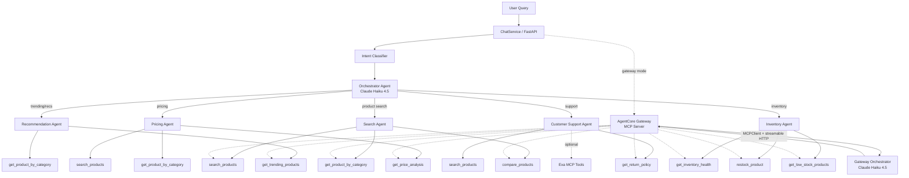

# Design Document: Customer Support Agent

## Overview

This feature adds two new specialist agents (Customer Support and Search) to the Pellier multi-agent e-commerce assistant, refactors the Recommendation Agent, and renames `semantic_product_search` to `search_products` across the codebase. The system grows from 3 to 5 specialist agents routed by the existing Orchestrator.

The Customer Support Agent handles return policy inquiries and general troubleshooting using a new `get_return_policy` tool (backed by the `pellier.return_policies` Aurora PostgreSQL table) and the renamed `search_products` tool. The Search Agent promotes the existing frontend-only "Search Agent" identity to a real backend agent backed by `search_products`, `get_product_by_category`, and `compare_products`. The Recommendation Agent is refactored to focus purely on trending/personalized recommendations by removing search tools.

Supporting changes span intent classification (new `SUPPORT_KEYWORDS` and `SEARCH_KEYWORDS`), FastAPI endpoint routing, `AgentType` enum, `PromptRegistry`, frontend agent identity, graph orchestrator visualization, and AgentCore Gateway integration for dynamic MCP-based tool discovery.

## Architecture

The architecture follows the existing Strands SDK multi-agent pattern: an Orchestrator Agent (Claude Haiku 4.5) classifies intent and dispatches to specialist agents (each Claude Opus 4.6), which are defined as `@tool` decorated functions.



### Key Design Decisions

1. **Aurora-backed return policy table** — Return policies are stored in `pellier.return_policies`, seeded by the bootstrap script alongside the product catalog. The `get_return_policy` tool queries this table using the same `_db_service` + `_run_async` pattern as every other tool. This keeps the "everything lives in Aurora" narrative clean.

2. **`search_products` rename** — Every other data tool follows `verb_noun` naming (`get_trending_products`, `restock_product`). Renaming `semantic_product_search` to `search_products` aligns with this convention. This is a codebase-wide find-and-replace affecting `agent_tools.py`, all agent modules, `chat.py`, and prompts.

3. **Search Agent promotion** — The frontend already has a `'search'` AgentType with full identity styling. Promoting it to a real backend agent means the frontend identity requires no changes — only the backend needs a new `agents/search_agent.py` and routing updates.

4. **Recommendation Agent refactor** — Removing `search_products` from the Recommendation Agent focuses it on trending/category browsing. Search queries go to the dedicated Search Agent instead.

5. **Intent classification priority** — Keywords are checked in order: PRICING → INVENTORY → SUPPORT → SEARCH → default to "recommendation". This prevents support-adjacent words in pricing queries from misrouting.

6. **Exa MCP is optional** — The Customer Support Agent must work without Exa. The MCP client is loaded in a try/except block; if unavailable, the agent uses only local tools.

7. **AgentCore Gateway is an alternative orchestration path** — The direct orchestrator (`create_orchestrator()`) imports agent tools directly. The gateway orchestrator (`create_gateway_orchestrator()`) discovers tools dynamically via MCP streamable HTTP transport. Both paths work with the expanded tool set. The gateway path requires no code changes when new tools are registered — it discovers them at runtime. The semantic search variant (`create_gateway_orchestrator_with_semantic_search()`) uses `x_amz_bedrock_agentcore_search` to find relevant tools by natural language description, scaling to hundreds of tools without bloating the agent's context window.

8. **Tool description optimization for semantic search** — With 9 data tools and 5 agent tools, tool descriptions must be concise and semantically distinct. Overlapping descriptions (e.g., `search_products` vs `get_product_by_category`) cause the gateway's semantic search to return the wrong tool. Each description follows the pattern: one clear sentence describing what the tool does, followed by when to use it.

## Components and Interfaces

### 1. `get_return_policy` Tool (`services/agent_tools.py`)

```python
@tool
def get_return_policy(category: str = "default") -> str:
    """Look up return policy for a product category.

    Args:
        category: Product category name (e.g., "Electronics", "Shoes")

    Returns:
        JSON string with return policy details
    """
    # Queries pellier.return_policies WHERE category_name = %s
    # Falls back to 'default' row if category not found
    # Uses _run_async(_db_service.fetch_one(...)) pattern
```

The tool queries the `pellier.return_policies` table (seeded by the bootstrap script with 21 rows). If the category isn't found, it falls back to the `'default'` row. Uses the same `_db_service` + `_run_async` pattern as every other DB-backed tool.

### 2. Customer Support Agent (`agents/experience_guide.py`)

```python
@tool
def customer_support_agent(query: str) -> str:
    """Handle customer support queries including return policies and troubleshooting.

    Args:
        query: Customer support question or request

    Returns:
        Agent response with support information and optional product data
    """
```

- Tools: `get_return_policy`, `search_products`, optionally Exa MCP tools
- System prompt: Instructs the model to use `get_return_policy` for return/refund questions, `search_products` for product-related support, and Exa for web troubleshooting (if available)
- Follows the `_ensure_products_in_output` + `AfterToolCallEvent` hook pattern from existing agents
- Model: `BedrockModel(model_id=settings.BEDROCK_CHAT_MODEL, max_tokens=4096, temperature=0.2)`

### 3. Search Agent (`agents/search_agent.py`)

```python
@tool
def search_agent(query: str) -> str:
    """Search for products using natural language, browse categories, or compare products.

    Args:
        query: Product search query or comparison request

    Returns:
        Agent response with product search results
    """
```

- Tools: `search_products`, `get_product_by_category`, `compare_products`
- System prompt: Instructs the model to use `search_products` for natural language queries, `get_product_by_category` for category browsing, `compare_products` for side-by-side comparisons
- Same `_ensure_products_in_output` pattern as other agents
- Model: `BedrockModel(model_id=settings.BEDROCK_CHAT_MODEL, max_tokens=4096, temperature=0.2)`

### 4. Orchestrator Updates (`agents/orchestrator.py`)

- Import `customer_support_agent` and `search_agent`
- Add both to the `tools=` list in `create_orchestrator()` and `create_guarded_orchestrator()`
- Update `ORCHESTRATOR_PROMPT` to describe all 5 specialist agents with example queries

### 5. Intent Classification Updates (`services/chat.py`)

```python
SUPPORT_KEYWORDS = {"return", "refund", "policy", "help", "support", "troubleshoot",
                    "issue", "problem", "warranty", "broken", "defective"}

SEARCH_KEYWORDS = {"search for", "looking for", "where can I", "compare", "browse"}
```

Updated `classify_intent` priority: pricing → inventory → support → search → recommendation (default).

### 6. AgentType Enum & PromptRegistry Updates (`services/context_manager.py`)

```python
class AgentType(Enum):
    ORCHESTRATOR = "orchestrator"
    INVENTORY = "inventory_agent"
    PRICING = "pricing_agent"
    RECOMMENDATION = "recommendation_agent"
    CUSTOMER_SUPPORT = "customer_support_agent"  # NEW
    SEARCH = "search_agent"                       # NEW
```

New `PromptRegistry.TEMPLATES` entries for `CUSTOMER_SUPPORT` and `SEARCH`.

### 7. FastAPI Endpoint Updates (`app.py`)

The `agent_query` function adds `"customer_support"` and `"search"` as valid `agent_type` values, importing and invoking the respective tool functions.

### 8. Frontend Updates (`frontend/src/utils/agentIdentity.ts`)

- Add `'support'` to `AgentType` union
- Add `support` entry to `AGENT_IDENTITIES` with unique colors (e.g., teal gradient)
- Reorder `resolveAgentType` checks to match Property 5 priority: support > search > inventory > pricing > recommendation > orchestrator (default). The current code checks `'orchestrat'` first (line 68) — this explicit check should be removed since unmatched names already fall through to `'orchestrator'` via the default return. Insert the `'support'` check at the top.
- The existing `'search'` type remains unchanged

### 9. Graph Orchestrator Updates (`agents/graph_orchestrator.py`)

Add two new nodes ("support" and "search") and two new edges from "router" to each. Update the description text.

### 10. `AIAssistant.tsx` Updates

- Add support-related keywords to Lab 2 single-agent mode agent type detection
- Add badge color mappings for "Support Agent" and "Customer Support"

### 11. AgentCore Gateway Integration (`services/agentcore_gateway.py`)

The existing AgentCore Gateway infrastructure automatically picks up new tools registered in the gateway — no code changes are needed in `create_gateway_orchestrator()` since it uses `MCPClient` with streamable HTTP transport to discover tools dynamically at runtime.

#### How it works

1. `create_gateway_orchestrator()` connects to the AgentCore Gateway MCP server via `MCPClient(streamablehttp_client(AGENTCORE_GATEWAY_URL))`. All tools registered in the gateway are available to the agent without explicit imports.
2. `create_gateway_orchestrator_with_semantic_search()` uses the `x_amz_bedrock_agentcore_search` meta-tool to find relevant tools by natural language description at query time. This avoids loading all tool descriptions into the agent's prompt.
3. `list_gateway_tools()` enumerates all registered tools for debugging and verification.

#### System prompt update for semantic search orchestrator

The `create_gateway_orchestrator_with_semantic_search()` system prompt needs updated routing hints to cover the new support and search domains:

```python
system_prompt=(
    "You are the Pellier shopping assistant. "
    "Use the x_amz_bedrock_agentcore_search tool to find "
    "relevant tools for the user's query, then invoke them. "
    "For product searches, search for 'product search' tools. "
    "For inventory questions, search for 'inventory' tools. "
    "For pricing, search for 'pricing' tools. "
    "For return policies and support, search for 'return policy' or 'customer support' tools. "
    "For category browsing, search for 'category' tools. "
    "For product comparisons, search for 'compare products' tools."
)
```

#### Tool description optimization guidelines

With 9 data tools registered in the gateway, descriptions must be distinct enough that semantic search returns the right tool. Guidelines:

- Each description is a single clear sentence stating what the tool does
- Include the primary use case (when to use it)
- Avoid overlapping keywords between tools
- No implementation details (no mention of "hybrid search", "pgvector", "reranking")

#### Optimized tool descriptions for all 9 data tools

| Tool                      | Optimized Description                                                                                                                                                                         |
| ------------------------- | --------------------------------------------------------------------------------------------------------------------------------------------------------------------------------------------- |
| `search_products`         | Search for products by natural language query with optional price and rating filters. Use for descriptive or intent-based product searches like "gift for a cook" or "headphones under $200". |
| `get_return_policy`       | Look up the return and refund policy for a specific product category. Use when customers ask about returns, refunds, warranties, or return windows.                                           |
| `get_trending_products`   | Get the most popular and trending products, optionally filtered by category. Use when customers ask about bestsellers, what's hot, or popular items.                                          |
| `get_price_analysis`      | Get pricing statistics and price distribution analysis for a product category. Use for price comparisons, budget analysis, or "what's the average price" questions.                           |
| `get_product_by_category` | Browse products within a specific category with rating and price filters. Use when customers want to browse a known category like "Shoes" or "Electronics".                                   |
| `get_inventory_health`    | Get current inventory health statistics including stock levels and alerts. Use for warehouse, stock status, or inventory overview questions.                                                  |
| `restock_product`         | Restock a specific product by adding inventory quantity. Use when an inventory manager needs to replenish stock for a product ID.                                                             |
| `get_low_stock_products`  | Get products that are running low on stock, prioritized by demand. Use to identify items that need restocking soon.                                                                           |
| `compare_products`        | Compare two products side by side by their product IDs. Use when customers want to see differences in price, rating, and features between two specific products.                              |

#### Gateway vs Direct orchestrator

Both orchestration paths work with the expanded tool set:

- **Direct orchestrator** (`create_orchestrator()`) — Imports agent tools directly as Python functions. Uses intent classification + `[USE: agent_name]` hints. Best for low-latency, predictable routing.
- **Gateway orchestrator** (`create_gateway_orchestrator()`) — Discovers all tools via MCP at startup. No code changes needed when tools are added/removed. Best for dynamic environments.
- **Gateway + semantic search** (`create_gateway_orchestrator_with_semantic_search()`) — Discovers tools per-query via `x_amz_bedrock_agentcore_search`. Scales to hundreds of tools. Best for large tool catalogs where loading all descriptions would bloat the prompt.

## Data Models

### Return Policy Data Structure

```python
# Each row in pellier.return_policies table
{
    "return_window_days": int,       # Number of days for returns (e.g., 30)
    "conditions": str,               # Human-readable return conditions
    "refund_method": str             # How refunds are processed
}
```

### get_return_policy Response (JSON string)

```json
{
  "category": "Electronics",
  "return_window_days": 30,
  "conditions": "Item must be in original packaging, unused, with all accessories",
  "refund_method": "Original payment method within 5-7 business days"
}
```

### get_return_policy Error Response

```json
{
  "error": "Return policy lookup error: <description>"
}
```

### Agent Response Format

All specialist agents (including the new Customer Support and Search agents) return a string that is either:

1. Natural language text with an appended ` ```json [...products...] ``` ` block (via `_ensure_products_in_output`)
2. A JSON error object: `{"error": "<agent_name> agent error: <description>"}`

### Graph Node Structure (new entries)

```python
{
    "id": "support",
    "label": "Customer Support",
    "type": "agent",
    "description": "Return policies, troubleshooting, and general support",
    "model": "Claude Opus 4.6"
}
```

```python
{
    "id": "search",
    "label": "Product Search",
    "type": "agent",
    "description": "Product search, category browsing, and product comparison",
    "model": "Claude Opus 4.6"
}
```

### Intent Classification Return Values

The `classify_intent` function returns one of: `"pricing"`, `"inventory"`, `"customer_support"`, `"search"`, or `"recommendation"` (default).

### AgentType Enum Values

| Enum Member      | Value                    |
| ---------------- | ------------------------ |
| ORCHESTRATOR     | "orchestrator"           |
| INVENTORY        | "inventory_agent"        |
| PRICING          | "pricing_agent"          |
| RECOMMENDATION   | "recommendation_agent"   |
| CUSTOMER_SUPPORT | "customer_support_agent" |
| SEARCH           | "search_agent"           |

## Correctness Properties

_A property is a characteristic or behavior that should hold true across all valid executions of a system — essentially, a formal statement about what the system should do. Properties serve as the bridge between human-readable specifications and machine-verifiable correctness guarantees._

### Property 1: Return policy lookup correctness

_For any_ category string, calling `get_return_policy(category)` should return a valid JSON string containing `return_window_days`, `conditions`, and `refund_method` fields. If the category exists in the `pellier.return_policies` table, the returned JSON should contain that category's specific policy data. If the category does not exist, the returned JSON should contain the `"default"` row's policy data.

**Validates: Requirements 1.2, 1.3**

### Property 2: Intent classification keyword matching

_For any_ query string containing at least one keyword from a given keyword set (PRICING_KEYWORDS, INVENTORY_KEYWORDS, SUPPORT_KEYWORDS, or SEARCH_KEYWORDS) and no keywords from any higher-priority set, `classify_intent(query)` should return the corresponding intent string (`"pricing"`, `"inventory"`, `"customer_support"`, or `"search"` respectively).

**Validates: Requirements 3.4, 3.6, 6.2, 6.6**

### Property 3: Intent classification priority ordering

_For any_ query string containing keywords from multiple keyword sets, `classify_intent(query)` should return the intent corresponding to the highest-priority matching set, where priority is: PRICING_KEYWORDS > INVENTORY_KEYWORDS > SUPPORT_KEYWORDS > SEARCH_KEYWORDS > default "recommendation".

**Validates: Requirements 3.5, 6.4, 6.7**

### Property 4: Product JSON appended when missing from agent output

_For any_ text string that does not contain a ` ```json\n[ ` block, and any list of tool result strings containing valid product JSON, `_ensure_products_in_output(text, tool_results)` should return a string that ends with a JSON code block containing all products extracted from the tool results.

**Validates: Requirements 2.7, 11.6**

### Property 5: Agent type resolution mapping

_For any_ agent name string, `resolveAgentType(name)` should return `'support'` if the name contains "support", `'search'` if it contains "search", `'inventory'` if it contains "inventory" or "stock" or "restock", `'pricing'` if it contains "pricing" or "price", `'recommendation'` if it contains "recommend", and `'orchestrator'` otherwise. The rules are applied in priority order: support > search > inventory > pricing > recommendation > orchestrator (default). The first matching rule wins.

**Validates: Requirements 9.3, 9.4**

### Property 6: ContextManager agent_contexts covers all AgentType values

_For any_ newly constructed `ContextManager` instance, the `agent_contexts` dictionary should contain a key for every member of the `AgentType` enum, including `CUSTOMER_SUPPORT` and `SEARCH`.

**Validates: Requirements 8.3**

### Property 7: Tool descriptions are distinct and free of implementation details

_For any_ pair of `@tool` decorated functions in `services/agent_tools.py`, their docstring descriptions should be non-empty, not identical to each other, and should not contain implementation-detail keywords (e.g., "pgvector", "hybrid search", "reranking", "Aurora", "SQL", "embedding", "vector similarity"). This ensures the AgentCore Gateway's semantic search can distinguish between tools.

**Validates: Requirements 12.5, 12.6**

## Error Handling

### get_return_policy

- Wraps the entire lookup in try/except. On any exception, returns `json.dumps({"error": f"Return policy lookup error: {str(e)}"})`.
- If `category` is `None` or empty, falls through to the `"default"` key.

### customer_support_agent

- Wraps the entire agent invocation in try/except. On any exception, returns `json.dumps({"error": f"Support agent error: {str(e)}"})`.
- Exa MCP initialization failures are caught separately and logged as warnings; the agent continues with local tools only.

### search_agent

- Wraps the entire agent invocation in try/except. On any exception, returns `json.dumps({"error": f"Search agent error: {str(e)}"})`.

### classify_intent

- No exceptions expected (pure string matching). If the keyword sets are somehow corrupted, the function falls through to the default `"recommendation"` return.

### agent_query endpoint

- Existing pattern: unknown `agent_type` values raise `HTTPException(status_code=400, detail="Invalid agent type")`. The new `"customer_support"` and `"search"` branches follow the same try/except pattern as existing agent types.

### Graph orchestrator

- No error handling changes needed. The `get_graph_structure` function returns a static dict.

### AgentCore Gateway

- `create_gateway_orchestrator()` and `create_gateway_orchestrator_with_semantic_search()` already wrap all initialization in try/except, returning `None` if the gateway URL is not set, MCP dependencies are missing, or connection fails. No changes needed — the expanded tool catalog is discovered dynamically.
- `list_gateway_tools()` returns an empty list on any failure.

## Testing Strategy

### Unit Tests

Unit tests verify specific examples, edge cases, and integration points:

- `get_return_policy` returns correct policy for each known category (one test per category)
- `get_return_policy` returns default policy for unknown category strings (e.g., `"NonexistentCategory"`, `""`, `None`)
- `get_return_policy` returns error JSON when an exception is forced
- `classify_intent` returns `"customer_support"` for specific support phrases (e.g., `"what's the return policy"`, `"my product is defective"`)
- `classify_intent` returns `"search"` for specific search phrases (e.g., `"search for headphones"`, `"looking for running shoes"`, `"compare these two products"`)
- `classify_intent` returns `"recommendation"` for unmatched queries (e.g., `"what's trending"`, `"suggest something for my mom"`)
- Graph structure contains exactly 5 agent nodes and 5 edges from router
- `AGENT_IDENTITIES` contains a `support` entry with all required fields
- `resolveAgentType("Customer Support Agent")` returns `'support'`
- `resolveAgentType("Search Agent")` returns `'search'`
- `_tool_to_agent_name` maps `'customer_support_agent'` to `'Support Agent'` and `'search_agent'` to `'Search Agent'`
- `AgentType` enum has `CUSTOMER_SUPPORT` and `SEARCH` members
- `PromptRegistry.TEMPLATES` has entries for `AgentType.CUSTOMER_SUPPORT` and `AgentType.SEARCH`
- Recommendation agent tools list contains only `get_trending_products` and `get_product_by_category` (no `search_products`)
- `create_gateway_orchestrator_with_semantic_search()` system prompt contains "return policy" and "customer support" routing hints
- All 9 data tool docstrings are non-empty
- No tool docstring contains implementation keywords ("pgvector", "hybrid search", "reranking", "Aurora")

### Property-Based Tests

Property-based tests verify universal properties across randomly generated inputs. Each test runs a minimum of 100 iterations.

The project should use **Hypothesis** (Python) for backend property tests and **fast-check** (TypeScript) for frontend property tests.

Each property test must be tagged with a comment referencing the design property:

```python
# Feature: customer-support-agent, Property 1: Return policy lookup correctness
```

- **Property 1**: Generate random category strings (both valid categories from the return_policies table and random strings). Verify the JSON output always contains the required fields and matches the expected policy.
- **Property 2**: Generate random query strings that contain exactly one keyword from a single keyword set (and no keywords from higher-priority sets). Verify `classify_intent` returns the correct intent.
- **Property 3**: Generate random query strings containing keywords from two or more keyword sets. Verify `classify_intent` returns the highest-priority intent.
- **Property 4**: Generate random text strings (without JSON code blocks) and random lists of tool result JSON strings containing product arrays. Verify `_ensure_products_in_output` appends the products.
- **Property 5** (fast-check): Generate random agent name strings containing known substrings. Verify `resolveAgentType` returns the correct agent type.
- **Property 6**: Construct a `ContextManager` and verify `agent_contexts` keys match all `AgentType` enum members.
- **Property 7**: Collect all `@tool` decorated function docstrings from `agent_tools.py`. For every pair of descriptions, verify they are not identical. For every description, verify it does not contain implementation-detail keywords (e.g., "pgvector", "hybrid search", "reranking", "Aurora", "SQL", "embedding", "vector similarity").
