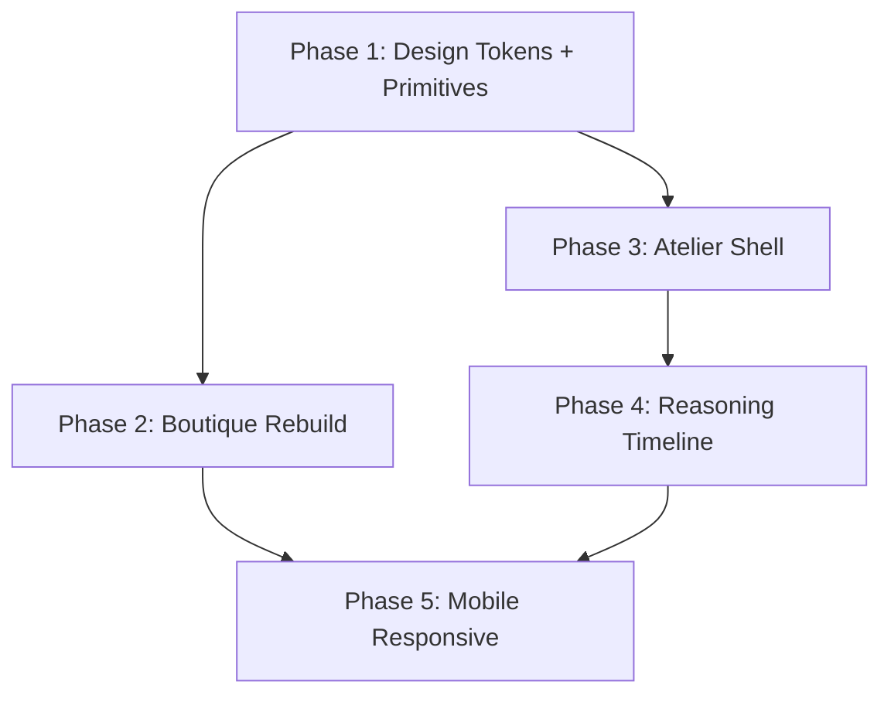

# Design Document: Frontend Redesign

## Overview

This design covers the complete frontend rebuild of Pellier across five sequential phases. Each phase ships as its own PR with the application remaining fully functional at every checkpoint. The rebuild replaces every visible surface with a cinematic editorial luxury aesthetic while preserving the frozen backend, chat drawer behavior, three-pattern agent model, and persona system.

The architecture follows a bottom-up strategy: Phase 1 lays the design token foundation and component primitives, Phases 2-3 rebuild the two primary surfaces (Boutique and Atelier), Phase 4 wires the reasoning timeline to live SSE telemetry, and Phase 5 adds mobile responsiveness.

### Key Architectural Decisions

1. **Coexistence over migration**: The new design system (`src/design/`) lives alongside the existing CSS custom properties in `index.css` and the current Tailwind config. Old tokens are not removed until all consumers are retired after Phase 5.

2. **Token-first primitives**: Every primitive consumes values exclusively from `tokens.ts` or the extended Tailwind config — no hardcoded color or spacing literals. This makes future theme changes a single-file edit.

3. **Preserve all hooks and contexts**: `useAgentChat`, `usePersona`, `useUI`, `useCart`, `useAuth`, `useLayout` are untouched. The rebuild is purely a rendering-layer change.

4. **Portal pattern preserved**: `ChatDrawer`, `Modal`, and `PersonaModal` continue using `createPortal(..., document.body)` because the header's `backdrop-filter: blur(12px)` creates a containing block that traps `position: fixed` descendants.

5. **No new heavyweight dependencies**: The rebuild uses only React 18, Tailwind CSS 3, Framer Motion 12, and lucide-react. No new UI framework libraries.

6. **Fluid-first responsive**: Layouts use CSS `clamp()`, viewport-relative units, CSS Grid `auto-fit`/`auto-fill`, and percentage-based widths so content adapts continuously across viewport widths (320px–2560px) rather than snapping only at fixed breakpoints. Three layout bands (mobile < 768px, desktop 768px–1440px, wide > 1440px) define structural shifts; within each band, content is fluid.

## Architecture

### Phase Dependency Graph



### File Structure

```
src/design/
  tokens.ts              — color, spacing, typography, shadow, radius constants
  typography.css         — @font-face imports, text utility classes
  primitives/
    Button.tsx           — primary/secondary/ghost variants
    Chip.tsx             — suggestion/tag chips, active/inactive
    Card.tsx             — borderless, soft shadow, product/recommendation/reasoning variants
    Input.tsx            — search bar variant (mic icon, ⌘K hint), text input variant
    Modal.tsx            — focus trap, Escape close, portal to body
    Drawer.tsx           — Framer Motion slide, 240ms ease-out
    Avatar.tsx           — circular monogram, configurable bg
    Pill.tsx             — status indicator (Live, High confidence)
    IconButton.tsx       — circular ghost, header use
    Sidebar.tsx          — dark (espresso) and light variants, nav items with active state
    Timeline.tsx         — vertical numbered steps with connecting lines
    index.ts             — barrel export
  README.md
```

### Provider Chain (Unchanged)

```
AuthProvider → PersonaProvider → LayoutProvider → CartProvider → UIProvider → BrowserRouter
```

All context providers remain in their current positions. The rebuild only changes what renders inside the route components.

### Route Table (Extended)

| Route                  | Component                                                                                                                                                                    | Phase     |
| ---------------------- | ---------------------------------------------------------------------------------------------------------------------------------------------------------------------------- | --------- |
| `/`                    | StorefrontPage (rebuilt)                                                                                                                                                     | Phase 2   |
| `/atelier`             | AtelierPage (new shell) — renders session list with cold-start fallback (editorial empty state with suggestion pills and chat drawer entry points) when no session is active | Phase 3   |
| `/atelier/session/:id` | AtelierSessionDetail                                                                                                                                                         | Phase 3-4 |
| `/dev/design-system`   | DesignSystemPreview (dev-only)                                                                                                                                               | Phase 1   |
| `/inspector`           | InspectorPage (unchanged)                                                                                                                                                    | —         |
| `/storyboard`          | StoryboardPage (unchanged)                                                                                                                                                   | —         |
| `/discover`            | DiscoverPage (unchanged)                                                                                                                                                     | —         |

## Components and Interfaces

### Design Tokens (`src/design/tokens.ts`)

```typescript
// Color tokens
export const colors = {
  cream: "#F7F3EE",
  sand: "#E8DFD4",
  espresso: "#3B2F2F",
  olive: "#6B705C",
  terracotta: "#C44536",
  // Preserved existing palette
  ink: "#2D1810",
  inkSoft: "#6B4A35",
  inkQuiet: "#A68668",
  dusk: "#3D2518",
  creamWarm: "#F5E8D3",
  // Atelier dark surface
  espressoDark: "#1F1410",
  espressoMid: "#2A1E18",
} as const;

// Spacing scale (4px base)
export const spacing = {
  xs: "4px",
  sm: "8px",
  md: "16px",
  lg: "24px",
  xl: "32px",
  "2xl": "48px",
  "3xl": "64px",
} as const;

// Typography
export const typography = {
  display: { family: "'Fraunces', Georgia, serif", weight: 400 },
  body: { family: "'Inter', system-ui, sans-serif", weight: 400 },
  mono: { family: "'JetBrains Mono', ui-monospace, monospace", weight: 400 },
} as const;

// Shadows (warm-tinted)
export const shadows = {
  sm: "0 2px 8px rgba(107, 74, 53, 0.06), 0 1px 3px rgba(107, 74, 53, 0.04)",
  md: "0 4px 16px rgba(107, 74, 53, 0.08), 0 2px 6px rgba(107, 74, 53, 0.05)",
  lg: "0 8px 24px rgba(107, 74, 53, 0.10), 0 4px 8px rgba(107, 74, 53, 0.06)",
  xl: "0 24px 48px rgba(107, 74, 53, 0.14), 0 8px 16px rgba(107, 74, 53, 0.08)",
} as const;

// Border radii
export const radii = {
  sm: "8px",
  md: "12px",
  lg: "16px",
  xl: "24px",
  full: "9999px",
} as const;

// Animation timing
export const animation = {
  slide: { duration: "240ms", easing: "ease-out" },
  fade: { duration: "180ms", easing: "ease-out" },
  spring: { stiffness: 320, damping: 28 },
} as const;

// Responsive breakpoints — two breakpoints define three bands:
// mobile (< 768px), desktop (768px–1440px implicit), wide (> 1440px)
export const breakpoints = {
  mobile: "768px",
  /** Atelier expansion area stacks from 3-col to 2+1 below this width */
  expansionStack: "1280px",
  wide: "1440px",
} as const;

// Fluid layout tokens — used via CSS clamp() for continuous scaling
export const fluid = {
  /** Container horizontal padding: 16px on mobile → 48px on wide */
  containerPadding: "clamp(16px, 4vw, 48px)",
  /** Display text: 28px on mobile → 48px on wide */
  displaySize: "clamp(28px, 4vw, 48px)",
  /** Section headline: 22px on mobile → 36px on wide */
  headlineSize: "clamp(22px, 3vw, 36px)",
  /** Body text: narrow 2px range is intentional — reading distance
   *  doesn't change meaningfully between 14" and 16" laptops, so
   *  body text stays near-constant while display type does the
   *  scaling work. */
  bodySize: "clamp(14px, 1.1vw, 16px)",
  /** Product grid min card width for auto-fill */
  gridCardMin: "280px",
  /** Max content width */
  maxWidth: "1440px",
} as const;
```

### Primitive Interfaces

**Button**

```typescript
interface ButtonProps {
  variant: "primary" | "secondary" | "ghost";
  size?: "sm" | "md" | "lg";
  disabled?: boolean;
  children: React.ReactNode;
  onClick?: () => void;
}
```

**Card**

```typescript
interface CardProps {
  variant?: "product" | "recommendation" | "reasoning" | "default";
  children: React.ReactNode;
  className?: string;
}
// Renders with warm-tinted soft shadows, no harsh borders.
// Product variant: image slot + content area.
// Reasoning variant: numbered step indicator + content.
```

**Modal**

```typescript
interface ModalProps {
  open: boolean;
  onClose: () => void;
  children: React.ReactNode;
  ariaLabel: string;
}
// Uses createPortal to document.body.
// Focus trap: Tab/Shift+Tab cycle within modal.
// Escape key closes.
```

**Drawer**

```typescript
interface DrawerProps {
  open: boolean;
  onClose: () => void;
  side?: "left" | "right";
  children: React.ReactNode;
  ariaLabel: string;
}
// Framer Motion AnimatePresence with 240ms ease-out slide.
// Uses createPortal to document.body.
// Focus trap while open.
```

**Sidebar**

```typescript
interface SidebarProps {
  variant: "dark" | "light";
  items: SidebarItem[];
  activeItem?: string;
  onItemClick: (id: string) => void;
}
interface SidebarItem {
  id: string;
  label: string;
  icon?: React.ReactNode;
  badge?: string;
}
// Dark variant: espresso #1F1410 background, cream text.
// Light variant: cream background, ink text.
```

**Timeline**

```typescript
interface TimelineProps {
  steps: TimelineStep[];
}
interface TimelineStep {
  number: number;
  label: string;
  status: "pending" | "in-progress" | "complete" | "skipped";
  content?: React.ReactNode;
}
// Vertical numbered steps with connecting lines.
// Status drives visual state: pending (muted), in-progress (pulsing), complete (filled), skipped (dimmed with skip indicator).
```

**Avatar**

```typescript
interface AvatarProps {
  initial: string;
  bgColor?: string;
  size?: "sm" | "md" | "lg";
}
// Circular monogram with configurable background color.
```

### Boutique Components (Phase 2)

**Rebuilt Header**: Centered "Pellier" wordmark, five nav items (Home, Shop, Storyboard, Discover, Account), surface toggle, persona avatar dropdown (replacing PersonaPill + PersonaModal flow), bag icon with count badge. Sticky with `backdrop-filter: blur(12px)` and `-webkit-backdrop-filter` prefix.

**Persona Avatar Dropdown**: Replaces the current PersonaPill + PersonaModal pattern. Click opens a dropdown (not a modal). Displays persona monogram when signed in, generic user icon when signed out. Calls the same `switchPersona` hook flow. Closes on outside click or Escape.

**Rebuilt HeroStage**: Same 8-intent rotation cycle, 7.5s cadence, hover-pause, ticker chip click-to-jump. Restyled with new primitives and tokens. Hero search bar submission opens ChatDrawer via existing `openDrawerWithQuery`.

**Rebuilt ProductGrid**: Card primitive with warm-tinted shadows. Scroll-reveal fade-in using IntersectionObserver (existing `useScrollReveal` hook). `prefers-reduced-motion` disables animation.

**Rebuilt Footer**: Brand column, explore links, editorial columns, bottom copyright strip. All using new primitives and tokens.

**Restyled ChatDrawer**: Same `useAgentChat` hook, SSE streaming, message persistence, three entry points. Visual refresh with new tokens: warm shadows, Fraunces display type for header, Inter for message body. 240ms ease-out slide animation via Drawer primitive timing. Success gate: side-by-side visual diff against current shipped version; diff must show only visual layer changes (tokens, fonts, shadows) with zero behavioral changes. Snapshot tests alone are insufficient — explicit before/after comparison required.

**Restyled CommandPill**: Same fixed bottom-right positioning, keyboard shortcut display, surface-aware toggle. Visual refresh with new tokens. Success gate: side-by-side visual diff against current shipped version; diff must show only visual layer changes with zero behavioral changes.

### Atelier Components (Phase 3)

**AtelierPage (new shell)**: Replaces the current `WorkshopPage` layout. Dark espresso sidebar (Sidebar primitive, dark variant), top bar with breadcrumb and live session indicator, main content area.

**Mode Strip**: Three pattern representations at the top of session detail. Pattern I (Agents-as-Tools) and Pattern II (Graph) are selectable pills with active states. Pattern III (Dispatcher) is non-selectable with dashed border, reduced opacity, and "Storefront · Production" label. Clicking Pattern III opens a small explainer popover but does not switch modes. A visual separator divides selectable (I, II) from informational (III).

**Session List**: Card-based list of available sessions with timestamps and summary info.

**Placeholder Views**: Memory, Inventory, Agents, Tools, Evaluations, Settings — accessible from sidebar, rendered as placeholder cards with "Coming soon" messaging.

### Reasoning Timeline (Phase 4)

**ReasoningTimeline**: Six numbered steps using Timeline primitive:

1. Understanding intent
2. Retrieving memory
3. Scanning inventory
4. Ranking
5. Agent collaboration
6. Final recommendation

Wired to SSE telemetry events (`agent_step`, `tool_call`, `content_delta`, `skill_routing`, `runtime_timing`). Each step transitions through pending → in-progress → complete states in real time. Steps may also transition to "skipped" when the agent pattern doesn't exercise that step (e.g., Pattern II graph mode may skip unmatched specialist nodes).

**Three-Column Expansion Area**:

- Column 1: "How we arrived at this" — reasoning narrative
- Column 2: "What we know about you" — Memory Orbit SVG (animated, static fallback for `prefers-reduced-motion`)
- Column 3: "A team of specialists" — agent team cards

**Footer Strip**: Editorial pull-quote "The Atelier doesn't just automate. It reasons, remembers and refines." alongside at-a-glance metrics (total duration, success rate).

### Mobile Components (Phase 5)

**Mobile Boutique** (viewport < 768px):

- Bottom navigation bar replaces desktop header nav
- Hero stage stacks info card below image instead of overlaying
- Product grid renders single-column with full-width cards
- ChatDrawer preserves existing mobile bottom-sheet variant (visual updates only, structural behavior unchanged)

**Mobile Atelier** (viewport < 768px):

- Sidebar renders as slide-in drawer triggered by hamburger menu
- Session list renders single-column card layout
- Reasoning timeline three-column expansion stacks vertically
- Mode strip renders as horizontally scrollable strip
- Gated on mockup artifacts in `docs/redesign-references/mobile-atelier/`

### Fluid Responsive Layout Strategy

The rebuild uses a fluid-first approach so layouts adapt continuously across the full viewport range (320px–2560px) rather than snapping at fixed breakpoints. Three structural bands define layout shifts; within each band, content scales fluidly.

**Three layout bands:**

| Band    | Viewport       | Boutique grid | Atelier sidebar | Typography scale                 |
| ------- | -------------- | ------------- | --------------- | -------------------------------- |
| Mobile  | < 768px        | 1 column      | Drawer (hidden) | `clamp(28px, 4vw, 48px)` display |
| Desktop | 768px – 1440px | 2-3 columns   | Fixed 240-260px | Fluid between mobile and wide    |
| Wide    | > 1440px       | 3-4 columns   | Fixed 240-260px | Full display size                |

**Fluid techniques used:**

- **Container padding**: `clamp(16px, 4vw, 48px)` — breathes on wide displays, doesn't cramp 14-inch screens
- **Typography**: `clamp()` for display, headline, and body sizes — no per-breakpoint font-size overrides needed
- **Product grid**: CSS Grid `auto-fill` with `minmax(280px, 1fr)` — columns adjust dynamically based on available width
- **Atelier main canvas**: `calc(100vw - sidebar-width)` fills remaining space fluidly on any laptop size
- **Atelier expansion area**: CSS Grid transitions from 3 columns (wide) → 2+1 stacked (below `expansionStack` token at 1280px) → 1 column (< 768px)
- **Max-width container**: `max-width: 1440px` with `margin: 0 auto` centers content on ultra-wide displays
- **Full-height layouts**: `100dvh` (not `100vh`) for iOS Safari address bar and Android navigation bar resilience
- **Pixel density**: SVGs and lucide-react icons render crisply at any DPR. Raster images use `srcset` where applicable

**Wide-band centering behavior:** On wide displays (> 1440px), content stops growing at `maxWidth` and centers with `margin: 0 auto`. On a 16-inch MacBook Pro (1728px effective), that's ~144px of margin per side. Wide displays get more breathing room, not more content. This is intentional editorial discipline.

**Device coverage (tested range):**

- iPhone SE (375px) through iPhone 15 Pro Max (430px)
- Samsung Galaxy S series (360px–412px)
- iPad Mini (768px) — hits desktop band
- 13-inch MacBook Air (1440×900 effective)
- 14-inch MacBook Pro (1512×982 effective)
- 16-inch MacBook Pro (1728×1117 effective)
- External displays up to 2560px

**Tailwind config additions for fluid layout:**

```javascript
// Added to theme.extend.screens
'wide': '1440px',
'expansion-stack': '1280px',

// Added to theme.extend.spacing
'container-x': 'clamp(16px, 4vw, 48px)',
```

### SSE Telemetry Mapping (Phase 4)

The existing `useAgentChat` hook already processes these SSE events. The reasoning timeline maps them to step states:

| SSE Event                      | Timeline Step                 | Behavior                                         |
| ------------------------------ | ----------------------------- | ------------------------------------------------ |
| `skill_routing`                | Step 1 (Understanding intent) | Mark complete when routing decision arrives      |
| `agent_step` (memory agent)    | Step 2 (Retrieving memory)    | Mark in-progress on start, complete on finish    |
| `tool_call` (search/inventory) | Step 3 (Scanning inventory)   | Mark in-progress on first tool call              |
| `agent_step` (recommendation)  | Step 4 (Ranking)              | Mark in-progress when ranking agent activates    |
| `agent_step` (orchestrator)    | Step 5 (Agent collaboration)  | Mark in-progress during multi-agent coordination |
| `content_delta` (final)        | Step 6 (Final recommendation) | Mark complete when streaming finishes            |

## Data Models

### Design Token Types

```typescript
// Token module exports — consumed by all primitives
export type ColorToken = keyof typeof colors;
export type SpacingToken = keyof typeof spacing;
export type ShadowToken = keyof typeof shadows;
export type RadiusToken = keyof typeof radii;

// Animation timing consumed by Drawer and Modal primitives
export interface AnimationTiming {
  duration: string;
  easing: string;
}
```

### Atelier Session Model (read from existing backend)

```typescript
// No new types — the Atelier reads from existing useAgentChat state
// and localStorage-persisted telemetry data. No backend changes.

// Timeline step state (new, frontend-only)
interface TimelineStepState {
  step: number;
  label: string;
  status: "pending" | "in-progress" | "complete" | "skipped";
  startedAt?: number;
  completedAt?: number;
  metadata?: Record<string, unknown>;
}
```

### Tailwind Config Extensions

The existing `tailwind.config.js` is extended (not replaced) with new token values:

```javascript
// Added to theme.extend.colors
'cream-50':     '#F7F3EE',
'sand':         '#E8DFD4',
'espresso':     '#3B2F2F',
'olive':        '#6B705C',
'espresso-dark': '#1F1410',
'espresso-mid':  '#2A1E18',

// Added to theme.extend.boxShadow
'warm-sm': '0 2px 8px rgba(107, 74, 53, 0.06), 0 1px 3px rgba(107, 74, 53, 0.04)',
'warm-md': '0 4px 16px rgba(107, 74, 53, 0.08), 0 2px 6px rgba(107, 74, 53, 0.05)',
'warm-xl': '0 24px 48px rgba(107, 74, 53, 0.14), 0 8px 16px rgba(107, 74, 53, 0.08)',
```

Existing color tokens (`cream`, `ink`, `accent`, etc.) and shadow tokens (`warm`, `warm-lg`) remain untouched for backward compatibility.

## Correctness Properties

_A property is a characteristic or behavior that should hold true across all valid executions of a system — essentially, a formal statement about what the system should do. Properties serve as the bridge between human-readable specifications and machine-verifiable correctness guarantees._

### Property 1: No hardcoded color or spacing literals in primitives

_For any_ primitive source file in `src/design/primitives/`, the file SHALL NOT contain hardcoded hex color values (e.g. `#F7F3EE`, `#2D1810`) or hardcoded pixel spacing values outside of the token module imports. All color and spacing values must trace back to `tokens.ts` exports or Tailwind utility classes that reference the extended config.

**Validates: Requirements 2.2**

### Property 2: Focus trap containment

_For any_ set of focusable elements rendered inside an open Modal or Drawer primitive, pressing Tab from the last focusable element SHALL move focus to the first focusable element, and pressing Shift+Tab from the first focusable element SHALL move focus to the last focusable element. Focus SHALL NOT escape the overlay boundary while it is open.

**Validates: Requirements 2.5, 14.4**

### Property 3: Avatar monogram rendering

_For any_ single Unicode character and _for any_ valid CSS color string, the Avatar primitive SHALL render that character centered inside a circular container with the specified background color. The rendered text content SHALL equal the input character.

**Validates: Requirements 2.7**

### Property 4: Timeline step count invariant

_For any_ list of N timeline steps (where N >= 1), the Timeline primitive SHALL render exactly N numbered step indicators and exactly N-1 connecting lines between consecutive steps.

**Validates: Requirements 2.8**

### Property 5: Persona avatar dropdown data binding

_For any_ persona with a non-empty `display_name` and `avatar_initial`, the Avatar dropdown trigger SHALL display that persona's `avatar_initial` as the monogram and include the `display_name` in the trigger's visible text content.

**Validates: Requirements 5.2**

### Property 6: Breadcrumb reflects sidebar navigation

_For any_ sidebar item in the Atelier, clicking that item SHALL update the breadcrumb trail to include the item's label as the terminal segment. The breadcrumb SHALL always reflect the currently active sidebar section.

**Validates: Requirements 7.6**

### Property 7: Pattern III non-selectability

_For any_ current active pattern (Pattern I or Pattern II), clicking the Pattern III pill in the Mode Strip SHALL NOT change the active pattern. The active pattern before and after the click SHALL be identical. Pattern III SHALL open an explainer popover instead.

**Validates: Requirements 8.1**

### Property 8: Pattern selection propagation

_For any_ selectable pattern (Pattern I "agents_as_tools" or Pattern II "graph"), selecting it in the Mode Strip SHALL visually highlight that pattern as active AND pass the corresponding pattern parameter string to the `useAgentChat` hook's pattern option.

**Validates: Requirements 8.2**

### Property 9a: Timeline step forward-only transitions

_For any_ valid sequence of SSE telemetry events, each reasoning timeline step SHALL only transition forward through the state sequence: pending → in-progress → complete, OR pending → skipped. No step SHALL regress to a previous state.

**Validates: Requirements 9.2**

### Property 9b: Timeline step completion ordering

_For any_ pair of steps N and N-1 that both reach "complete" status in the same session, step N's `completedAt` timestamp SHALL be greater than or equal to step N-1's `completedAt` timestamp. Steps with status "skipped" or "pending" are exempt from this ordering constraint.

**Validates: Requirements 9.2**

### Property 10: WCAG AA contrast compliance

_For any_ foreground/background color pair from the design token palette that is used together in the rebuilt surfaces, the computed contrast ratio SHALL meet WCAG AA thresholds: at least 4.5:1 for normal text (below 18px or below 14px bold) and at least 3:1 for large text (18px+ or 14px+ bold).

**Validates: Requirements 10.5, 14.1**

### Property 11: Visible focus indicators on interactive primitives

_For any_ interactive primitive (Button, Chip, Input, IconButton, Sidebar item, Modal close button, Drawer close button), when the element receives keyboard focus via Tab navigation, the element SHALL display a visible focus indicator (outline, ring, or border change) that is distinguishable from the unfocused state.

**Validates: Requirements 14.2**

### Property 12: Backdrop-filter vendor prefix pairing

_For any_ source file (`.tsx`, `.css`) in the rebuilt surfaces that contains a `backdrop-filter` CSS declaration, that same file or the same rule block SHALL also contain a corresponding `-webkit-backdrop-filter` declaration with the same value, ensuring Safari compatibility.

**Validates: Requirements 15.3**

### Property 13: No horizontal overflow at any viewport width

_For any_ viewport width between 320px and 2560px, the rendered page (Boutique or Atelier) SHALL NOT produce a horizontal scrollbar. The `document.documentElement.scrollWidth` SHALL be less than or equal to `document.documentElement.clientWidth` at every tested width.

**Validates: Requirements 16.10**

## Error Handling

### Chat Drawer Offline Fallback

When the ChatDrawer fails to connect to the backend (network error or backend down), it displays the existing offline fallback message: "Unable to connect. Please check that the backend is running." This behavior is preserved from the current `useAgentChat` hook's catch block — no changes needed.

### SSE Telemetry Disconnection

If the SSE stream disconnects during a reasoning timeline update, the timeline freezes at its current state. Steps that were "in-progress" remain visually in-progress (pulsing indicator). The timeline does not reset or show an error state — it simply stops advancing. This matches the current behavior where `useAgentChat` handles SSE errors by marking the message as complete with an error content string.

### Persona Switch Failure

If `POST /api/persona/switch` fails, the `PersonaContext` catches the error and logs it. The avatar dropdown remains open so the user can retry. The current persona state is not modified on failure. This is the existing behavior in `PersonaContext.switchPersona`.

### Missing Design Tokens

If a primitive receives a token reference that doesn't exist in `tokens.ts` (e.g., a typo in a color name), TypeScript's type system catches this at compile time since all tokens are typed as `const` objects. No runtime fallback is needed.

### Mobile Atelier Mockup Gate

Phase 5 mobile Atelier implementation is gated on the existence of mockup artifacts in `docs/redesign-references/mobile-atelier/`. If the mockups don't exist when Phase 5 begins, the mobile Atelier work is deferred. The desktop Atelier continues to function normally on mobile viewports (scrollable but not optimized).

### Preview Route Production Guard

The `/dev/design-system` route is wrapped in `import.meta.env.DEV` conditional rendering (same pattern as the existing `/atelier/_components` route). In production builds, Vite's dead-code elimination removes the route and its component from the bundle entirely.

## Testing Strategy

### Unit Tests (Example-Based)

Unit tests cover specific rendering checks, interaction behaviors, and edge cases. These use Vitest + React Testing Library (already configured in the project).

**Phase 1 tests:**

- Each primitive renders without crashing
- Button renders all three variants (primary, secondary, ghost)
- Card renders with warm shadow tokens
- Modal renders via portal to document.body
- Drawer animates with 240ms timing
- Avatar renders monogram character
- Timeline renders correct number of steps
- Preview route renders all primitives
- Color palette display shows token names and hex values
- `prefers-reduced-motion` disables animations on all animated primitives
- Existing CSS custom properties (--cream, --ink, --accent) still exist in index.css

**Phase 2 tests:**

- Header renders wordmark, 5 nav items, surface toggle, persona dropdown, bag icon
- Hero stage preserves 8-intent rotation and hover-pause behavior
- Product grid renders with Card primitive
- Footer renders all 5 columns
- ChatDrawer restyled with new tokens (visual snapshot)
- CommandPill preserves positioning and keyboard shortcut display
- Persona dropdown opens on click, closes on outside click and Escape
- Hero search bar submission opens ChatDrawer with query

**Phase 3 tests:**

- Atelier renders dark sidebar with espresso background
- Top bar renders breadcrumb and session indicator
- Mode Strip renders 3 patterns with correct selectability
- Session list renders with timestamps
- Placeholder views render for all 6 sidebar sections

**Phase 4 tests:**

- Reasoning timeline renders 6 numbered steps
- Three-column expansion area renders with correct titles
- Footer strip renders pull-quote and metrics
- Memory Orbit SVG renders static layout with prefers-reduced-motion

**Phase 5 tests:**

- Mobile Boutique renders bottom nav at 767px viewport
- Hero stage stacks info card below image at 767px
- Product grid renders single-column at 767px
- Mobile Atelier sidebar renders as drawer at 767px
- Mode strip renders as horizontally scrollable at 767px

### Property-Based Tests

Property-based tests use `fast-check` (already available as a lightweight library, under 10KB gzipped) with Vitest. Each test runs a minimum of 100 iterations and references its design document property.

**Configuration:**

- Library: `fast-check` with Vitest
- Minimum iterations: 100 per property
- Tag format: `Feature: frontend-redesign, Property N: <property text>`

**Property tests to implement:**

1. **No hardcoded literals** (Property 1): Generate random primitive file paths, read source content, assert no raw hex color patterns outside of token imports.

2. **Focus trap containment** (Property 2): Generate random numbers of focusable elements (1-20) inside Modal/Drawer, simulate Tab/Shift+Tab sequences, assert focus never escapes.

3. **Avatar monogram rendering** (Property 3): Generate random single characters (ASCII, Unicode) and random valid CSS colors, render Avatar, assert text content matches input character.

4. **Timeline step count invariant** (Property 4): Generate random step lists (1-20 steps), render Timeline, assert exactly N step indicators and N-1 connecting lines.

5. **Persona dropdown data binding** (Property 5): Generate random persona objects with display_name and avatar_initial, render dropdown trigger, assert initial and name appear in rendered output.

6. **Breadcrumb sidebar sync** (Property 6): Generate random sequences of sidebar item clicks, assert breadcrumb terminal segment matches the last clicked item's label.

7. **Pattern III non-selectability** (Property 7): Generate random initial active patterns (I or II), simulate click on Pattern III, assert active pattern unchanged.

8. **Pattern selection propagation** (Property 8): Generate random pattern selections from {agents_as_tools, graph}, simulate selection, assert visual highlight and hook parameter match.

9a. **Timeline forward-only transitions** (Property 9a): Generate random valid SSE event sequences (including sequences with skipped steps for Pattern II graph mode), feed to timeline state reducer, assert no step regresses to a previous state. Valid transitions: pending → in-progress → complete, or pending → skipped.

9b. **Timeline completion ordering** (Property 9b): Generate random valid SSE event sequences where multiple steps reach "complete", assert that for any pair of completed steps N and N-1, step N's completedAt >= step N-1's completedAt. Steps with "skipped" or "pending" status are excluded from the ordering check.

10. **WCAG AA contrast** (Property 10): Generate all foreground/background color pairs from the token palette, compute contrast ratios, assert WCAG AA compliance.

11. **Focus indicators** (Property 11): Generate random interactive primitives, simulate Tab focus, assert visible focus indicator is present (outline or ring style differs from unfocused).

12. **Backdrop-filter prefix pairing** (Property 12): Scan all rebuilt source files containing `backdrop-filter`, assert each also contains `-webkit-backdrop-filter`.

13. **No horizontal overflow** (Property 13): For viewport widths sampled between 320px and 2560px at 50px increments, render both Boutique and Atelier routes, assert `scrollWidth <= clientWidth` at every width.

### Integration Tests

Integration tests verify cross-phase stability and backend contract preservation:

- After each phase, the application builds without errors (`tsc && vite build`)
- After each phase, existing routes render without console errors
- Lighthouse performance audits: Boutique >= 90, Atelier >= 85
- Cross-browser rendering on Chrome, Safari, Firefox (last 2 versions)
- No backend files modified across all phases
- No new heavyweight dependencies added to package.json
