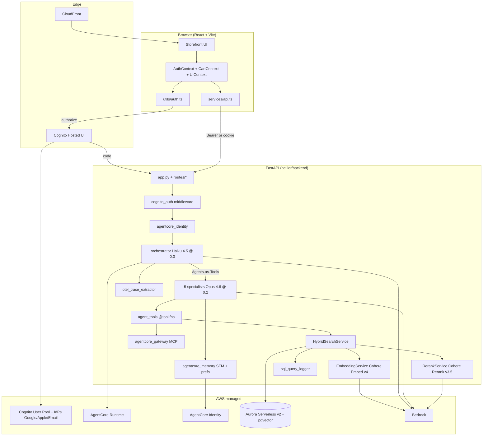
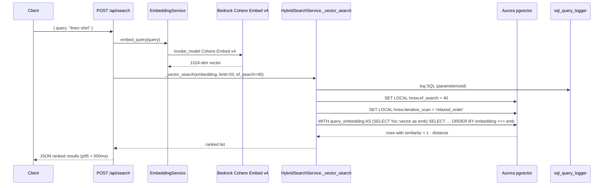
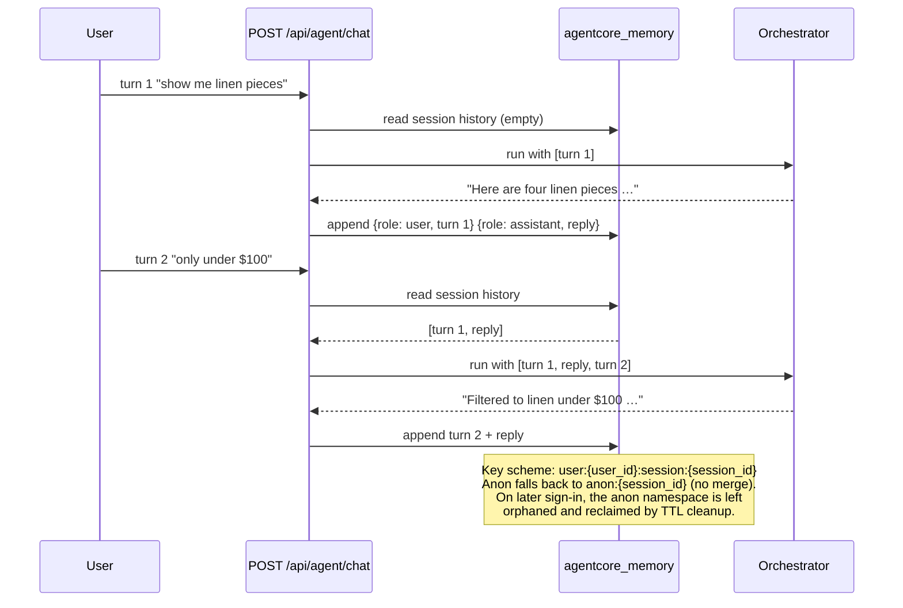
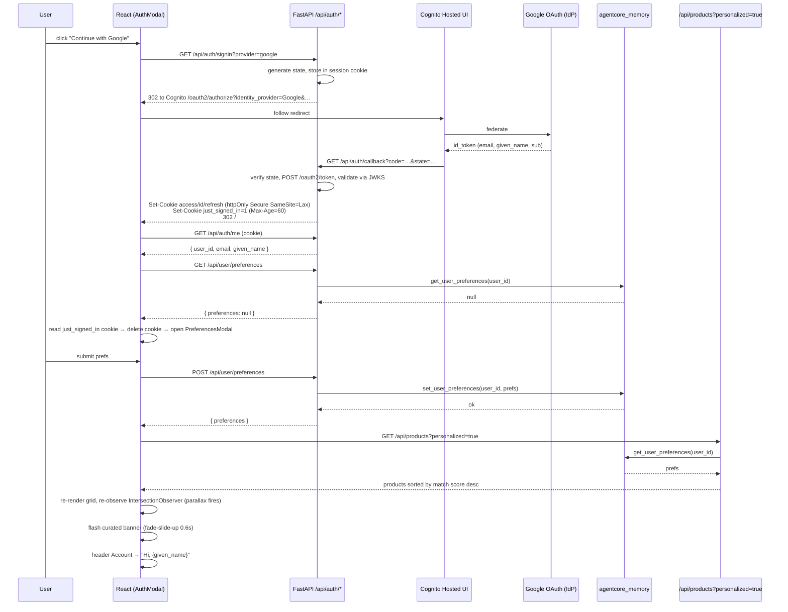

# Pellier Storefront — Design

## Introduction

This design realizes the requirements in `requirements.md`. It specifies architecture, data flow, component decomposition, data models, the service layer, error handling, and testing. Steering files (`project.md`, `tech.md`, `coding-standards.md`, `database.md`, `storefront.md`, `workshop-content.md`) remain authoritative; this document cites them rather than restating them.

Sibling specs own adjacent scope and are referenced, not duplicated:

- `catalog-enrichment` — product table DDL, `tags text[]` column, embedding pipeline, seed catalog.
- `customer-support-agent` — the customer support specialist wrapped by the orchestrator in C4.

### Repo fit

- Backend root: `pellier/backend/` with sibling packages `agents/`, `services/`, `models/`. All repo files referenced below already exist unless marked `new`.
- Frontend root: `pellier/frontend/src/` with `components/`, `contexts/`, `hooks/`, `services/`, `utils/`.
- The existing `AuthContext.tsx`, `Header.tsx`, `LoginButton.tsx`, and `SignInPage.tsx` are the starting points that Challenge 9.3/9.4 extend. This design does not introduce a second auth layer.
- Observability hooks into the existing `services/sql_query_logger.py` (confirmed in repo) and `services/otel_trace_extractor.py`.

### Design decisions worth calling out

1. **Personalization scoring** implements the equal-weight tag-overlap specified in Requirement 3.3.2, cleanly replaceable by a weighted variant as the Take It Further extension.
2. **Preferences onboarding "fresh sign-in" signal** — resolves the open question from Requirement 1.4.4. Backend sets a `just_signed_in=1` cookie (httpOnly false, Secure, SameSite=Lax, `Max-Age=60`) on the Cognito callback. Frontend reads it once on mount, immediately deletes it, and opens the preferences modal if `preferences === null`. This beats URL hash/referrer because it survives the Cognito redirect chain, can't be spoofed into repeated triggering, and auto-expires.
3. **Storyboard and Discover routes** (Requirement 1.13) stay deliberately small — one `<PageShell>` component wrapping the Storyboard grid or the personalized product grid plus one editorial line. No separate router module beyond React Router's base `<Routes>`.
4. **Centralized copy** lives in `frontend/src/copy.ts` and `backend/storefront_copy.py`. All 8 intents, all 9 product-card reasoning strings, all banner/modal copy, all error envelopes go through these two files.

---

## Architecture

### System diagram



Keyed to steering: Bedrock model IDs and Python stack come from `tech.md`; Aurora/pgvector patterns come from `database.md`; agent/tool names come from `workshop-content.md` + `coding-standards.md`.

### Request lifecycle (authenticated call)

```
Browser ──Bearer/Cookie──▶ FastAPI route
                             │
                             ▼
                     cognito_auth middleware
                       (JWKS validate, 1h cache,
                        sets request.state.user)
                             │
                             ▼
                 agentcore_identity.get_verified_user_context(request)
                             │
                             ▼
                 route handler → orchestrator / prefs / products
                             │
                             ▼
                 agentcore_memory scoped by user:{user_id}
```

---

## Sequence Diagrams

### 1. Vector search (C1 result path)



### 2. Agent reasoning with tool use (C3 + C4 path)

```mermaid
sequenceDiagram
  participant U as User
  participant API as POST /api/agent/chat
  participant ID as AgentCoreIdentity
  participant O as Orchestrator (Haiku @ 0.0)
  participant S as product_recommendation_agent (Opus @ 0.2)
  participant T as get_trending_products
  participant DB as Aurora
  participant MEM as AgentCore Memory
  participant OT as OpenTelemetry

  U->>API: { message, session_id? }
  API->>ID: get_verified_user_context(request)
  ID-->>API: user_id, session namespace
  API->>O: route(message)
  O->>OT: start span orchestrator
  O-->>O: intent priority: pricing>inventory>support>search>recommendation
  O->>S: invoke as tool
  S->>OT: start span specialist
  S->>T: @tool get_trending_products()
  T->>DB: parameterized SELECT
  DB-->>T: rows
  T-->>S: JSON string
  S-->>O: response text
  O->>MEM: append session turn at user:{user_id}:session:{session_id}
  O->>OT: close spans
  O-->>API: response
  API-->>U: SSE stream (first token < 2s, full < 6s)

  Note over API,O: JWT is validated once at stream start.<br/>Server does NOT re-check per chunk.<br/>If the token expires mid-stream, the stream<br/>completes normally; silent refresh (Req 4.2.4)<br/>fires on the next request.
```

### 3. Multi-turn conversation with STM (C6 path)



### 4. Full auth + preferences flow



---

## Frontend Component Tree

```
App.tsx
└── <AuthProvider>                 (existing contexts/AuthContext.tsx, extended by C9.3)
    └── <CartProvider>
        └── <UIProvider>           (controls ⌘K + modal singleton visibility)
            └── <Routes>
                ├── "/"           → <HomePage/>
                ├── "/storyboard" → <StoryboardPage/>   (Req 1.13)
                ├── "/discover"   → <DiscoverPage/>     (Req 1.13)
                └── "/signin"     → redirects to <AuthModal/> over last route

<HomePage/>
├── <AnnouncementBar/>              copy.ts: ANNOUNCEMENT
├── <StickyHeader/>                 5 items + wordmark + AccountButton + ⌘K link
│   ├── <NavLink "Home"/>
│   ├── <NavLink "Shop"/>
│   ├── <NavLink "Storyboard"/>
│   ├── <NavLink "Discover"/>
│   ├── <Wordmark/>
│   └── <AccountButton/>            reads useAuth().user
├── <HeroStage/>                    Req 1.3
│   ├── <HeroImage slow-zoom/>
│   ├── <IntentInfoCard/>           floating top-left card
│   ├── <SearchPill/>               floating bottom-center
│   ├── <IntentTicker/>             8 chips, active state
│   └── <ProgressBar 7.5s/>
├── <AuthStateBand/>                Req 1.4, renders one of:
│   ├── <SignInStrip/>              sessionStorage dismiss
│   └── <CuratedBanner/>            fade-slide-up on prefs save
├── <LiveStatusStrip/>
├── <CategoryChips/>                7 chips horizontal scroll
├── <ProductGrid/>                  Req 1.6
│   └── <ProductCard/> × N          uses useScrollReveal for parallax
│       └── <ReasoningChip/>        4 styles per Req 1.7
├── <RefinementPanel/>              4 chips, AND semantics
├── <StoryboardTeaser/>             3-card grid
├── <Footer/>                       5 columns
├── <CommandPill/>                  fixed bottom-right
└── <Modals singleton/>
    ├── <ConciergeModal/>
    ├── <AuthModal/>                (C9.4)
    ├── <PreferencesModal/>         (C9.4)
    ├── <CartModal/>                (existing)
    └── <CheckoutModal/>            (existing)

<StoryboardPage/>                   Req 1.13.1 — minimal
├── <StickyHeader/>
├── <StoryboardTeaser/>             reuse the home-page grid
├── <ComingSoonLine/>               italic Fraunces
├── <Footer/>
└── <CommandPill/>

<DiscoverPage/>                     Req 1.13.2 — minimal
├── <StickyHeader/>
├── signed-out: <DiscoverSigninPrompt/>
├── signed-in:  <ProductGrid personalized/> + <ComingSoonLine/>
├── <Footer/>
└── <CommandPill/>
```

### Modal singleton (Req 1.11.4)

`UIContext` keeps a single `activeModal: 'concierge' | 'auth' | 'preferences' | 'cart' | 'checkout' | null`. Opening any modal calls `setActiveModal(next)` which closes the previous one first. `Escape` and `⌘K / Ctrl+K` handlers live in `UIProvider` so every route inherits them.

### Parallax hook

```ts
// frontend/src/hooks/useScrollReveal.ts (already exists — extend)
export function useScrollReveal<T extends HTMLElement>(options?: {
  threshold?: number;
  rootMargin?: string;
  staggerMs?: number;
  index?: number;
}): { ref: RefCallback<T>; revealed: boolean };
```

Defaults match `storefront.md` exactly: `threshold: 0.05`, `rootMargin: '0px 0px -5% 0px'`, `staggerMs: 220`. Hook uses IntersectionObserver once per element (not re-triggering on scroll-back, per Req 1.6.4). Re-observation is forced by mounting `<ProductGrid key={prefsVersion}>` so the grid remounts on preference change (Req 1.6.6).

---

## Data Models

Defined in `pellier/frontend/src/services/types.ts` (extend existing) and mirrored on the backend in `pellier/backend/models/`. Product table DDL lives in `catalog-enrichment` — **referenced, not duplicated**.

```ts
// TypeScript (frontend/src/services/types.ts)

export interface Product {
  id: string;
  brand: string;
  name: string;
  color: string;
  price: number; // dollars, two decimals
  rating: number; // 0..5
  reviewCount: number;
  category:
    | "Linen"
    | "Dresses"
    | "Accessories"
    | "Outerwear"
    | "Footwear"
    | "Home";
  imageUrl: string;
  badge?: "EDITORS_PICK" | "BESTSELLER" | "JUST_IN";
  tags: string[]; // from catalog-enrichment
  reasoning?: ReasoningChip;
}

export type ReasoningStyle = "picked" | "matched" | "pricing" | "context";
export interface ReasoningChip {
  style: ReasoningStyle;
  text: string;
  urgentClause?: string; // rendered in --accent when pricing
}

export interface Intent {
  id: number; // 1..8
  query: string; // italic Fraunces text (quoted in UI)
  productRef: { id: string } | ProductOverride;
  matchedOn: string[];
}
export interface ProductOverride {
  name: string;
  brand: string;
  color: string;
  price: number;
  rating: number;
  reviewCount: number;
  imageUrl: string;
}

export interface User {
  userId: string; // Cognito sub
  email: string;
  givenName: string;
}

export interface Preferences {
  vibe: VibeTag[]; // 'minimal'|'bold'|'serene'|'adventurous'|'creative'|'classic'
  colors: ColorTag[]; // 'warm'|'neutral'|'earth'|'soft'|'moody'
  occasions: OccasionTag[]; // 'everyday'|'travel'|'evening'|'outdoor'|'slow'|'work'
  categories: CategoryTag[]; // 'linen'|'footwear'|'outerwear'|'accessories'|'home'|'dresses'
}
export type VibeTag =
  | "minimal"
  | "bold"
  | "serene"
  | "adventurous"
  | "creative"
  | "classic";
export type ColorTag = "warm" | "neutral" | "earth" | "soft" | "moody";
export type OccasionTag =
  | "everyday"
  | "travel"
  | "evening"
  | "outdoor"
  | "slow"
  | "work";
export type CategoryTag =
  | "linen"
  | "footwear"
  | "outerwear"
  | "accessories"
  | "home"
  | "dresses";

export interface SearchResponse {
  // wire shape from POST /api/search
  products: Product[];
  queryEmbeddingMs: number;
  searchMs: number;
  totalMs: number;
}
export type SearchResult = SearchResponse; // alias kept for existing call sites

export interface AgentResponse {
  sessionId: string;
  tokenStream: ReadableStream<string>;
  traceId?: string;
}

// AuthTokens are intentionally not modeled client-side.
// Tokens live in httpOnly cookies (Req 5.3.1). The client knows only { user, preferences }.
```

Backend Pydantic mirrors (stubs):

```python
# backend/models/__init__.py (extend)
class Preferences(BaseModel):
    vibe: list[VibeTag] = []
    colors: list[ColorTag] = []
    occasions: list[OccasionTag] = []
    categories: list[CategoryTag] = []

class VerifiedUser(BaseModel):
    user_id: str
    email: EmailStr
    given_name: str

class SearchResponse(BaseModel):
    products: list[Product]
    query_embedding_ms: int       # serialized to queryEmbeddingMs via pydantic alias_generator
    search_ms: int                # -> searchMs
    total_ms: int                 # -> totalMs
    model_config = ConfigDict(alias_generator=to_camel, populate_by_name=True)
```

---

## Service Layer

### Backend

#### `services/hybrid_search.py` — `HybridSearchService` (C1 lives here)

```python
class HybridSearchService:
    def __init__(self, db: DatabaseService):
        self._db = db

    async def search(self, query: str, limit: int = 20) -> list[ProductRow]:
        """Top-level entry. Embeds via EmbeddingService, calls _vector_search,
           then optional rerank via Cohere Rerank v3.5."""

    # C1 — between # === CHALLENGE 1: START/END === markers
    async def _vector_search(
        self,
        embedding: list[float],
        limit: int,
        ef_search: int,
        iterative_scan: bool = True,
    ) -> list[ProductRow]:
        """pgvector cosine similarity search.
        - CTE pattern from database.md: WITH query_embedding AS (SELECT %s::vector as emb)
        - <=> cosine distance; similarity = 1 - distance
        - SET LOCAL hnsw.ef_search = %s (per-query tuning)
        - SET LOCAL hnsw.iterative_scan = 'relaxed_order' when iterative_scan=True
        - Caller passes pre-computed embedding (Req 2.3.5).
        - Parameterized placeholders only (database.md), logged via sql_query_logger.
        - quantity > 0 in-stock filter (database.md).
        """
```

#### `services/embeddings.py` — `EmbeddingService`

Already exists. Wraps Cohere Embed v4 via Bedrock. Used by search and by preference re-ranking extensions.

#### `services/agent_tools.py` — `@tool` functions (C2 lives here)

All tools follow `coding-standards.md` exactly: `@tool` decorator from `strands`, return JSON strings, check `_db_service` availability, use `_run_async()`, catch and return `json.dumps({"error": str(e)})`.

Tools (names per `workshop-content.md`):

- `search_products(query: str, limit: int = 20) -> str`
- `get_trending_products() -> str` **[C2]**
- `get_price_analysis(product_id: str) -> str`
- `get_product_by_category(category: str) -> str`
- `get_inventory_health() -> str`
- `get_low_stock_products() -> str`
- `restock_product(product_id: str, quantity: int) -> str`
- `compare_products(ids: list[str]) -> str`
- `get_return_policy(category: str) -> str`

#### `agents/curator.py` — `product_recommendation_agent` (C3)

```python
product_recommendation_agent = Agent(
    model=BedrockModel(model_id=settings.BEDROCK_CHAT_MODEL),  # Opus 4.6
    temperature=0.2,
    tools=[search_products, get_trending_products, compare_products, get_product_by_category],
    system_prompt=copy.RECOMMENDATION_SYSTEM_PROMPT,
)
```

`copy.RECOMMENDATION_SYSTEM_PROMPT` emphasizes warm, editorial, catalog-style reasoning grounded in specific product attributes (Req 2.4.4). No customer-facing copy forbidden words appear in responses (Req 1.12.2).

#### `agents/orchestrator.py` — Multi-agent orchestrator (C4)

```python
orchestrator = Agent(
    model=BedrockModel(model_id='global.anthropic.claude-haiku-4-5-20251001-v1:0'),
    temperature=0.0,
    tools=[
        search_agent,
        product_recommendation_agent,
        price_optimization_agent,
        inventory_restock_agent,
        customer_support_agent,  # from customer-support-agent spec
    ],
    system_prompt=copy.ORCHESTRATOR_SYSTEM_PROMPT,  # enforces pricing>inventory>support>search>recommendation
)
```

Routing tests (see Testing Strategy) assert one representative query per specialist intent lands on the expected specialist.

#### `services/agentcore_runtime.py` (C5)

Exposes `run_agent_on_runtime(message: str, session_id: str, user_id: str | None) -> AsyncIterator[str]` that migrates the orchestrator from in-process Strands to AgentCore Runtime.

**Runtime selection switch:** `settings.USE_AGENTCORE_RUNTIME: bool = False` (default). Route handler for `/api/agent/chat`:

```python
if settings.USE_AGENTCORE_RUNTIME:
    stream = run_agent_on_runtime(message, session_id, user_id)   # C5
else:
    stream = run_orchestrator_inprocess(message, session_id, user_id)  # C4 in-process Strands
```

Before C5 completion, the in-process Strands orchestrator handles all requests. Participants flip `USE_AGENTCORE_RUNTIME=true` in `backend/.env` as part of C5 verification; no other route-handler changes are needed.

#### `services/agentcore_memory.py` (C6)

```python
class AgentCoreMemory:
    async def append_session_turn(self, session_ns: str, turn: Turn) -> None: ...
    async def get_session_history(self, session_ns: str) -> list[Turn]: ...
    async def get_user_preferences(self, user_id: str) -> Preferences | None: ...
    async def set_user_preferences(self, user_id: str, prefs: Preferences) -> Preferences: ...
```

Namespaces:

- Session (authenticated): `user:{user_id}:session:{session_id}`
- Session (anonymous): `anon:{session_id}` — **never** merged on later sign-in (Req 4.3.3).
- Preferences: `user:{user_id}:preferences`.

#### `services/agentcore_gateway.py` (C7)

Exposes the tools defined in `agent_tools.py` via the MCP streamable HTTP transport for external clients. Same tool signatures, same JSON envelope.

#### `services/otel_trace_extractor.py` (C8)

Already exists. Extracts OpenTelemetry spans produced during an agent run and maps them into the `/inspector` view's expected shape: `{ spans: Span[], totalMs: number, specialistRoute: string }`.

#### `services/cognito_auth.py` (C9.1 — new)

```python
class CognitoAuthService:
    def __init__(self, pool_id: str, region: str, client_id: str):
        self._jwks = JwksClient(url=..., ttl_seconds=3600)       # Req 4.2.1

    async def validate_jwt(self, token: str) -> VerifiedUser:
        """Validate signature via JWKS, iss, aud, exp, token_use='access'."""

    async def extract_user(self, request: Request) -> VerifiedUser | None:
        """Read Authorization: Bearer then fall back to access_token cookie."""

# FastAPI dependency
async def require_user(request: Request, svc: CognitoAuthService = Depends()) -> VerifiedUser:
    user = await svc.extract_user(request)
    if user is None:
        raise HTTPException(status_code=401, detail="auth_failed")
    request.state.user = user
    return user
```

Middleware wraps all `/api/user/*`, `/api/agent/*`, and `/api/auth/me`. Public endpoints (`/api/products`, `/api/search`) optionally call `extract_user` to personalize when a token is present.

#### `services/agentcore_identity.py` (C9.2 — new)

```python
class AgentCoreIdentityService:
    async def get_verified_user_context(self, request: Request) -> UserContext:
        """Returns user_id + session namespace for agentcore_memory."""

@dataclass
class UserContext:
    user_id: str | None        # None for anonymous requests
    session_id: str
    namespace: str             # 'user:{user_id}:session:{session_id}' or 'anon:{session_id}'
```

### Frontend

#### `frontend/src/utils/auth.ts` (C9.3 — new)

```ts
export function redirectToSignIn(
  provider: "google" | "apple" | "email",
  opts?: { returnTo?: string },
): void;
// Routes the browser to /signin?returnTo=... and opens AuthModal showing ALL three providers.
// The caller does NOT pick the IdP for re-auth; the user does, preserving their original choice.
export function openSignInChooser(opts?: { returnTo?: string }): void;
export function redirectToLogout(): Promise<void>;
export function useAuth(): {
  user: User | null;
  preferences: Preferences | null;
  refresh(): Promise<void>; // calls /api/auth/me + /api/user/preferences
  savePreferences(p: Preferences): Promise<void>;
  isLoading: boolean;
};
```

`useAuth()` extends the existing `contexts/AuthContext.tsx` rather than replacing it. Silent refresh: on any `401` from `services/api.ts`, the interceptor calls `/api/auth/refresh` (server-side token rotate against Cognito). On success, retry the original request once. On failure, call `openSignInChooser({ returnTo: window.location.pathname + window.location.search })` — this routes to `/signin` and opens `AuthModal` with all three providers so a user who originally signed in with Google isn't forced into email/password. The caller never picks the provider for re-auth; only the initial sign-in buttons in `AuthModal` do.

#### `frontend/src/copy.ts` (new)

Single export of every user-facing string: intents, reasoning chip phrases, banner copy, modal copy, CTA labels, editorial lines. Auto-checkable by a lint test against Requirement 1.12.2 forbidden words.

---

## Personalization Scoring

Implements Requirement 3.3.2 as equal-weight tag overlap:

```python
# backend/services/personalization.py (new)
def match_score(product_tags: list[str], prefs: Preferences) -> int:
    union = {*prefs.vibe, *prefs.colors, *prefs.occasions, *prefs.categories}
    # Case-insensitive compare; catalog-enrichment stores lowercase tags.
    return sum(1 for t in product_tags if t.lower() in union)

def sort_personalized(products: list[Product], prefs: Preferences) -> list[Product]:
    default_order = {p.id: i for i, p in enumerate(products)}   # editorial order preserved for ties
    return sorted(
        products,
        key=lambda p: (-match_score(p.tags, prefs), default_order[p.id]),
    )
```

Swap-in hook for the Take It Further weighted variant is a single function override — `match_score` takes a `weights: dict[str, float]` keyword-only arg that defaults to all-ones. No call-site changes needed.

---

## Error Handling

| Error                                   | Detection                                                | Response                                                                   | User-visible                                                                                         |
| --------------------------------------- | -------------------------------------------------------- | -------------------------------------------------------------------------- | ---------------------------------------------------------------------------------------------------- |
| Bedrock Embed timeout                   | `asyncio.TimeoutError` in `EmbeddingService.embed_query` | 1 retry with 500ms jitter; then `502` JSON envelope                        | Search pill shows "Pellier is thinking..." fallback state                                             |
| Empty vector-search result              | `_vector_search` returns `[]`                            | Return empty list (not an error)                                           | Grid shows editorial "Nothing yet. Try a different wording." card                                    |
| Agent timeout                           | Orchestrator streaming exceeds 10s                       | SSE `event: error` with `{ code: "agent_timeout" }`                        | Chat bubble shows "Taking a moment. Try again?" + retry button                                       |
| JWT expired + refresh succeeds          | 401 at middleware, valid `refresh_token` cookie          | rotate cookies, retry request once (Req 4.2.4)                             | Invisible to user                                                                                    |
| JWT expires mid-SSE stream              | Not detected during stream                               | Stream completes from the server's POV. No per-chunk re-validation.        | Invisible; next request triggers the normal refresh/redirect path                                    |
| JWT expired + refresh fails             | 401 at middleware, no/invalid refresh                    | Clear cookies, 401 `{ error: "auth_failed" }`                              | Frontend routes to `/signin?returnTo=…` which opens `AuthModal` with all three providers (Req 4.2.5) |
| Cognito OAuth error at callback         | `state` mismatch or token exchange non-200               | 400 `{ error: "invalid_state" }` or 502 `{ error: "auth_failed" }`         | Auth modal shows "Something interrupted the sign-in. Try again."                                     |
| Preferences 422                         | Payload contains unknown values                          | `422 { error: "invalid_preferences", fields: [...] }`                      | Preferences modal shakes the offending group briefly                                                 |
| DB connection drop                      | psycopg pool returns error                               | 503 `{ error: "unavailable" }`                                             | Status strip flips to "Catalog refreshing..." amber state                                            |
| `_db_service` unavailable inside a tool | Tool sees `None`                                         | `return json.dumps({"error": "db_unavailable"})` per `coding-standards.md` | Agent responds "I can't reach the catalog right now."                                                |

All error envelopes live in `copy.py` / `copy.ts`. Token payloads are never logged (Req 5.3.3).

---

## Testing Strategy

### Backend (pytest)

- **Unit**
  - `test_vector_search.py` — C1: asserts CTE shape, `SET LOCAL` calls, returns ranked results; property-tests that the `limit` parameter bounds result count.
  - `test_agent_tools.py` — C2: tools return valid JSON, handle `_db_service=None`, handle exceptions via `json.dumps({"error": …})`.
  - `test_personalization.py` — `match_score` returns expected counts; `sort_personalized` preserves default order on ties; weighted-variant hook verified.
  - `test_cognito_auth.py` — C9.1: valid token passes; expired, wrong `iss`, wrong `aud`, wrong `token_use`, unsigned-by-JWKS all fail. JWKS cache is populated once for N concurrent calls.
- **Integration**
  - `test_orchestrator_routing.py` — C4: five representative queries route to expected specialists per priority order. Uses stubbed Bedrock.
  - `test_preferences_api.py` — GET/POST round-trip via `agentcore_memory`.
  - `test_products_personalized.py` — with seeded catalog + known tags, assert Sundress/Cardigan top the list for `vibe=['creative'] + occasions=['evening']`.
  - `test_c3_recommendation_relevance.py` — Req 2.4.5: run `product_recommendation_agent` with query `"something for warm evenings out"`, parse the response, assert the named product's `tags` column intersects `{evening, warm, dresses, outerwear}`.

### Frontend

- **Component (Vitest + Testing Library)**
  - `HeroStage.test.tsx` — intent cycles every 7.5s (fake timers), hover pauses + progress bar freezes, ticker chip click jumps + resets.
  - `ProductGrid.test.tsx` — parallax triggers once; remount on `prefsVersion` change re-fires.
  - `AuthStateBand.test.tsx` — signed-out shows SignInStrip; signed-in + prefs shows CuratedBanner; signed-in + no prefs shows nothing and triggers the onboarding modal.
  - `Copy.test.tsx` — regex-scans `copy.ts` for Req 1.12.2 forbidden words and emoji/em dash.
- **E2E (Playwright against a dedicated Cognito dev pool)**
  - E2E uses a dedicated Cognito User Pool separate from the workshop infrastructure, configured with **email/password authentication only**. Google and Apple IdP flows are validated through manual workshop dry-runs, not automated E2E. Test credentials are provisioned once per CI run via the pool's admin API (`AdminCreateUser` + `AdminSetUserPassword`) and torn down at the end of the job. Pool ID, client ID, and a CI-scoped admin role come from CI secrets.
  - `e2e/auth-happy-path.spec.ts` — email/password sign-in, first sign-in, preferences modal auto-opens, save, curated banner appears, grid re-sorts.
  - `e2e/auth-refresh.spec.ts` — expire access cookie, observe silent refresh.
  - `e2e/auth-refresh-fail.spec.ts` — expire both access and refresh, observe redirect to `/signin?returnTo=...` with `AuthModal` showing all three providers.
  - `e2e/anon-to-auth.spec.ts` — chat anonymously, sign in, verify no history leak (Req 4.3.3).
- **Visual regression (Percy or Chromatic, pick one in tasks)**
  - Home page at mobile/tablet/desktop breakpoints.
  - Hero stage at each of the 8 intents.
  - Storyboard and Discover pages in both auth states.

### Cross-cutting

- Lint test ensures all customer-facing strings route through `copy.ts` / `copy.py` (grep for hardcoded string literals inside JSX text and `return "..."`).
- Perf smoke: `POST /api/search` p95 < 500ms; `POST /api/agent/chat` first token < 2s (Req 5.1.1, 5.1.2) run in CI against the seeded catalog.

---

## Open Questions (decided here; call out if different intent)

1. **Router.** Use `react-router-dom` v6 (already implicit in React 18 app). No SSR layer — Vite SPA only.
2. **Preferences shape on the wire.** Uses lowercase tag strings matching the catalog's `tags` column values (e.g., `"minimal"`, `"linen"`). The UI's capitalized labels (Minimal, Linen) are display-only.
3. **Cold-start of `just_signed_in` cookie.** If the cookie expires before the SPA mounts (rare, 60s budget), the modal still opens because `preferences === null`; subsequent navigation won't re-trigger since the next `/api/user/preferences` call returns the saved value. This is the conservative "open once, on first null-preferences fetch per browser session" fallback.

---

## Approval Gate

Design complete. Key things to confirm:

- The `just_signed_in` cookie approach for Req 1.4.4 (Design decision #2).
- Personalization as equal-weight overlap with a swap-in hook for weighted (the Take It Further path).
- Minimal Storyboard/Discover pages that reuse the home-page pieces.
- Backend files stay in `services/` and `agents/` (no `app/` layer), matching the resolved requirements.

Reply **approve** to proceed with `tasks.md`, or point out edits.
