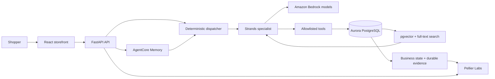

# Pellier

<div align="center">

_The focused Builders' Session edition of Pellier, built on Aurora PostgreSQL_

<br/>

[](https://docs.aws.amazon.com/AmazonRDS/latest/AuroraUserGuide/AuroraPostgreSQL.VectorDB.html)
[](https://aws.amazon.com/bedrock/)
[](https://aws.amazon.com/bedrock/agentcore/)
[](https://strandsagents.com)
[](https://www.python.org/)
[](https://react.dev/)

[](https://github.com/aws-samples/sample-pellier-agentic-search-apg/actions/workflows/quality.yml?query=branch%3Amain)
[](https://github.com/aws-samples/sample-pellier-agentic-search-apg/actions/workflows/e2e.yml?query=branch%3Amain)
[](LICENSE)
[](https://github.com/aws-samples/sample-pellier-agentic-search-apg/stargazers)

</div>

Pellier is a fictional artisan retailer built to demonstrate how an AI shopping
concierge can move beyond a chat interface. Natural-language requests become
grounded catalog retrieval, specialist-agent decisions, deterministic tool
calls, durable business state, and inspectable evidence.

The repository pairs a polished commerce experience with an engineering
surface that shows how each answer was routed, retrieved, executed, and
recorded.

**You are reading the `main` branch README.** This edition supports the
60-minute **Build Agentic AI-Powered Search with Amazon Aurora and Amazon RDS**
Builders' Session. The [`governed` edition](#governed-edition) is the more
comprehensive implementation for exploring managed agent execution,
authorization, and commerce transaction controls.

> This is an educational reference implementation. It demonstrates
> production-oriented architecture and controls, but it is not intended for
> production deployment without workload-specific security, resilience,
> compliance, and operational hardening.


**Explore:** [Choose an edition](#choose-an-edition) | [Experience](#experience) | [Capabilities](#capabilities) |
[Architecture](#architecture) | [Governed edition](#governed-edition) |
[Technology](#technology) | [Run locally](#run-locally) |
[Quality](#quality) | [Repository layout](#repository-layout)

---

## Choose an edition

| | `main` — Builders' Session | `governed` — comprehensive edition |
|---|---|---|
| Intended use | A focused, 60-minute hands-on build | A deeper implementation and workshop covering the full governed request and transaction path |
| Learning path | Compare four retrieval strategies, then implement and verify `floor_check`, grant the tool, and inspect its receipt | Follow identity, managed execution, tool authorization, business-state invariants, and transaction evidence across service boundaries |
| Agent execution | FastAPI and in-process Strands specialists with explicit tool grants | AgentCore Runtime, Gateway, and Policy with shopper identity carried through the managed path |
| Memory and data | AgentCore session turns and preferences; Aurora catalog, inventory, and tool receipts | Extends the shared foundation with broader state, policy, and transaction controls |
| Commerce depth | A workshop storefront and bounded inventory proof; additional scenarios are optional | Quotes, explicit consent, reservations, sandbox payment events, outbox records, and immutable receipts |
| Start here | Follow the [Builders' Session path below](#joining-the-60-minute-builders-session) | Read the [governed branch README](https://github.com/aws-samples/sample-pellier-agentic-search-apg/blob/governed/README.md) and its own setup instructions |

The experience, capabilities, architecture, and local setup below describe
`main`. Its Optional Deep Dives include reference patterns beyond the required
build; opening those pages does not provision the governed edition. Use the
matching branch, lab guide, and deployment revision for each edition.

## Experience

### Joining the 60-minute Builders' Session

Use the guide in `build-agentic-ai-powered-search-with-amazon-aurora-and-amazon-rds-builders`.
Your Workshop Studio environment is already provisioned. Open `CodeEditorURL`
and `PellierURL` from Event outputs, then start with Introduction. Work at your
own pace and use each page's result checks and troubleshooting. Workshop support
is available for issues you cannot resolve with those steps.

| Estimated time | Guide section | Participant outcome |
|---|---|---|
| 10 minutes | Introduction | Understand the PostgreSQL and agent request paths and open both tabs |
| 20 minutes | Lab 1: Compare PostgreSQL Retrieval Strategies | Write SQL eligibility filters and rank fusion, test empty results, then compare four retrieval paths |
| 20 minutes | Lab 2: Extend a Strands Agent with a Python Tool | Write and test warehouse SQL, grant `floor_check` to Stock Keeper, then verify the new request’s record |
| 10 minutes | Review Results and Next Steps | Explain the design and save your edits and evidence |

The guide's **PostgreSQL and Agent Architecture Reference** provides
commands, recovery steps, and further reading after the required path.

The deployed starter includes two SQL tasks and an agent tool-list edit.
`workshop/retrieval.sql` contains the eligibility and rank-fusion scaffold.
Provisioning also replaces the marked warehouse SQL body in
`pellier/backend/services/inventory_sql.py` and removes the agent grant.
This `main` checkout retains the working application implementation.
A `shipped` label checks wiring; direct tests and the session-specific
`agent-check` command verify execution. Check these results separately.

For the optional visual retrieval comparison, open **Pellier Labs → Optional
Deep Dives → Performance**. **Search** explains one hybrid pipeline, and
**Live Workbench** runs a shopper conversation. Reference numbers are labeled;
they do not establish a successful live run.

Pellier has two connected surfaces:

- **Pellier** (`/`) is the customer-facing storefront. It combines editorial
  merchandising, profile-guided discovery, semantic search, live inventory,
  product comparison, a shopping bag, and a conversational concierge.
  Choose a profile, type a request, and use **Send** or Enter. The storefront
  composer uses text input; it does not start microphone capture or transcription.
- **Pellier Labs** (`/pellier-labs`) is the engineering and operator surface.
  It exposes routing, retrieval, tools, memory, evaluations, performance,
  architecture, and durable evidence from the same application path. Start in
  **Live Workbench** for the interactive participant path; **Optional Deep
  Dives** are reference views when you want the underlying architecture or
  evidence detail.

**Stories** (`/storyboard`) connects the seeded catalog, declared profiles, and
execution evidence through short field notes. Each story card links to its
matching essay; Theo's returns scenario is optional follow-up. **About**
(`/about`) explains the 60-minute build and the ownership of application state.
Architecture links with `?ask=...` prefill the storefront composer and wait for
you to send the request.

The optional architecture and evaluation pages include authored configuration,
SQL examples, and illustrative scorecards. Use a completed live comparison,
Workbench turn, or Aurora receipt for participant proof. Opening a reference
page does not run an evaluation or verify provisioned AWS services.

A concise first-visit tour introduces the shopper point of view, the
concierge, and the optional evidence surface. Three returning-customer
profiles make personalization visible:

| Shopper | Shopping intent | System behavior to inspect |
|---|---|---|
| **Marco** | Natural fibers, travel, and packable layers | Inventory grounding and deterministic warehouse tools |
| **Anna** | Gifts, milestones, candles, and wrapped pairings | Semantic, hybrid, reranked, and agentic retrieval |
| **Theo** | Ceramics, slow craft, care, and returns | Multi-turn context and durable action evidence |

The seeded catalog contains 40 stable products with real Cohere Embed v4
vectors. A committed embedding cache makes local seeding deterministic and
keeps the sample reproducible.

## Capabilities

| Capability | Implementation |
|---|---|
| Semantic retrieval | Cohere Embed v4 query embeddings, `vector(1024)`, pgvector HNSW, and cosine distance in Aurora PostgreSQL |
| Hybrid retrieval | Parallel pgvector and PostgreSQL full-text search branches combined with Reciprocal Rank Fusion |
| Retrieval refinement | Cohere Rerank v3.5 reorders hybrid candidates; Claude can extract structured filters for agentic retrieval |
| Agent orchestration | A deterministic dispatcher routes each request to one of five Strands specialists |
| Controlled tool use | Specialists receive explicit tool allowlists across 15 declared `@tool` functions |
| Working memory | AgentCore Memory preserves session-scoped turns and supplies bounded context |
| Durable evidence | JSONB tool-audit records capture caller, arguments, result, latency, session, and timestamp |
| Runtime skills | Five checked-in markdown skills add task-specific guidance without changing product selection |
| Operator inspection | Pellier Labs reconstructs routing, retrieval, tool, memory, evaluation, and evidence paths |
| Managed foundation | Required AgentCore Memory; optional Runtime, Gateway, Identity, Policy, Evals, and MCP implementations |

## Architecture



For each concierge request:

1. FastAPI loads bounded session context from AgentCore Memory.
2. The dispatcher classifies the request and selects one specialist.
3. The specialist invokes Amazon Bedrock and only its declared tools.
4. Retrieval uses semantic, lexical, hybrid, reranked, or agentic strategies.
5. AgentCore Memory stores completed conversation turns; Aurora stores tool evidence.
6. The storefront streams the answer while Pellier Labs exposes the
   corresponding engineering detail.

This separation is deliberate. The model can reason and recommend, but
deterministic code owns routing boundaries, tool grants, business-state
changes, and evidence persistence.

### Agents and tools

| Specialist | Responsibility | Model role |
|---|---|---|
| Style Advisor | Semantic search, fit, fabric, and comparison | Editorial |
| Curator | Pairing, occasion, and hybrid retrieval | Editorial |
| Value Analyst | Pricing and collection analysis | Reporting |
| Stock Keeper | Warehouse inventory and restocking | Reporting |
| Experience Guide | Care, returns, and escalation | Editorial |

The in-process tool set is:

`find_pieces` | `find_pieces_hybrid` | `style_match` | `whats_trending` |
`price_intelligence` | `explore_collection` | `side_by_side` |
`floor_check` | `restock_shelf` | `running_low` | `returns_and_care` |
`process_return` | `preference_snapshot` | `trace_receipt` |
`escalate_to_stylist`

The default runtime uses fixed tool grants. Aurora also stores a semantic tool
registry for discovery and comparison, but a similarity result does not
silently expand an agent's authority.

### Memory and evidence

Pellier keeps memory and audit evidence distinct:

| Concern | Owner | Purpose |
|---|---|---|
| Working context | AgentCore Memory session events | Supply bounded, successful prior turns |
| Semantic preference | AgentCore Memory `USER_PREFERENCE` strategy | Preserve durable shopper preferences |
| Episodic history | Aurora orders, returns, and customer events | Keep business history in the system of record |
| Procedural guidance | Checked-in skills and MCP schemas | Make instructions and tool contracts reviewable |
| Operational evidence | Aurora tool audit and receipts | Record what executed and why |

An audit row is not agent memory, and a model trace is not transaction proof.
The distinction matters when an application must explain both what the agent
knew and what the system actually changed.

## Governed edition

The [`governed`](https://github.com/aws-samples/sample-pellier-agentic-search-apg/tree/governed)
branch is Pellier's more comprehensive edition. It extends the shared
storefront and Aurora foundation with a managed, identity-aware execution path.
The following controls belong to that edition's scope; its
[README and setup instructions](https://github.com/aws-samples/sample-pellier-agentic-search-apg/blob/governed/README.md)
describe how to deploy and verify them.

Both editions use Cognito for shopper sign-in. The governed edition carries
that identity through managed execution, tool authorization, and transaction
checks across service boundaries.

| Boundary | Governed implementation |
|---|---|
| Identity | Amazon Cognito JWT verification and shopper-bound requests |
| Managed execution | Bedrock AgentCore Runtime with access-token passthrough |
| Tool contract | AgentCore Gateway exposes a target-qualified MCP catalog |
| Authorization | AgentCore Policy evaluates Cedar before sensitive tool execution |
| Data authorization | Aurora functions enforce ownership and write invariants |
| Observability | Correlated OpenTelemetry, Runtime, policy, tool, and Aurora evidence |
| Commerce | Server-priced quotes, explicit consent, inventory reservations, sandbox payment events, outbox rows, and immutable receipts |

The governed edition demonstrates **proof-carrying commerce**: an agent can
recommend and prepare a transaction, while identity,
explicit consent, deterministic business rules, payment state, and durable
evidence determine what actually executes.

The governed payment adapter is intentionally a sandbox. It does not collect
card data, process a real charge, or claim PCI compliance. Its purpose is to
make payment state, idempotency, inventory movement, and receipt verification
testable without hiding those boundaries behind a mock success message.

AWS Glue Data Catalog, Amazon DataZone, and Amazon SageMaker can govern
analytical data products, metadata, and model development. They are adjacent
to this architecture, but they do not prove that a shopper confirmed a
specific total or that order, payment, and inventory state agree. The governed
edition keeps transaction governance at the identity, authorization, deterministic
state-transition, and durable-evidence boundaries.

## Technology

| Layer | Technology |
|---|---|
| Database | Aurora PostgreSQL Serverless v2, engine 18.3 |
| Vector retrieval | pgvector 0.8.1, `vector(1024)`, HNSW, cosine distance |
| Lexical retrieval | PostgreSQL `tsvector`, GIN, `ts_rank_cd`, and `pg_trgm` |
| Hybrid merge | Application-layer Reciprocal Rank Fusion |
| Models | Claude Opus 4.8, Claude Sonnet 4.6, Cohere Embed v4, and Cohere Rerank v3.5 through Amazon Bedrock |
| Agent framework | Strands Agents SDK with `Agent`, `@tool`, hooks, and `GraphBuilder` |
| Backend | Python, FastAPI, psycopg 3, boto3, Pydantic, and SSE streaming |
| Frontend | React 18, TypeScript 5, Vite 6, Tailwind CSS 3, Framer Motion 12, and Lucide |
| Optional MCP | Generated configuration for `awslabs.postgres-mcp-server`; requires RDS Data API and matching IAM access |
| Managed agent services | AgentCore Memory is required for the Builders' Session; Runtime, Gateway, Identity, Policy, and Evals are optional deployment paths |
| Typography | Self-hosted Fraunces, Instrument Sans, Instrument Serif, and JetBrains Mono |

MCP configuration is generated during bootstrap by
[`pellier/backend/generate_mcp_config.py`](pellier/backend/generate_mcp_config.py).
The generated configuration is not committed with credentials.

## Run locally

The reference toolchain uses Python 3.14 and Node.js 20. The backend package
supports Python 3.12 or newer.

### Deterministic smoke mode

Smoke mode serves the real production frontend bundle and deterministic chat
responses without initializing Aurora, Bedrock, or AgentCore. It supports UI
inspection; endpoints that need those services can still return errors. It
does not prove retrieval, persistent memory, authentication, or database writes.
Run these commands from the repository root:

```bash
python3 -m venv .venv
source .venv/bin/activate
python -m pip install --require-hashes \
  -r pellier/backend/requirements.lock

cd pellier/frontend
npm ci
npm run build
cd ../backend

PELLIER_SMOKE_MODE=true \
PELLIER_DISABLE_DOTENV=1 \
DB_HOST=localhost \
DB_NAME=pellier_smoke \
DB_USER=pellier_smoke \
DB_PASSWORD=pellier_smoke \
AWS_REGION=us-east-1 \
AWS_DEFAULT_REGION=us-east-1 \
python -m uvicorn app:app --host 0.0.0.0 --port 8000
```

Open <http://localhost:8000> for Pellier or
<http://localhost:8000/pellier-labs> for Pellier Labs.
Keep the server terminal running while using the preview. The retrieval
comparison is at <http://localhost:8000/pellier-labs/performance>.

### Aurora and Bedrock

The complete path needs Aurora PostgreSQL, accessible Bedrock models, Cognito
for the seeded shopper identities, and AgentCore Memory with a
`USER_PREFERENCE` strategy. Workshop Studio provisions these through the
bootstrap scripts. For an existing local AWS environment, supply the actual
Cognito settings and `AGENTCORE_MEMORY_ID`; copying the example file does not
create them. See [Memory provisioning](scripts/provision_agentcore_memory.py)
for the maintainer deployment entry point.

The commands below prepare the database and start the backend after that AWS
setup. Start from the repository root with your Python environment active:

```bash
cp pellier/backend/.env.example pellier/backend/.env
# Replace every placeholder, including DB_*, AWS_REGION, and model IDs.
set -a
source pellier/backend/.env
set +a

PGPASSWORD="$DB_PASSWORD" psql -h "$DB_HOST" -p "$DB_PORT" \
  -U "$DB_USER" -d "$DB_NAME" -v ON_ERROR_STOP=1 \
  -f scripts/migrations/001_schema.sql

python scripts/seed_pellier_catalog.py --from-cache

for migration in \
  002_workshop_telemetry.sql \
  003_persona_seed.sql \
  004_anna_hybrid_search.sql \
  005_theo_returns.sql \
  006_warehouse_inventory.sql \
  007_chat_session_tables.sql \
  008_search_performance_indexes.sql \
  009_return_policies.sql \
  010_governed_receipts.sql \
  011_governed_write_integrity.sql \
  012_retrieval_receipts.sql \
  013_inventory_ledger.sql
do
  PGPASSWORD="$DB_PASSWORD" psql -h "$DB_HOST" -p "$DB_PORT" \
    -U "$DB_USER" -d "$DB_NAME" -v ON_ERROR_STOP=1 \
    -f "scripts/migrations/$migration"
done

python scripts/seed_tool_registry.py

cd pellier/backend
python -m uvicorn app:app --reload --host 0.0.0.0 --port 8000
```

For frontend hot module replacement, run `npm run dev` from
`pellier/frontend`. The Vite application on `:5173` calls the backend on
`:8000`.

### Reverse proxies

FastAPI serves both the API and the built React application. If a reverse
proxy preserves a path prefix, set both values before building or starting the
application:

```bash
export SPA_MOUNT_PATH=/app
export VITE_BASE_PATH=/app/
```

Rebuild the frontend after changing `VITE_BASE_PATH`. Workshop Studio uses
`/ports/8000/` in the browser; its nginx proxy strips that prefix before
forwarding to FastAPI, so that deployment keeps `SPA_MOUNT_PATH=/`.

### Publishing workshop updates

The application and Workshop Studio guides are separate repositories. Publish
reviewed app changes to `main` first, then use the Workshop Studio repository's
`scripts/set_source_revision.py` to update all three immutable source pins.
Run its release validator, publish the updated guides/templates, and make sure
the selected Workshop Studio asset version contains the matching nested
templates before rehearsing a fresh environment. See that repository's README
for the release order and S3 asset contract.

## Quality

The main branch runs backend tests, frontend tests, type checking, linting,
production builds, dependency auditing, shell validation, CodeQL, and
production-build Playwright smoke tests.

Run the primary gates locally:

```bash
cd pellier/backend
AWS_REGION=us-east-1 AWS_DEFAULT_REGION=us-east-1 python -m pytest -q

cd ../frontend
npm test -- --run
npm run type-check
npm run lint
npm run build
npm audit --omit=dev --audit-level=high

cd ../..
git diff --check
find scripts -type f -name '*.sh' -print0 | xargs -0 -n1 bash -n
```

The `e2e` workflow builds the production SPA, serves it through FastAPI in
smoke mode, and exercises the storefront, Pellier Labs, persona selection,
streaming, and reset behavior in Chromium without AWS secrets.

## Repository layout

```text
sample-pellier-agentic-search-apg/
|-- pellier/
|   |-- backend/                  FastAPI app, agents, services, routes, tests
|   `-- frontend/                 React storefront and Pellier Labs
|-- skills/                       Runtime markdown skills
|-- solutions/                    Reference retrieval, tool, AgentCore, and MCP implementations
|-- scripts/
|   |-- migrations/               Ordered idempotent SQL migrations
|   |-- deploy/                   Optional managed-path deployment scripts
|   |-- bootstrap-environment.sh  Host and reverse-proxy setup
|   `-- bootstrap-labs.sh         Schema, seed, build, and service setup
|-- tests/                        Cross-repository E2E and performance checks
`-- .github/workflows/            Quality and browser gates
```

## Resources

- [Aurora PostgreSQL with pgvector](https://docs.aws.amazon.com/AmazonRDS/latest/AuroraUserGuide/AuroraPostgreSQL.VectorDB.html)
- [Amazon Bedrock](https://aws.amazon.com/bedrock/)
- [Amazon Bedrock AgentCore](https://aws.amazon.com/bedrock/agentcore/)
- [Model Context Protocol specification](https://modelcontextprotocol.io/)
- [Strands Agents SDK](https://strandsagents.com/latest/)
- [pgvector performance on Aurora](https://aws.amazon.com/blogs/database/supercharging-vector-search-performance-and-relevance-with-pgvector-0-8-0-on-amazon-aurora-postgresql/)

## Credits and license

Built and curated by **Shayon Sanyal** (<shayons@amazon.com>).

Licensed under the [MIT License](LICENSE), copyright 2026 Amazon Web Services.
The license requires the copyright and permission notice to remain in copies or
substantial portions of the software. See [NOTICE](NOTICE) for the requested
attribution format for derived applications, talks, and other reuse.
