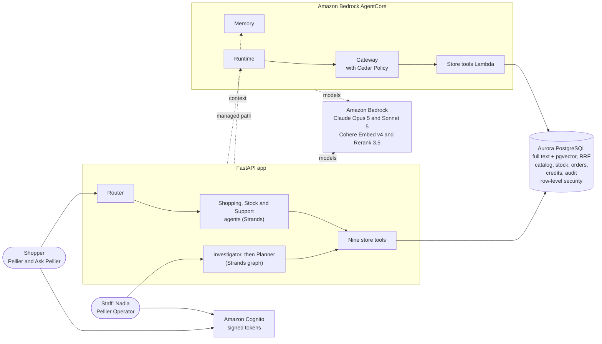

# Pellier: governed agentic AI search

The application and lab code for the AWS workshop *Build governed agentic AI search with Aurora, RDS, & Bedrock AgentCore* (DAT416).

[](LICENSE)
[](https://github.com/aws-samples/sample-pellier-agentic-search-apg/actions/workflows/quality.yml?query=branch%3Agoverned)
[](https://docs.aws.amazon.com/AmazonRDS/latest/AuroraUserGuide/AuroraPostgreSQL.VectorDB.html)

> This is an educational sample for a workshop, not production code. See [Security and responsible use](#security-and-responsible-use).

## What Pellier is

Pellier is a small retail store, invented for this workshop. Its assistant, Ask Pellier, answers shoppers from live data in Aurora PostgreSQL: the catalog, warehouse stock, orders and support tickets. Staff use the Pellier Operator (`/operator`), where agents can investigate a case and propose a store credit, but a person approves anything that moves money. The workshop asks one question: how do you let an agent act on real data and prove what happened?

## The four labs

Each lab follows one customer and answers one worry a store's leadership would have. You edit a few marked regions of code, then check the result against Aurora, the deployed services and the app.

| Lab | Customer | Leadership worry | What you build | What proves it |
|---|---|---|---|---|
| 1. Retrieval | Anna | "Shoppers describe what they want, and our search only matches words." | The RRF expression that fuses the vector and full-text ranks, and a search fallback that keeps her budget, stock and exclusions | Your expression reproduces the score recorded for her search, and every product returned meets her limits in Aurora |
| 2. Grounding | Marco | "If the assistant guesses stock, we'll promise things we can't ship." | The `check_stock` tool body and the Stock agent's tool grant | The agent's counts match the warehouse rows in Aurora, and a piece Pellier does not carry is "not found", never zero |
| 3. Managed | Theo | "The assistant should remember our customers, but never let one see another's account." | Publish `get_tickets` on AgentCore Gateway, bind it to the signed-in caller and deploy to AgentCore Runtime | His own tickets come back and another customer's do not, a new session recalls his taste from AgentCore Memory, and the audit rows name the build that ran |
| 4. Governed | Jessica, with Nadia (staff) | "No AI moves money on its own, and when money moves, we must prove what happened." | A Cedar rule that caps a staff store credit at $100, and the row-level security predicate for customer rows | Nadia's approved credit of up to $100 is allowed and recorded once, even on retry; $100.01 is denied and leaves no audit or credit row; another customer's rows return nothing |

## Architecture


```mermaid
flowchart LR
  shopper(["Shopper<br/>Pellier and Ask Pellier"])
  staff(["Staff: Nadia<br/>Pellier Operator"])
  cognito["Amazon Cognito<br/>signed tokens"]

  subgraph app["FastAPI app"]
    router["Router"]
    agents["Shopping, Stock and Support<br/>agents (Strands)"]
    investigation["Investigator, then Planner<br/>(Strands graph)"]
    tools["Nine store tools"]
  end

  subgraph agentcore["Amazon Bedrock AgentCore"]
    runtime["Runtime"]
    gateway["Gateway<br/>with Cedar Policy"]
    lambda["Store tools Lambda"]
    memory["Memory"]
  end

  bedrock["Amazon Bedrock<br/>Claude Opus 5 and Sonnet 5<br/>Cohere Embed v4 and Rerank 3.5"]
  aurora[("Aurora PostgreSQL<br/>full text + pgvector, RRF<br/>catalog, stock, orders,<br/>credits, audit<br/>row-level security")]

  shopper --> cognito
  staff --> cognito
  shopper --> router --> agents --> tools
  staff --> investigation --> tools
  tools --> aurora
  app -. managed path .-> runtime --> gateway --> lambda --> aurora
  app -. context .-> memory
  app -. models .-> bedrock
  agentcore -. models .-> bedrock
```

- **Router and agents.** A deterministic Router, with no model call, sends each request to one of three Strands agents: Shopping and Support on Claude Opus 5, Stock on Claude Sonnet 5. Each agent gets only its own tools once Lab 2 narrows the Stock agent's grant. `pellier/backend/services/intent_router.py`, `pellier/backend/agents/`
- **Store tools.** Nine tools: `search_products`, `browse_department`, `compare_products`, `check_stock`, `get_orders`, `get_return_policy`, `get_tickets`, `give_store_credit` and `ask_a_person`. One implementation serves both the local agents and the Gateway Lambda. `pellier/backend/services/store_tools.py`, `scripts/deploy/pellier_store_tools.py`
- **Hybrid search.** The shopper's limits become SQL filters on a pgvector branch and a full-text branch. Reciprocal Rank Fusion (k = 60) merges them, Cohere Rerank 3.5 reorders the pool, and a shopper's search records its ranks in a retrieval receipt. The storefront's Builder view shows the ranks as "How it ranked". `pellier/backend/services/store_tools.py`, `pellier/backend/services/search_plan.py`
- **Managed path.** AgentCore Runtime runs the same Router and agents, and their tools come through AgentCore Gateway. AgentCore Policy evaluates Cedar before the Lambda runs, so a denied call never executes and leaves no `tool_audit` row. `pellier/backend/agentcore_runtime.py`, `scripts/deploy/gateway_tool_schemas.py`, `policies/`
- **Identity.** Amazon Cognito signs in shoppers and staff, and the app keeps their sessions separate. A customer-scoped read uses the customer in the signed token, never one the model names: the local tools refuse a mismatch, and the Gateway checks it again with an owner-only Cedar permit. The handoff, `ask_a_person`, may name only the caller's own customer, so a direct Gateway caller cannot open a credit request on someone else's case. `pellier/backend/services/auth.py`, `pellier/backend/services/agent_tools.py`
- **Managed identity boundary.** Runtime independently verifies the Cognito access token and derives the subject and customer claim from it, rejecting conflicting payload identities before constructing an agent. Both Runtime and Gateway explicitly require `token_use=access`. The backend binds Runtime session IDs to the verified subject. Cedar authorizes tools; memory and model instructions never grant permission. `pellier/backend/services/runtime_identity.py`
- **Row-level security.** The customer-scoped tools (`get_orders`, `get_tickets`) run as the `pellier_agent` database role with one customer named. In process, that customer comes from the signed token. On the Gateway, it is the customer Cedar's owner-only permit admitted. Either way Aurora returns only that customer's rows, even if the tool's own SQL asks for someone else's. Lab 4 has you write the ownership predicate and prove it with direct SQL. `workshop/lab-4-rls.sql`
- **Memory.** AgentCore Memory keeps conversation events and the preferences it extracts from them. A remembered preference can guide a pick; prices and stock still come from Aurora. `pellier/backend/services/agentcore_memory.py`
- **Human approval.** In the Operator, a two-node Strands graph (Investigator, then Planner) reads the case, proposes one store credit and stops. `give_store_credit` writes only for a review a person approved with the same arguments, and a retry under that review's key returns the first result instead of a second credit. `pellier/backend/services/operator_graph.py`, `pellier/backend/services/store_tools.py`

## Run it

### In the workshop

Start with [START_HERE.md](START_HERE.md). Code Editor opens [Pellier.code-workspace](Pellier.code-workspace): **01 - Retrieve**, **02 - Ground**, **03 - Deploy**, **04 - Govern**, and **05 - Explore Pellier source**. Each lab has a short README, links to its actual exercise files, and a solution folder for the documented recovery path. The terminal always starts at the repository root.

At an AWS event, Workshop Studio gives you an AWS account with Aurora PostgreSQL, Amazon Cognito and the AgentCore resources already provisioned, a browser-based Code Editor with this repository, and the lab guide with every step and check. The guide is the source of truth for the labs; this repository holds the app and the code you edit.

### Locally

Prerequisites:

- Python 3.14 and Node.js 24, the versions the CI workflow uses.
- PostgreSQL with the `vector` (pgvector) and `pg_trgm` extensions, a user that can create extensions and roles, and `psql`. The workshop uses Aurora PostgreSQL.
- AWS credentials with Amazon Bedrock access to Claude Opus 5, Claude Sonnet 5, Cohere Embed v4 and Cohere Rerank 3.5.

From the repository root:

```bash
# 1. Backend environment
cd pellier/backend
python3 -m venv .venv
./.venv/bin/python -m pip install --require-hashes -r requirements.lock
cp .env.example .env    # set DB_* (or DATABASE_URL) and AWS_REGION
cd ../..

# 2. Into an existing, empty database: schema, the 100-product catalog
#    (from its committed embeddings) and the seed data
DB_HOST=localhost DB_PORT=5432 DB_NAME=pellier DB_USER=postgres DB_PASSWORD=... \
  PYTHON="$PWD/pellier/backend/.venv/bin/python" \
  bash scripts/setup/database-setup.sh

# 3. API on 127.0.0.1:8003 and the app on http://127.0.0.1:5173, with hot reload
cd pellier/frontend
npm ci
npm run dev
```

`npm run start:prod` instead builds the frontend and serves the app and API from FastAPI on port 8000.

Locally the agents run in-process. Ask Pellier works signed out, and AgentCore Memory falls back to a process-local store when `AGENTCORE_MEMORY_ID` is empty. Shopper sign-in and the Operator need the Cognito user pool and demo users that the workshop deployment creates (`COGNITO_*` in `.env`).

The code is in the labs' starting state: some marked regions are incomplete on purpose (for example, the Stock agent is connected to the catalog tools but not `check_stock` until Lab 2 connects it), and `solutions/` holds reference versions.

To deploy the managed path to your own account, `scripts/provision_agentcore_end_to_end.py` deploys the store tools Lambda and the AgentCore Runtime, Memory, Gateway and Policy resources with the pinned AgentCore CLI (`@aws/agentcore@0.29.0`). It expects an existing Aurora cluster and Cognito user pool, which the Workshop Studio templates create; those templates are not in this repository.

## Repository layout

| Path | Contents |
|---|---|
| `pellier/backend/` | FastAPI app: the Router, agents, store tools, routes and backend tests |
| `pellier/frontend/` | React and TypeScript app: the storefront, Ask Pellier and the Operator |
| `skills/` | Five runtime skills: instructions the agents load, not code |
| `policies/` | The Cedar policy you complete in Lab 4 |
| `workshop/` | Lab SQL worksheets and a starter copy of each marked region |
| `solutions/` | Reference solutions for the lab tasks |
| `scripts/` | Database setup and migrations, catalog seeding, AgentCore deployment and lab checks |
| `data/` | The 100-product catalog and its cached Cohere Embed v4 vectors |

## Tests

The `governed-quality` workflow runs the backend, frontend and shell-script checks on pushes and pull requests to the `governed` branch. To run them locally:

```bash
# Backend, from pellier/backend
./.venv/bin/python -m pytest -q

# Frontend, from pellier/frontend
npm test -- --run
npm run type-check
npm run lint
npm run build
npm audit --omit=dev --audit-level=high

# Repository, from the root
git diff --check
find scripts -type f -name '*.sh' -print0 | xargs -0 -n1 bash -n
pipx run ruff==0.16.10 check --select F821 scripts/
```

These checks run without AWS. Runtime, Gateway, Cedar and Lambda behavior can only be proven in a provisioned account.

## Security and responsible use

This is an educational sample. Review it carefully before you use any part of it in production.

- **Synthetic data.** Products, prices, reviews, availability, customers and orders are synthetic data built for this workshop. Nothing here charges a card.
- **Demo accounts.** The home page's shopper chooser signs in one of four demo shoppers (Anna, Marco, Theo and Jessica) with a real Cognito sign-in that the server performs. It is a workshop convenience, not a production pattern. The chooser refuses staff accounts; Nadia signs in to the Operator with her password.
- **Imagery.** AI-generated imagery is for illustrative purposes only.
- **Reporting a security issue.** If you discover a potential security issue in this project, notify AWS Security through the [vulnerability reporting page](https://aws.amazon.com/security/vulnerability-reporting/). Do not create a public GitHub issue.

## License

This project is licensed under the MIT License. See [LICENSE](LICENSE), and [NOTICE](NOTICE) for the attribution requested when you reuse it.
