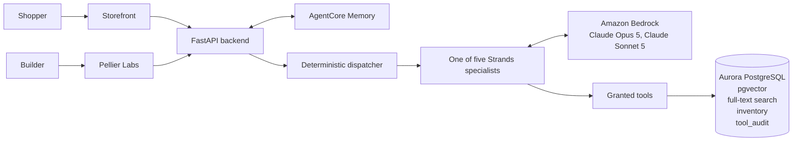

# Pellier: agentic search on Aurora PostgreSQL

A fictional retail store for learning how to ground an AI shopping agent in
PostgreSQL retrieval, live inventory, and recorded tool calls.

[](https://github.com/aws-samples/sample-pellier-agentic-search-apg/actions/workflows/quality.yml?query=branch%3Amain)
[](https://github.com/aws-samples/sample-pellier-agentic-search-apg/actions/workflows/e2e.yml?query=branch%3Amain)
[](LICENSE)

> Educational sample for an AWS workshop. It is not intended for production use
> without your own security, resilience, and compliance review.

## Which branch to use

This `main` branch holds the shorter builders session: 60 minutes and two
hands-on labs. The full governed workshop, which adds managed agent execution
and governance to the same application, is on the
[`governed` branch](https://github.com/aws-samples/sample-pellier-agentic-search-apg/tree/governed).

## What Pellier is

Pellier is a fictional artisan retailer with a 40-product catalog and three
returning shoppers: Marco, Anna, and Theo. Shoppers browse the storefront at `/`
and ask the concierge, Ask Pellier, for help in plain language. A deterministic
dispatcher sends each request to one of five Strands specialist agents, which
answer from Aurora PostgreSQL through an explicit list of Python tools. The
workbench, Pellier Labs (`/pellier-labs`), shows the routing, retrieval, tool
calls, memory, and recorded evidence behind each answer.

## The labs on this branch

### Joining the 60-minute Builders' Session

Workshop Studio provisions the AWS resources and opens this repository in Code
Editor. The session's Workshop Studio guide gives every command and result.

| Lab | Title | What you edit | Time |
|---|---|---|---|
| 1 | Compare PostgreSQL Retrieval Strategies | The two marked blocks in `workshop/retrieval.sql`: price and stock eligibility, then Reciprocal Rank Fusion | 20 min |
| 2 | Extend a Strands Agent with a Python Tool | The warehouse SQL block in `pellier/backend/services/inventory_sql.py`, then `floor_check` in the marked `INVENTORY_AGENT_TOOLS` list in `pellier/backend/agents/stock_keeper.py` | 20 min |

On this branch `workshop/retrieval.sql` ships with both blocks stubbed and the
Lab 2 files ship complete. Provisioning runs `scripts/builders_starter.py`,
which stubs the warehouse SQL and removes `floor_check` from the grant, so you
test the tool directly before you give it to Stock Keeper. The lab checks
(`retrieval`, `compare`, `tool-check`, `agent-check`) are in `scripts/builders_lab.py`.

For the optional visual retrieval comparison, open **Pellier Labs**, then
**Optional Deep Dives**, then **Performance** (`/pellier-labs/performance`). It
runs one request through four strategies: vector only, hybrid (RRF), hybrid with
rerank, and agentic filtering with rerank.

## Architecture


```mermaid
flowchart LR
    shopper["Shopper"] --> store["Storefront"]
    builder["Builder"] --> labs["Pellier Labs"]
    store --> api["FastAPI backend"]
    labs --> api
    api <--> memory["AgentCore Memory"]
    api --> dispatcher["Deterministic dispatcher"]
    dispatcher --> specialist["One of five Strands specialists"]
    specialist <--> bedrock["Amazon Bedrock<br/>Claude Opus 5, Claude Sonnet 5"]
    specialist --> tools["Granted tools"]
    tools --> aurora[("Aurora PostgreSQL<br/>pgvector<br/>full-text search<br/>inventory<br/>tool_audit")]
```

- **Dispatcher.** `pellier/backend/services/intent_router.py` picks one
  specialist per request by keyword, with no model call.
- **Specialists.** The five are Strands agents in `pellier/backend/agents/`. Style
  Advisor, Curator, and Experience Guide default to Claude Opus 5; Stock Keeper
  and Value Analyst default to Claude Sonnet 5 (`pellier/backend/config.py`).
- **Tools.** `pellier/backend/services/agent_tools.py` declares 15 `@tool`
  functions; each specialist receives an explicit list of them.
- **Retrieval.** `pellier/backend/services/hybrid_search.py` fuses pgvector and
  PostgreSQL full-text results with Reciprocal Rank Fusion, and
  `pellier/backend/services/rerank.py` reorders them with Cohere Rerank v3.5.
- **Memory.** `pellier/backend/services/agentcore_memory.py` keeps session turns
  and shopper preferences in AgentCore Memory; orders and returns stay in Aurora.
- **Evidence.** `pellier/backend/services/tool_audit_writer.py` records each
  tool call that runs, with arguments, result, and latency, in `pellier.tool_audit`.
- **Skills.** A Claude Sonnet 5 router (`pellier/backend/skills/router.py`) adds
  the relevant Markdown skills from `skills/` to the specialist's prompt.

## Run it

Smoke mode serves the production frontend with canned chat replies and no Aurora,
Bedrock, or AgentCore, so use it for UI inspection only. It needs Python 3.12 or
newer (CI uses 3.14) and Node.js 20. From the repository root:

```bash
python3 -m venv .venv
source .venv/bin/activate
python -m pip install --require-hashes -r pellier/backend/requirements.lock
(cd pellier/frontend && npm ci && npm run build)
cd pellier/backend
export PELLIER_SMOKE_MODE=true PELLIER_DISABLE_DOTENV=1
export DB_HOST=localhost DB_NAME=pellier_smoke
export DB_USER=pellier_smoke DB_PASSWORD=pellier_smoke
export AWS_REGION=us-east-1 AWS_DEFAULT_REGION=us-east-1
python -m uvicorn app:app --port 8000
```

Open <http://localhost:8000> for Pellier and `/pellier-labs` for Pellier Labs.

The full path also needs Aurora PostgreSQL with pgvector, Bedrock model access,
Cognito, and AgentCore Memory. Fill in `pellier/backend/.env` from
`pellier/backend/.env.example`. `scripts/bootstrap-labs.sh` shows the database
order: `001_schema.sql`, `scripts/seed_pellier_catalog.py --from-cache`,
migrations `002` to `013`, then `scripts/seed_tool_registry.py`.

## Repository layout

| Path | Contents |
|---|---|
| `pellier/backend/` | FastAPI app, Strands agents, tools, services, and tests |
| `pellier/frontend/` | React storefront, Pellier Labs, and Playwright specs |
| `workshop/retrieval.sql` | Lab 1 exercise |
| `scripts/` | Bootstrap, seeding, and the lab helpers `builders_lab.py` and `builders_starter.py` |
| `scripts/migrations/` | Ordered SQL migrations `001` to `013` |
| `scripts/deploy/` | Optional AgentCore Runtime, Gateway, and Policy deployment |
| `skills/` | Runtime Markdown skills |
| `solutions/` | Reference implementations; bootstrap copies several into place |
| `data/` | The 40-product catalog and its committed embedding cache |

## Tests

```bash
(cd pellier/backend && AWS_REGION=us-east-1 AWS_DEFAULT_REGION=us-east-1 python -m pytest -q)
(cd pellier/frontend && npm test -- --run && npm run type-check && npm run lint)
```

`quality.yml` runs these with the frontend build, a production dependency audit,
and shell syntax checks. `e2e.yml` serves the production build in smoke mode and
runs Playwright specs in Chromium without AWS credentials.

## Security and responsible use

- All shoppers, customers, orders, and products are synthetic.
- Workshop environments seed throwaway Cognito demo accounts for the three
  shoppers and keep the passwords in AWS Secrets Manager. Workshop use only.
- The product, persona, and hero images are AI-generated; the PNG originals
  carry C2PA content credentials that record this.
- Report security issues as described in [CONTRIBUTING.md](CONTRIBUTING.md),
  not in public GitHub issues.

## License

MIT. See [LICENSE](LICENSE) and [NOTICE](NOTICE) for the attribution terms.
