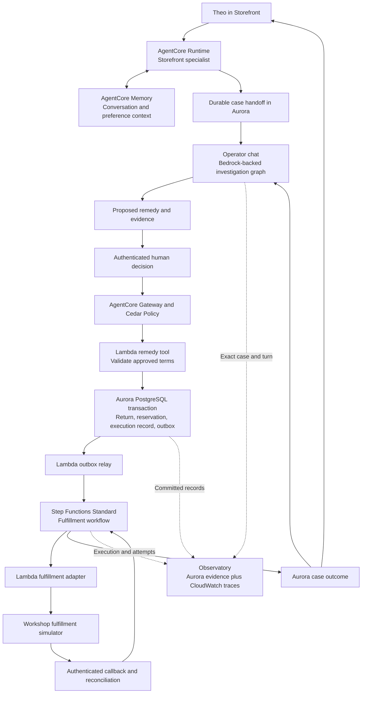

# Theo: the replacement, interrupted

Status: product design with local implementation under review on 2026-09-12.
See `scripts/deploy/REPLACEMENT_RECOVERY.md` for current validation, activation
order, and the remaining live integration gates. AWS activation and the
100-minute Workshop Studio exercise redesign remain deferred. The updated
participant scope is in `docs/L400-SEARCH-RETRIEVAL-BRIEF.md`.

## The case

Theo reports that his Wabi-Sabi Bowl arrived chipped. He wants the same piece
replaced, if possible, and asks whether he needs to send the damaged bowl back.
The operator must verify the purchase, establish the available remedy, obtain
agreement, and follow the outcome through to fulfillment.

The product scenario adds a controlled failure: Aurora commits the approved
replacement and its fulfillment request, but the response is lost. The operator
sees an interrupted request and Theo asks again. Recover the committed outcome
without creating another return, reservation, or fulfillment request.

The replacement preference, damaged-item disposition policy, constrained stock,
and injected failure are proposed scenario inputs. They are not facts established
by the current seed. The damage itself remains a customer report unless the case
contains corroborating evidence.

Jessica remains the investigation of disputed evidence: what do the records
establish, what does a support note claim, and what is fair? Theo becomes service
recovery across an interrupted business operation: what was agreed, what committed,
and what still needs to happen?

## What the current application establishes

| Current capability | Source and limit |
| --- | --- |
| Theo owns a Wabi-Sabi Bowl in the workshop seed | `scripts/migrations/003_persona_seed.sql`. Resolve the canonical customer and actual order, not the legacy `theo` alias. |
| His storefront journey ends with a chipped-bowl return request | `pellier/frontend/src/data/workshopJourneys.ts`. The shopper path prepares a human review checkpoint. |
| Governed return execution has a durable idempotency record and ownership checks | `scripts/migrations/039_return_replay_scope.sql`. Ownership is checked before returning a stored result. The function creates a return; it does not reserve or ship a replacement. |
| Operator chat supports investigation and replacement search | `pellier/frontend/src/operator/concierge/templates.ts` and `pellier/backend/services/operator_concierge.py`. Replacement search is advisory and explicitly cannot change an order or reserve stock. |
| Checkout already contains inventory reservations and a transactional outbox | `pellier/backend/services/commerce.py` and `scripts/migrations/015_proof_carrying_commerce.sql`. These are useful existing patterns, but belong to checkout and its sandbox payment flow. They are not a returns fulfillment integration. |
| The Operator investigation is a bounded Strands Graph | `pellier/backend/services/operator_graph.py`. It currently executes in the Pellier backend using Bedrock. The storefront has the AgentCore Runtime path. Preserve accurate deployment labels. |

Two production gaps matter before extending the story:

- The return function is keyed to customer and product. Bind a replacement remedy
  to an exact order line and eligible quantity; a previous purchase of the same
  product is insufficient to identify the returned item.
- `_default_recommendation` in `services/operator_review.py` adds a fixed $25
  credit suggestion and an assumed previous damaged piece for damaged returns.
  Replace that rationale with retrieved case history and an explicit discretionary
  approval. Membership alone must not determine whether damage merits a remedy.

## Proposed AWS architecture

The warehouse adapter is a declared simulator for the workshop. It lets participants
exercise an accepted request with a lost response without contacting a real carrier.
The same contract could later front a fulfillment provider.

| Boundary | Why it is here | Evidence to expose |
| --- | --- | --- |
| AgentCore Runtime and Memory | Continue Theo's shopper conversation and retain retrieved preferences. Long-term memory extraction is asynchronous; do not require an immediate new memory record to finish a turn. Memory is context, not proof of approval or shipment. | Runtime build and invocation; actual memory retrieval with its scope and record identifiers. |
| Operator graph and human review | Compare current records and propose exact terms. End the model turn before human approval. Continue through a separate authenticated request. | Reported facts versus established facts; proposed terms; approver; approval version and expiry. |
| AgentCore Gateway and Cedar | Authorize the actual tool invocation for the verified caller and permitted parameters. Tool-side grant validation and database invariants remain necessary. | Policy ALLOW or DENY, tool invocation, and correlated execution or non-execution evidence. |
| Aurora PostgreSQL | Own order eligibility, approval state, inventory allocation, idempotency, and business outcomes. Commit the remedy and outbox event together. | Exact order line, one committed remedy, reservation quantity, durable result, outbox event. |
| Lambda relay and Step Functions Standard | Recover publication after a database commit, run fulfillment, and wait for callbacks outside the model invocation. Use Standard for durable execution history and callback support. | Relay attempts, stable event ID, execution ID, provider operation ID, callback and reconciliation result. |
| CloudWatch and Observatory | Connect service execution to the human decision and database result. CloudWatch traces diagnose execution; committed Aurora rows establish business state. | Case-to-turn-to-approval-to-execution mapping; source-specific service icons; exact evidence links. |

## Commit and recovery contract

1. Read the current order line, already-returned quantity, policy, and warehouse
   availability. Treat availability as an observation until a reservation commits.
2. Persist the proposed remedy. Bind the approval to the case, requester,
   order line, quantity, chosen remedy, any credit amount, terms version, and expiry.
   The operator explicitly approves those terms. Changed terms require review again.
3. On execution, verify the caller and approval, then recheck eligibility and stock
   in the Aurora transaction. Claim a stable operation key and protect the approved
   remedy with a database uniqueness constraint so a different retry key cannot
   create a second execution. Atomically record the return, allocate replacement
   stock, consume the approval, store the result, and insert the outbox event.
4. If the response is lost, query or retry that same operation. Return the stored
   outcome to an authorized caller. Reject changed arguments and out-of-scope
   callers. If the transaction did not commit, a retry can attempt it again.
5. Publish committed outbox events with a stable event ID. The relay may publish
   more than once after a crash; workflow start and consumers must deduplicate.
   Persist the execution association instead of assuming an API timeout means the
   workflow did not start.
6. Fulfillment uses a stable provider operation key. On an ambiguous timeout,
   reconcile the provider's result before retrying or releasing the reservation.
   If a provider offers neither idempotency nor a reliable status query, route the
   ambiguous outcome to manual reconciliation.
7. Accept an authenticated callback only for the expected operation and valid state
   transition. Ignore duplicate callbacks and prevent older callbacks from moving
   a completed case backward. Do not mark an item shipped from label creation alone.

Keep database transactions short. No model call, human wait, or network call to a
fulfillment provider belongs inside a transaction. A workflow retry is not an
end-to-end guarantee that an external shipment happens once.

The post-approval worker needs a scoped service identity and a validated durable
grant. Do not depend on a shopper's access token remaining valid throughout
fulfillment, or accept a model-supplied customer ID as identity.

Damaged stock is not automatically returned to sellable inventory. The exercise
must provide a disposition rule, such as inspection, quarantine, or an approved
no-return remedy, before the agent can explain what Theo should do with the bowl.

## Fold it into the existing design

- **Storefront:** keep Ask Pellier. Show the reported damage, agreed remedy, and
  current outcome in plain language. Suggested prompts come from the case:
  "What happens next?", "Do I need to send it back?", and "Check my replacement".
  Offer each only when the corresponding workflow and evidence are available.
- **Operator:** give Theo a case entry alongside Jessica when a real case exists.
  Open the current scoped conversation. Keep the client record and current
  decision panel, adding a compact sequence of actual case events.
- **Decision panel:** separate facts, proposed remedy, human decision, and committed
  outcome. Display "Stock checked" before allocation and "Replacement reserved"
  only after allocation commits. Use "Outcome needs checking" for ambiguous
  fulfillment instead of a generic failed state that encourages duplicate actions.
- **Service evidence:** place Aurora, Memory, Gateway/Policy, and workflow icons
  beside the specific result they supplied. Link each evidence pill to that case,
  turn, or execution in Observatory. Missing evidence stays visibly unavailable.

Do not add a fourth top-level surface or a dashboard of technical fields to the
shopper's experience.

## Product checks and optional recovery extension

The required 100-minute workshop focuses on Aurora PostgreSQL search and
retrieval with AgentCore. Building an evaluation framework belongs to
AgentEats and is not a requirement here. The recovery cases below remain
product checks and possible extension material after the core retrieval path.

| Scenario | Engineering check | Objective pass condition |
| --- | --- | --- |
| Response lost after commit | Identify the ambiguous boundary and recover using the durable operation | Exactly one remedy, return, reservation, and outbox intent for the approved terms; retry returns the original result. |
| Two callers compete for the last replacement | Implement and test conditional allocation against concurrent requests | At most one reservation wins; inventory never becomes negative; the losing request cannot claim a replacement or consume a successful approval. |
| Same operation, different caller or changed terms | Test replay authorization and request binding | No stored result leaks across scope; changed arguments are rejected; no extra business mutation occurs. |
| Duplicate event or callback | Inject repeated deliveries through the workflow adapter | One fulfillment operation is accepted; repeated callbacks do not duplicate stock movements or regress state. |
| Memory claims approval, ledger does not | Supply conflicting conversation context | The assistant attributes the claim, requires authoritative approval, and never promises shipment. |

Use direct SQL assertions and exact operation identifiers when validating
these product invariants. They do not require participants to build a reusable
evaluator. A fluent answer cannot compensate for two reservations.

For the first implementation, center the recovery demo on response loss after commit.
Use the stock race as a second test of the same design. An actual Aurora failover
can be an isolated advanced rehearsal; it is not necessary to inject failure into
the shared preview cluster.

## Cedar and optional temporal policy depth

Keep Cedar as the baseline. A later Dogwood experiment could require an earlier
approval event within the same policy session. AgentCore documentation describes
Dogwood as Cedar-compatible with temporal conditions, evaluated over a supplied
policy session. That does not replace the durable approval, argument binding, or
cross-session business uniqueness in Aurora.

## Primary references checked

- AgentCore Policy concepts, including Cedar, Dogwood, and policy sessions:
  `https://docs.aws.amazon.com/bedrock-agentcore/latest/devguide/policy-core-concepts.html`
- AgentCore short-term and asynchronous long-term memory:
  `https://docs.aws.amazon.com/bedrock-agentcore/latest/devguide/memory-types.html`
- AWS transactional outbox guidance, including duplicate delivery:
  `https://docs.aws.amazon.com/prescriptive-guidance/latest/cloud-design-patterns/transactional-outbox.html`
- Step Functions Standard and Express execution semantics:
  `https://docs.aws.amazon.com/step-functions/latest/dg/choosing-workflow-type.html`
- Step Functions callback integration and task tokens:
  `https://docs.aws.amazon.com/step-functions/latest/dg/connect-to-resource.html`
- AgentCore sessions, traces, spans, and instrumentation:
  `https://docs.aws.amazon.com/bedrock-agentcore/latest/devguide/observability-telemetry.html`
