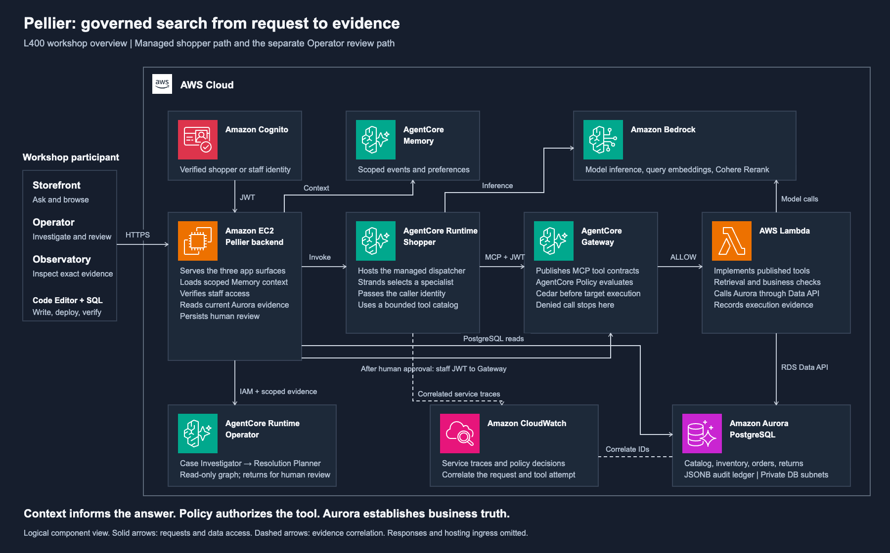
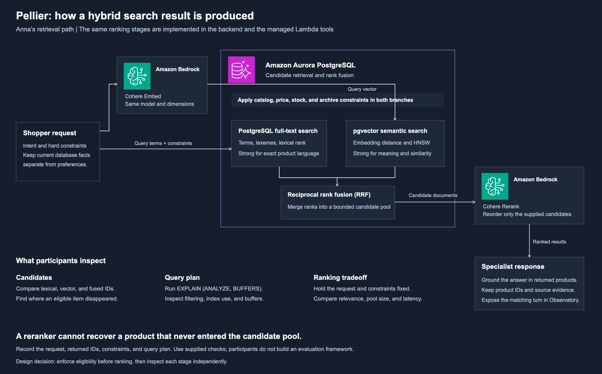

# Pellier governed architecture

Architecture assets for the overview and background of the revised 100-minute
L400 workshop. These diagrams describe the inspected application architecture.
They are not proof that a particular local or hosted environment is available.

## Deliverables

- [Editable PowerPoint](pellier-governed-architecture.pptx): two diagrams, with
  editable labels, boundaries, connectors, original SVG icons, and speaker notes.
- [Managed application overview, SVG](pellier-governed-overview.svg) and
  [PNG](pellier-governed-overview.png).
- [Hybrid retrieval detail, SVG](pellier-retrieval-flow.svg) and
  [PNG](pellier-retrieval-flow.png).
- [Icon provenance](icon-provenance.json): source deck, slide numbers, and hashes.

The icons come from the user-supplied
`AWS-Architecture-Icons-Deck_For-Dark-BG_07312026.pptx`. The original deck is
unchanged. Service icons retain their original SVG bytes, colors, aspect ratio,
and predefined 80-pixel size. The AWS Cloud group icon is 40 pixels. Service
labels use Arial at 12 points in PowerPoint. The diagrams use dark backgrounds
and straight or orthogonal connectors with open arrowheads.

## Read the overview

| Component | Its job in the required workshop |
| --- | --- |
| Pellier on Amazon EC2 | Serve Storefront, Operator, and Observatory; coordinate requests and scoped context. Verify staff access, read scoped evidence, and persist human checkpoints. |
| Amazon Cognito | Establish the verified shopper or staff identity. Choosing a persona does not establish that identity. |
| Amazon Bedrock AgentCore Runtime | Separate shopper and Operator endpoints. Shopper JWT continues to Gateway; the backend invokes the read-only Operator graph with IAM. |
| AgentCore Memory | Store and retrieve scoped conversation context and extracted preferences. It does not establish current stock, order ownership, approval, or shipment. |
| AgentCore Gateway and Policy | Publish the MCP tool contract and evaluate Cedar before target execution. A policy allow does not bypass business constraints. |
| AWS Lambda | Implement the published tools, call RDS Data API, and record execution evidence. |
| Amazon Aurora PostgreSQL | Own catalog, inventory, customer, order, return, and audit records. Enforce database constraints. |
| Amazon Bedrock | Supply model inference, query embeddings, and Cohere Rerank. |
| Amazon CloudWatch and Observatory | Correlate the service decision and execution evidence with exact turn, attempt, and record IDs. |

This is a logical component view. It intentionally omits CloudFront and other
hosting ingress details, individual availability zones, and the complete VPC
topology. The database remains private. Early labs also inspect the in-process
application tools; the managed shopper path shown here uses Runtime, Gateway,
Lambda, and RDS Data API.

The backend retrieves scoped Memory context before invoking Runtime in the
inspected implementation. Do not read the diagram as Runtime automatically
retrieving every Memory record. The Operator graph investigates and proposes;
an authenticated human decision and the subsequent governed action are separate
requests.

Dashed connectors denote evidence correlation. They do not imply that Aurora
exports business rows to CloudWatch. Observatory reads and relates the relevant
records and service evidence.

## Explain the retrieval decisions

Full-text search contributes exact language matches. Vector retrieval contributes
semantic candidates. SQL applies eligibility predicates in both branches.
Reciprocal rank fusion combines ranked lists without treating lexical scores and
vector distances as comparable units. Cohere Rerank then orders the supplied
candidate documents against the original request.

Ask participants to locate a missing item before tuning the reranker. Was the
item ineligible? Did approximate search miss it under the filter? Was the
candidate pool too small? A later stage cannot rank an item it never received.
Use returned IDs and `EXPLAIN (ANALYZE, BUFFERS)` to support the explanation.

The application and managed tools have separate implementations with a shared
intended contract. A revised live retrieval exercise must preserve eligibility
and validate parity across the paths.

## Source anchors and authoring limits

- `pellier/backend/agentcore_runtime.py`: managed entrypoint, token forwarding,
  dispatcher invocation, and executed build identity.
- `pellier/backend/services/agentcore_gateway.py`: tool discovery and specialist
  catalog.
- `pellier/backend/services/chat.py`: request coordination and scoped context.
- `pellier/backend/services/operator_graph.py`: shared graph implementation; `operator_agentcore_runtime.py` is its managed entrypoint.
- `pellier/backend/services/hybrid_search.py`: lexical and vector fusion.
- `pellier/backend/services/rerank.py`: Bedrock Rerank API call and fallback.
- `scripts/deploy/pellier_search_server.py`: managed search tools and RDS Data API.
- `WORKSHOP.md`: existing participant builds and evidence contracts.

The [revised curriculum brief](../L400-SEARCH-RETRIEVAL-BRIEF.md) proposes a live
retrieval build because the current Lab 2 worksheet only reconstructs recorded
RRF scores. The diagrams do not implement that change. Theo's fulfillment
recovery, Step Functions workflow, and replacement action are outside this
required search path.

Import the assets into Workshop Studio with the guide rewrite and timed
rehearsal. Creating these local files does not publish Workshop Studio.
