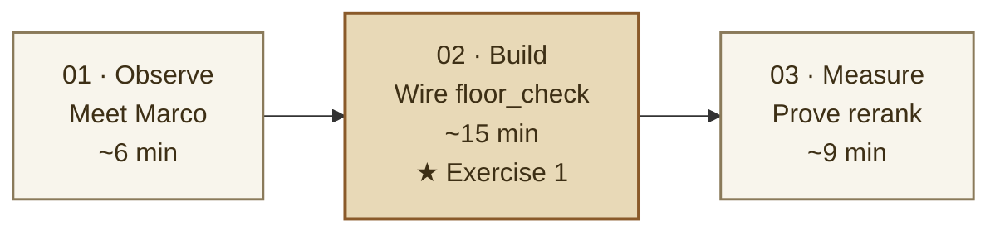

:::alert{type="info"}
**Time:** ~30 min  
**Exercises:** 1 (the only build moment in the session)  
**Code surface:** `pellier/backend/services/agent_tools.py`
:::

This is where your hands get on the keys. Five Strands specialists are already wired into a single FastAPI process on `:8000`. **One tool body – `floor_check` – is left for you.** Everything else is production-shaped: the same orchestrator, the same Aurora pgvector index, the same Cohere reranker your laptop would run.

By the end of the act, **Marco's Turn 4 lands against live warehouse data** and you have measured, for Anna's anchor query, whether hybrid + rerank earned its latency.

The Boutique is the storefront a shopper sees. Behind the cream paper
and the editorial photograph, five specialists are listening, a
1024-dim Cohere v4 vector index is warm, and a tool registry is
waiting to be asked.

Marco walks in first. Three of his five turns land cleanly; **Turn 4
breaks** because the warehouse tool he needs is a stub. You wire it.
Then **Anna** asks something messier – and you measure whether
hybrid + rerank earned its cost while editing the skill that shapes
her answer.

---


:::alert{type="info" header="Pattern to borrow"}
This act uses Pellier to name three reusable production patterns: a domain-corpus retriever (`find_pieces` over product copy), a deterministic system-of-record read (`floor_check` over warehouse inventory), and a measurement seam (`vector` vs `hybrid` vs `rerank`) that lets you decide whether relevance quality earns the latency.

In another stack, the corpus might be policies, claims, tickets, manuals, or contracts; the system of record might be eligibility, account standing, bed capacity, part availability, or asset telemetry. The architecture is the same even when the nouns change.
:::

## The arc



---

## Learning objectives

By the end of Act I you will be able to:

1. **Read the anatomy of a Strands specialist** – model, instructions,
   skills, tools, state, telemetry – and know which lever to pull when
   an answer goes wrong.
2. **Wire a Strands `@tool` body** that bridges agent intent to a real
   Aurora source of truth, using `BusinessLogic.floor_check()` against
   `pellier.warehouse_inventory`.
3. **Decide per-query-class** whether `vector` vs `hybrid (RRF)` vs
   `hybrid + rerank` earns its latency, using the Atelier's three-way
   comparison against the live catalog.

---

## Core concepts ladder

A taste of the technical territory underneath the build, in the order
you'll meet it:

| Concept | What you'll see |
|---|---|
| **Strands SDK anatomy** | `Agent`, `@tool`, system instructions, skills as markdown playbooks, telemetry on every turn |
| **Aurora pgvector retrieval** | HNSW index, 1024-dim Cohere Embed v4, cosine similarity, sub-100 ms vector recall |
| **Hybrid retrieval with RRF** | pgvector cosine + Postgres FTS (`tsvector` + GIN + `ts_rank_cd`), merged via Reciprocal Rank Fusion *without* normalizing raw scores |
| **Cohere Rerank v3.5** | Cross-encoder reordering of the merged candidate pool for the exact user phrasing |
| **Production tuning knobs** | `hnsw.iterative_scan` for filtered recall, `halfvec` for storage footprint, `binary_quantize(...)` for compact coarse retrieval – named, not exercised |

---

## What you'll do

| Page | Activity | Time | Exercise |
|---|---|---|---|
| [01: Meet Marco](01-meet-marco/) | Click 5 hero pills; spot the broken one | ~6 min | – |
| [02: Wire `floor_check`](02-wire-floor-check/) | Replace one stub body so Stock Keeper reads Aurora | ~15 min | **Exercise 1** |
| [03: Prove rerank earns its cost](03-prove-rerank/) | Compare 3 retrieval strategies; make the analyst's call | ~9 min | – |

---

:::alert{type="warning" header="Exercise 1: the build moment in Act I"}

**`floor_check` tool body**  *(in 02-wire-floor-check)*
Replace the stub between the `START` / `END` markers in
`pellier/backend/services/agent_tools.py`. Marco's Turn 4 lands
against live warehouse data after you save.
**⏩ Out of time?** A one-line `cp` from `solutions/closing-marcos-gap/`
swaps in the reference implementation – the act still completes.

Act II has a second exercise (an observability hook on the managed
Runtime) – see [Act II: The Ledger](/20-act-2-the-ledger/).

:::

---

## What you'll have shipped

```text
   13/13 tools shipped       → floor_check has a sage "Shipped" pill
   Marco Turn 4 lands         → Brooklyn (BK-01), real quantity, real ship window
   Anna's anchor measured     → vector vs hybrid vs hybrid+rerank, side by side
   the analyst's call         → did rerank earn its latency for this query class?
```

::::expand{header="Who's on the floor (the cast)"}

If you need a quick reminder of which specialist answers what, the
Appendix has a one-page reference: [The Cast](/90-appendix/01-reference/#the-cast).

::::

:::alert{type="success" header="Begin Act I"}
[Meet Marco →](01-meet-marco/)
:::
