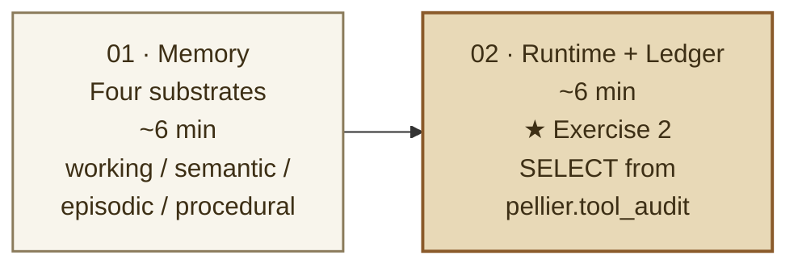

:::alert{type="info"}
**Time:** ~12 min  
**Exercises:** 1 mandatory (Aurora SQL ledger query against `pellier.tool_audit`) + 1 optional (`logger.info` observability seam)  
**Surfaces:** `/api/agent/session/{id}` (working memory) · `/api/agent/chat` (Runtime) · `pellier.tool_audit` (Aurora)
:::

Act I proved the agent can call a real Aurora-backed tool. Act II proves the same system across platform seams: **AgentCore Memory** keeps the session timeline, **AgentCore Runtime** owns managed invocation, and **Aurora PostgreSQL** keeps durable tool evidence you can query with SQL.

You do not need prior AgentCore experience for this act. Treat AgentCore as the managed platform around an agent you already met in Act I:

- **Memory** stores the session evidence the agent needs on the next turn.
- **Runtime** exposes the same orchestrator behind a managed invocation endpoint.
- **Identity** is the production trust boundary; Cognito user identity plus AgentCore Identity workload credentials are part of the prewired managed path, and this session focuses on observing that seam.
- **Gateway and MCP** are the managed tool-hosting path; this lab keeps that as an Act III read so Act II can stay focused on memory, runtime, policy, and evidence.

Every good boutique keeps a ledger: a quiet record of what happened, in order, that an operator can reopen later. Pellier has two ledgers in this act:

1. **Session timeline:** AgentCore Memory stores ordered turns for the current session. You read that timeline from `/api/agent/session/{session_id}` and prove it survives a page reload.
2. **Tool evidence:** Aurora stores tool-call evidence in `pellier.tool_audit`. You generate a policy-gated Theo turn, then read the row back with SQL so you can inspect arguments, result, latency, and timestamp.

:::alert{type="info" header="For a mixed audience"}
If AgentCore is new to you, focus on the artifact each service exposes: a memory record, a Runtime event stream, and an Aurora row. If you already operate production systems, focus on the control boundary: which platform owns state, which endpoint owns execution, and which database row lets you reconstruct behavior after the fact.
:::

:::alert{type="info" header="Pattern to borrow"}
The two ledgers answer different operator questions. **Working memory** answers: *what did this session say to the agent, in order?* **`tool_audit`** answers: *what did the agent do, with what arguments, result, and latency?* The same pattern maps to claim updates, dispute workflows, eligibility checks, RMAs, work orders, exception queues, and any tool action a human may need to reconstruct.
:::

---

## The arc



---

## Learning objectives

By the end of Act II you will be able to:

1. Prove that **AgentCore Memory-backed working memory** persists Marco's turns within a session and rehydrates after a page reload.
2. Locate the four memory substrates Pellier wires together: *working*, *semantic*, *episodic*, and *procedural*.
3. Invoke a pre-launched **AgentCore Runtime** through `/api/agent/chat` and read the SSE sequence: `session` → `chunk` → `done`.
4. Run one `SELECT` against `pellier.tool_audit` to reconstruct a Cedar-allowed tool call from Aurora.
5. Use PostgreSQL JSONB operators (`->`, `->>`) to inspect structured tool arguments and results.
6. Explain why production agent systems need durable evidence in addition to logs and trace chips.

---

## Core concepts ladder

| Concept | Plain-English meaning | What you will see |
|---|---|---|
| **AgentCore Memory** | Managed session and memory storage for agent applications | `AGENTCORE_MEMORY_ID`, namespace-scoped session events, `/api/agent/session/{id}` |
| **Working memory (AgentCore STM)** | The current conversation timeline, not a generated summary | Ordered user/assistant turns |
| **Memory substrates** | Different memory stores for different lifetimes and questions | Working, semantic, episodic, procedural panels in Atelier |
| **AgentCore Runtime** | Managed execution boundary for the same orchestrator code | `@app.entrypoint`, `/api/agent/chat`, SSE events |
| **Cedar policy seam** | Authorization check before a tool action runs | Theo's damaged-return turn exercises `process_return` |
| **Aurora ledger** | Durable tool-call evidence | `pellier.tool_audit`, JSONB args/result, latency, `created_at` |
| **Identity seam** | Where anonymous sessions become signed-in, user-scoped sessions | `anon-{session_id}` vs `user-{cognito_sub}-session-{session_id}` |

---

## What you'll do

| Page | Activity | Time | Exercise |
|---|---|---|---|
| [01: Memory – four substrates](01-memory-substrates/) | Generate two turns, read working memory back from the API, prove continuity on reload, then locate the other three substrates in the Atelier. | ~6 min | – |
| [02: AgentCore Runtime + Aurora ledger](02-agentcore-runtime/) | Invoke the managed endpoint, then `SELECT` from `pellier.tool_audit` to reconstruct what the agent did. | ~6 min | **Exercise 2** |

---

## What you'll have proved

```text
   Working memory persists    → /api/agent/session/{id} returns ordered turns
   Working memory reload      → conversation rehydrates from the same session id
   Four substrates are wired  → Atelier Memory shows working / semantic /
                                episodic / procedural evidence
   Runtime is reachable       → SSE: event: session → event: chunk → event: done
   Aurora is system-of-record → SELECT from pellier.tool_audit returns the
                                process_return row: args, result, latency
   JSONB extraction works     → result->>'return_id' returns the inserted row id
                                without parsing JSON in application code
   Same agent, two surfaces   → /api/chat/stream (in-process) and
                                /api/agent/chat (managed Runtime)
```

:::alert{type="warning" header="Exercise 2: the build moment in Act II"}
**Aurora SQL ledger query against `pellier.tool_audit`** *(in 02-agentcore-runtime)*

Fire Theo's damaged-return turn through `/api/agent/chat`, then run one `SELECT` to recover the `process_return` row: arguments, result, latency, and timestamp from a single Aurora query. This is what "Aurora as agent system-of-record" looks like in practice. The optional `logger.info` seam is a second receipt, not the required proof.
:::

:::alert{type="success" header="Begin Act II"}
[Memory: four substrates →](01-memory-substrates/)
:::
