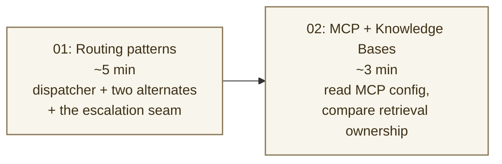

:::alert{type="info"}
**Time:** ~8 min  
**Exercises:** 0 (operator-grade read)  
**Surfaces:** Atelier → Routing · `/api/chat/stream` · `/api/agent/chat` · MCP server config
:::

Every boutique needs a concierge: someone who decides which specialist should answer before the customer ever sees a hesitation. **Act I built the agent. Act II proved the managed runtime and the ledger. Act III is the operator's read of the room.**

Marco's warehouse question is not Anna's gift question; Anna's gift question is not Theo's returns question. Behind the calm storefront, a **dispatcher** reads intent and hands the turn to one specialist – fast, cheap, auditable. You will watch that routing decision in the Atelier, then read the **MCP** and **Knowledge Bases** seams that carry the same patterns into larger enterprise stacks.

A boutique with five specialists has a quiet decision to make on every
turn: *who answers this one?*

Three orchestration patterns ship in the codebase: the dispatcher behind
Marco's turns (production), plus two alternates exposed as toggles so
you can read the shape of each without redeploying. The final page then
steps one level out: MCP is how tool contracts become portable, and a
knowledge base is how document-heavy retrieval becomes an owned platform
capability rather than hand-rolled query code.

---

## The arc



---

## Learning objectives

By the end of Act III you will be able to:

1. **Read the Dispatcher + specialists pattern** as the production
   default for storefront concierge work, and explain why it beats an
   LLM router on predictability, latency, and cost for curated intents.
2. **Recognize the two-routers-one-turn shape**: an **intent router**
   picks the specialist, and a **skill router** picks the persona
   overlay. Wrong specialist and wrong voice are different bugs.
3. **Match pattern to problem** across Dispatcher, Agents-as-Tools,
   Graph, AgentCore Runtime, Gateway semantic search, MCP, and
   Knowledge Bases without reaching for the most powerful pattern by
   default.
4. **Use embedding-based tool discovery** as the upgrade path for
   catalog-scale capabilities (hundreds of tools), not as the default
   per-turn router for curated storefront intents.
5. **Read the MCP contract** that exposes Aurora to any MCP-aware host
   (your IDE, Claude Code, Strands, or Bedrock AgentCore Gateway), and
   explain how the same retrieval layer could also be exposed through a
   knowledge-base pattern such as Bedrock Knowledge Bases, an
   OpenSearch-backed search layer, or a custom pgvector service.

---

## Core concepts ladder

The orchestration territory appears in this order in the Atelier:

| Concept | What you will see |
|---|---|
| **Dispatcher pattern** | `classify_triage` (rules) → `classify_intent` (keyword map) → one specialist · ~60–120 ms · one model call per turn |
| **Two routers per turn** | `classify_intent` picks specialist; `POST /api/atelier/skills/route` picks persona overlay such as `the-gift-table` |
| **Agents-as-Tools** | A Haiku orchestrator treats specialists as `@tool`. Useful for teaching multi-agent routing |
| **Graph** | Explicit edges for multi-step workflows where order matters |
| **AgentCore Runtime as deploy boundary** | Same orchestrator, managed execution boundary, ops-owned deploy contract |
| **Gateway semantic search for tools** | Embed tool descriptions; retrieve by cosine when the registry is too large to stuff into a prompt |
| **MCP as a protocol** | A process speaking JSON-RPC over stdio that any MCP-aware host can drive against Aurora |
| **Knowledge Bases** | Managed or platform-owned retrieval over a document-heavy corpus. Bedrock Knowledge Bases is one AWS option; build-it-yourself pgvector is the option you exercised in this lab |

---

## What you will do

| Page | Activity | Time |
|---|---|---|
| [01: Routing patterns](01-routing-patterns/) | Read the live dispatcher, the two-routers seam, human escalation, and the decision tree | ~5 min |
| [02: MCP and Knowledge Bases](02-mcp-and-knowledge-bases/) | Read the MCP config wired against Aurora, verify the server, and compare build-it-yourself retrieval with knowledge-base options | ~3 min |

---

## What you will have read

```text
   the dispatcher              → keyword classify → one specialist, ~60–120 ms
   the two-routers seam        → intent vs skill (different bugs, different fixes)
   the escape hatch            → escalate when no tool would be honest
   the upgrade path            → rules → small classifier / Haiku T=0 → embedding discovery
   the MCP contract            → JSON-RPC process over stdio, --readonly True, same Aurora
   the knowledge-base pattern  → managed/document retrieval when ingestion and chunking matter
   the closing loop            → question → retrieval → specialist → memory → Runtime → evidence
```

:::alert{type="info" header="Pattern to borrow"}
The dispatcher pattern is rules-first routing: predictable, cheap,
auditable, and usually one model call per turn. In Pellier that means a
keyword map to five specialists. In another stack it could route a
contact-center turn, claims intake, IT ticket, manufacturing work order,
or public-sector case to the right specialist. Reach for an LLM router
only when deterministic routing genuinely runs out; reach for
embedding-based tool discovery only when the tool registry is too large
to enumerate.
:::

:::alert{type="info" header="Why end the workshop on routing?"}
Routing is the architectural choice that pays off only after you have
lived inside one specialist (`floor_check`) and one platform boundary
(AgentCore Runtime). Ending here gives participants the operator frame:
you do not pick the most powerful pattern. You pick the one whose
predictability, latency, cost, and auditability match the turn you are
serving.
:::

:::alert{type="success" header="Begin Act III"}
[Routing patterns →](01-routing-patterns/)
:::
