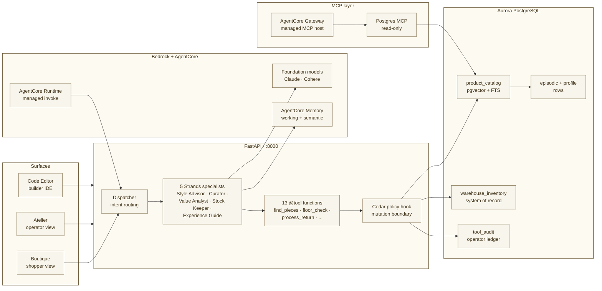

:::alert{type="info"}
**Level:** 400 (Expert)  
**Duration:** 60 minutes  
**Format:** Guided build + architecture walkthrough  
**Outcome:** Build and inspect a production-shaped agentic search system with persistent memory, tool use, routing, observability, and managed runtime invocation on Aurora PostgreSQL and Amazon Bedrock AgentCore.
:::

## Welcome to Pellier

Pellier is a small editorial boutique with one quiet promise: *a shopper asks in their own words, and the right pieces find them.*

In this workshop, that promise becomes a working agentic system. You will use Aurora PostgreSQL with pgvector for retrieval, combine semantic and keyword signals through hybrid search, rerank results for relevance, route requests through specialist agents, preserve short-term memory across turns, and invoke the orchestrator through an AgentCore Runtime endpoint.

:::alert{type="success" header="What you will walk away with"}
By the end of the session, you will understand how to move from a classic RAG search box to an agentic search architecture that can retrieve, reason, remember, use tools, enforce policy, and expose operator evidence.
:::

## Why this workshop

Many teams already have a Retrieval-Augmented Generation (RAG) application: a corpus, embeddings, a vector index, and a prompt that grounds an answer. The next production step is deciding what happens when retrieval is not enough.

Pellier makes that step concrete. You will keep the retrieval foundation, then add the seams that make an agentic application operational: deterministic tools over systems of record, session memory, dispatcher-style routing, policy-aware tool execution, managed invocation, and an evidence trail an operator can inspect.

The domain is retail, but the pattern is portable. In your environment, Pellier's product catalog might be clinical protocols, policy documents, service manuals, claims, contracts, tickets, product reviews, or operational records.

## System architecture

## Learning outcomes

By the end of this workshop, you will be able to:

- Explain how Pellier combines **Aurora PostgreSQL**, **pgvector**, **hybrid retrieval**, **reranking**, **specialist agents**, **memory**, and **runtime invocation** into one agentic search architecture.
- Build and validate a local development loop in **Code Editor** without losing sight of the managed services behind the lab.
- Wire a **Strands** `@tool` body to a real **Aurora** system-of-record table and verify the result from the shopper and operator views.
- Compare **vector search**, **hybrid retrieval**, and **reranking** as query-class decisions rather than defaults.
- Inspect **AgentCore Memory**, **AgentCore Runtime** events, routing decisions, and Aurora `tool_audit` rows as production evidence.
- Describe how **Model Context Protocol (MCP)**, **AgentCore Gateway**, **Cedar** policy, and **Knowledge Bases** fit into a production-oriented agent workflow.
- Translate the Pellier retail example into your own domain: healthcare operations, financial services, manufacturing, public sector, software operations, or another corpus-plus-tools workload.

## Prerequisites

You will move faster if you are comfortable with:

- AWS Workshop Studio and basic AWS console navigation.
- Terminal commands, environment variables, and reading logs.
- Python 3.10+ syntax, decorators, and basic async flow.
- PostgreSQL basics: `psql`, tables, indexes, JSONB, and simple `SELECT` statements.
- RAG concepts: embeddings, vector search, semantic similarity, and grounded generation.
- API and application architecture concepts such as request routing, authentication boundaries, and observability.

The workshop environment is pre-provisioned. You do not need to install packages locally or deploy infrastructure from scratch during the session.

## Module map

| Section | Focus | Time |
|---|---|---|
| [Introduction](/00-introduction/) | Open the environment, understand the surfaces, and frame the architecture. | ~5 min |
| [Act I: The Boutique](/10-act-1-the-boutique/) | Local development: observe Marco, wire `floor_check`, and measure retrieval quality. | ~30 min |
| [Act II: The Ledger](/20-act-2-the-ledger/) | Platform evidence: validate memory, invoke Runtime, and read the Aurora audit ledger. | ~12 min |
| [Act III: The Concierge](/30-act-3-the-concierge/) | Production patterns: routing, MCP, and managed RAG with Knowledge Bases. | ~8 min |
| [Summary and conclusion](/40-close/) | Close the loop and map the architecture back to your own stack. | ~3 min |
| [Appendix](/90-appendix/) | Reference, troubleshooting, portability maps, and facilitator notes. | Optional |

::::alert{type="success" header="Start here"}
[Introduction →](/00-introduction/)
::::
