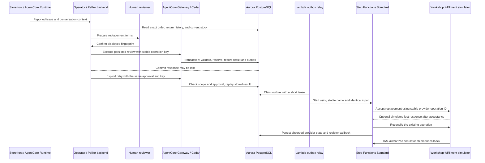

# Theo replacement recovery

**Paused checkpoint, September 12, 2026.** This is work in progress. The source
builds, but the new recovery path has not been activated or verified against
Aurora and the managed Gateway. Final browser review is also pending.

The six earlier backend contract failures have been reconciled. The focused
run passed 251 tests with one skipped. The subsequent full run was interrupted
at the user's next pause, so it does not establish a complete regression pass.
The new local TLS configuration tests still need their focused run.

The local SSM path now requires `verify-full`, the remote Aurora hostname, and
the AWS RDS CA bundle while connecting through loopback. A direct connection
negotiated TLS 1.3 with certificate verification. Read-only AWS inspection found
the instance private and database ingress restricted to one security-group
source, with no world-open database rule. No security groups were changed.
A follow-up verification stopped at an unsupported `rds.force_ssl` query before
checking the app pool or the negative hostname case; those checks remain open.

Theo's labelled browser fixture was inspected at 1440px and 1024px with no
horizontal overflow; the exact replacement evidence link and return path worked.
This fixture review does not prove live authorization or replacement execution.

Frontend type checking, lint, build, and production dependency audit passed.
The full frontend run had three expectation failures; those expectations were
corrected, and all 92 tests in the two affected files passed on recheck.

This is the application implementation and activation contract. The 100-minute
L400 lab design follows the product review. Its per-persona component tables,
participant builds, timing, and evaluation instructions are deliberately deferred.

The operator records reported damage against an exact order and quantity. A
separate human decision approves the terms. The managed Gateway authorizes
`replace_damaged_item`, and Aurora validates the approval, order scope, remaining
return quantity, and stock inside one transaction.

AgentCore Memory supplies conversation context. It cannot prove approval,
reservation, or shipment. The Operator graph runs in the Pellier backend.
Observatory reads the exact persisted operation through the operator-authorized
API; it does not infer shipment from workflow success or a model answer.

## Invariants and deliberate tradeoffs

- One approved review produces at most one replacement. A second key cannot
  consume the same review again. A changed fingerprint, order, quantity, reason,
  or disposition fails validation.
- Customer scope is checked before returning a stored result. An idempotency key
  grants no data access.
- The return, stock decrement, replacement, shared write result, outbox, and
  initial event commit together. Execution receipts can reconstruct the domain
  return through the existing `write_operations` join.
- Approval expires 24 hours after the decision for first execution. A completed
  operation can still be recovered with the same currently approved terms.
- Damaged goods require inspection and are not restocked. Historical returns
  without an exact order are conservatively counted against eligibility.
- Order, write-key, catalog, and warehouse locks serialize competing mutations.
  The catalog lock agrees with the existing return and checkout paths. This
  simplifies aggregate stock consistency at the cost of concurrent throughput
  for one popular SKU; measure contention before changing that lock strategy.
- The relay commits its lease before calling Step Functions. A lost start
  response is recovered using the same execution name and byte-identical input.
  `ExecutionAlreadyExists` requires an input check against the existing run.
- The provider operation ID is stable. A duplicate dispatch does not create a
  second simulated fulfillment. Late attempts cannot regress accepted or shipped
  state to unknown.
- Callback registration and shipment publication lock the same replacement row.
  Shipment before registration and registration before shipment both work. Task
  tokens remain in a worker-only table and never enter UI evidence or logs.
- `OUTCOME_UNKNOWN` means the commit response was interrupted. It is neither a
  rollback claim nor a success claim. “Recover this approved action” reuses the
  same review and key; it may execute the still-valid action if nothing committed.

The fulfillment adapter is explicitly a simulator. The implementation has no
real carrier, automatic cancellation, stock-release flow, or promise of a
shipping date. `NeedsReview` ends with an operator-review resolution and is not
shipment proof. The worker role has no stock or approval write privileges.

## Activation order

Source and UI checks do not activate this path. Apply changes only after the
local product review and approval to update the chosen AWS deployment.

1. Apply `scripts/migrations/052_replacement_recovery.sql` using the existing
   migration procedure. It adds tables, a worker role, functions, and two
   constraint extensions. It does not seed a claim that Theo already reported
   damage or modify existing orders and stock.
2. Package and update the experience target Lambda with the existing
   `deploy_lambda.py` workflow. The package includes
   `common/replacement_contract.py`.
3. Update the existing Gateway target from `gateway_tool_schemas.py` and install
   the rendered `replace_damaged_item_staff_scope` Cedar permit. Keep Gateway
   enforcement enabled. Verify shopper denial, staff authorization, and a
   database refusal for an unapproved review independently.
4. Package `replacement_worker.py`, `common/__init__.py`, and `common/dataapi.py`
   at those exact relative paths in a ZIP. Upload it to the deployment's
   artifact bucket under a new immutable key.
5. Create a change set from `replacement-workflow.template.json` with the chosen
   artifact, Data API cluster, secret, and database. Inspect the Lambda, Standard
   workflow, IAM, logs, and scheduled relay changes before execution.
6. Use a database login that can assume `pellier_fulfillment`. The migration
   grants that role to the migration owner for the workshop account. For a
   separate deployment login, grant this role explicitly instead of giving
   stock or approval write access. If the chosen secret uses a customer managed
   KMS key, its decrypt permission must also be included in that deployment's
   worker policy.
7. Verify the integration gates below with isolated, clearly labelled test
   orders. Then review Theo's live path without substituting fixture evidence.

The template defaults `SimulateLostResponse` to `false`. Setting it to `true`
loses the simulator response **after provider acceptance commits**; the workflow
then reconciles. The target's lost Aurora commit-response path is exercised by
the transport unit test and needs a controlled transport failure during the
integration rehearsal. No public shopper argument enables fault injection.

An IAM-authorized invocation of the deployed worker with
`{"action":"record_shipment","replacementId":"<the existing UUID>"}` records a
simulated shipment and signals the registered workflow callback. It never names
a new operation or accepts a callback token from the shopper.

## Verification and remaining live gates

Hermetic tests cover proposal-only behavior, exact scope, approval fingerprint
parity, role binding before SQL, ambiguous commit classification, rollback and
attempt recording, input validation, stable outbox retries, monotonic provider
state, and shipment-before-registration handling.

AWS `ValidateTemplate` and `ValidateStateMachineDefinition` validate the
CloudFormation and ASL shapes without deploying anything. They do not establish
runtime IAM, database privileges, or fulfillment behavior.

Before calling the live integration verified:

| Scenario | Required authoritative result |
|---|---|
| Approved first execution | One exact-order return, one stock decrement, one replacement, one completed write result, one outbox event |
| Commit succeeds; response is lost | Same key recovers the same IDs; all counts and stock remain unchanged |
| Two approved orders compete for the final unit | Exactly one commits; no negative stock and no partial return or outbox for the refused caller |
| Replay from another customer scope | No result disclosure and no new writes |
| Changed terms or a new key for an already consumed review | Refusal; no second remedy |
| Declined, missing, or expired first-use approval | No stock, return, or outbox effect |
| Duplicate relay delivery / lost StartExecution response | Same execution identity and provider operation |
| Duplicate, early, and expired shipment callbacks | One durable shipment outcome; no state regression or exposed task token |
| Worker interruption / workflow timeout | Explicit unresolved record and an operator follow-up, never a fabricated shipment |

Keep SQL row counts, inventory deltas, receipt IDs, execution ARN, and provider
operation ID with the rehearsal result. Unit tests and browser fixtures cannot
prove database concurrency or a managed Cedar decision.

## AWS references

- Standard execution idempotency and its 90-day name reuse window:
  https://docs.aws.amazon.com/step-functions/latest/apireference/API_StartExecution.html
- Callback task tokens:
  https://docs.aws.amazon.com/step-functions/latest/dg/connect-to-resource.html
- Transactional outbox pattern:
  https://docs.aws.amazon.com/prescriptive-guidance/latest/cloud-design-patterns/transactional-outbox.html
- Data API transaction failures:
  https://docs.aws.amazon.com/AmazonRDS/latest/AuroraUserGuide/data-api.troubleshooting.html

The outbox and provider key remain durable beyond Step Functions execution
history. A stale, unpublished event near the execution-name retention window
needs operator investigation before re-delivery; execution naming alone is not
permanent deduplication.
