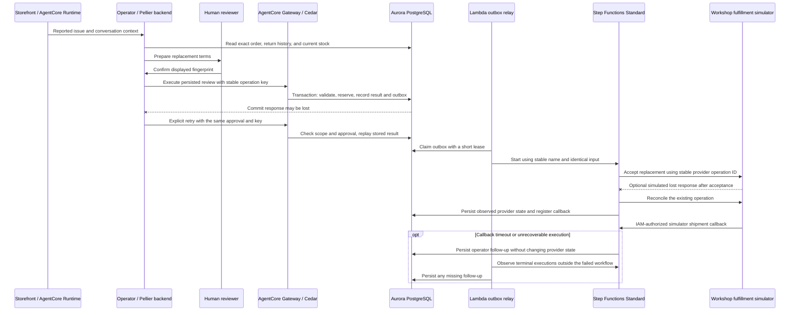

# Theo replacement recovery

**Local product review, September 12, 2026.** The source and labelled browser
review are ready for user review. The replacement migrations, managed tool
update, Cedar permit, worker, and workflow have not been activated on Aurora.
No Workshop Studio content or hosted app has been published by this pass.

The local SSM path requires `verify-full`, the remote Aurora hostname, and the
AWS RDS CA bundle while connecting through loopback. Direct connections and
the observed app-pool sessions negotiated TLS 1.3. A deliberately incorrect
hostname was rejected. On the later connection pass, a stalled SSM child was
stopped after checking ownership; the existing launcher reopened it, and the
backend pool was refreshed. AWS confirmed `dat4xx-labs-test` was available,
with no public instance, one database security-group source, and no IPv4 or
IPv6 CIDR sources. No security groups changed.

The health route now uses the pool's live checkout probe without business-query
setup, runs its synchronous Bedrock check off the API event loop, and returns
503 for a degraded dependency. Vector adapters register once per physical
connection; every business checkout still reasserts strict iterative scanning.
Live health checks returned healthy in about one second. The live storefront
read returned 60 products; a repeated read took 6.82 seconds compared with
24.21 seconds before the adapter reuse change. Cold reads can still take over
20 seconds on the flight connection. These checks do not establish server-wide
`rds.force_ssl` or sustained network availability.

A fresh browser tab without fixtures showed Concierge online. Operator showed
the expected sign-in requirement, not an unavailable state; authenticated
Operator records still require the user's Cognito session.

The labelled Theo fixture was inspected at 1440, 1024, 768, and 390 pixels with
no horizontal overflow or clipped controls. The care form posts only a proposal;
explicit recovery sends the persisted review ID and expected fingerprint.
An interrupted response requires a refresh. Opening the client or its saved
chat submits no action. Care and chat link to the exact customer/replacement
record in Observatory, with a working return path. All fixture POSTs are
intercepted and refused. This does not prove live authorization or execution.

The latest backend suite passed 2,847 tests with 64 skipped. The frontend suite passed
1,016 tests. Type checking, lint, production build,
and production dependency audit passed; the audit found zero vulnerabilities.
The later footer and navigation checks passed 37 focused tests. The Operator
account refinement passed 102 focused tests, type checking, lint, and build;
its layout was inspected at 1440, 1024, 768, and 390 pixels. TLS config checks
passed 18 tests, and the recovery boundaries passed 36 focused tests.
The later connection changes passed 30 focused backend checks. Navigation and
presence passed 20 focused frontend tests, type checking, lint, and build.
Both navigation rows now share 14px labels on desktop and 12px at mobile widths.

The connected product keeps Storefront typography, pill controls, and service
icons. Observatory is a core participant surface, with no whole-surface
`Optional` badge. Copper marks the Pellier dot, numbered surface navigation,
and Operator workspace and Membership labels. Burgundy remains the primary
action color. The footer uses the same wordmark. The Operator identity sits
beside a separate Sign out pill.

This is the application implementation and activation contract. The 100-minute
L400 lab design follows the product review. Its per-persona component tables,
participant builds, timing, and retrieval checks are deliberately deferred.
The revised search-first scope is recorded in `docs/L400-SEARCH-RETRIEVAL-BRIEF.md`;
building an evaluation framework is not part of this workshop.

The operator records reported damage against an exact order and quantity. A
separate human decision approves the terms. The managed Gateway authorizes
`replace_damaged_item`, and Aurora validates the approval, order scope, remaining
return quantity, and stock inside one transaction.

AgentCore Memory supplies conversation context. It cannot prove approval,
reservation, or shipment. The Operator graph runs in the Pellier backend.
Observatory reads the exact persisted operation through the operator-authorized
API; it does not infer shipment from workflow success or a model answer.

## Invariants and deliberate tradeoffs

- One approved review produces at most one replacement. A second key cannot
  consume the same review again. A changed fingerprint, order, quantity, reason,
  or disposition fails validation.
- Customer scope is checked before returning a stored result. An idempotency key
  grants no data access.
- The return, stock decrement, replacement, shared write result, outbox, and
  initial event commit together. Execution receipts can reconstruct the domain
  return through the existing `write_operations` join.
- Approval expires 24 hours after the decision for first execution. A completed
  operation can still be recovered with the same currently approved terms.
- Damaged goods require inspection and are not restocked. Historical returns
  without an exact order are conservatively counted against eligibility.
- Order, write-key, catalog, and warehouse locks serialize competing mutations.
  The catalog lock agrees with the existing return and checkout paths. This
  simplifies aggregate stock consistency at the cost of concurrent throughput
  for one popular SKU; measure contention before changing that lock strategy.
- The relay commits its lease before calling Step Functions. A lost start
  response is recovered using the same execution name and byte-identical input.
  `ExecutionAlreadyExists` requires an input check against the existing run.
- Delivery and observation failures are isolated per record within each batch.
  Healthy records still progress, and the invocation fails after the batch so
  monitoring retains visibility of the incomplete work.
- The provider operation ID is stable. A duplicate dispatch does not create a
  second simulated fulfillment. Late attempts cannot regress accepted or shipped
  state to unknown.
- Callback registration and shipment publication lock the same replacement row.
  Shipment before registration and registration before shipment both work. Task
  tokens remain in a worker-only table and never enter UI evidence or logs.
- `workflow_resolution` is separate from provider `status`. A timeout or failed
  reconciliation records `operator_review_required` without erasing acceptance.
  A recorded shipment closes it as `shipment_recorded`. Both update paths lock
  the same row; a late timeout cannot reopen a shipped operation, and a late
  acceptance cannot silently close a follow-up.
- A separate scheduled observation runs in bounded, rotating batches of ten.
  It covers terminal failure, timeout, abort, and an execution that ended
  successfully without a matching shipment record. It never derives shipment
  from workflow success. If AWS or Aurora remains unavailable, follow-up
  persistence waits for a later successful observation; the failed worker
  invocation remains visible in CloudWatch.
- `OUTCOME_UNKNOWN` means the commit response was interrupted. It is neither a
  rollback claim nor a success claim. “Recover this approved action” reuses the
  same review and key; it may execute the still-valid action if nothing committed.

The fulfillment adapter is explicitly a simulator. The implementation has no
real carrier, automatic cancellation, stock-release flow, or promise of a
shipping date. `NeedsReview` persists follow-up in Aurora with bounded retries.
The worker role has no stock or approval write privileges.

## Activation order

Source and UI checks do not activate this path. Apply changes only after the
local product review and approval to update the chosen AWS deployment.

1. Apply `scripts/migrations/052_replacement_recovery.sql`, then
   `053_replacement_follow_up.sql`, using the existing migration procedure.
   They add tables, a worker role, functions, constraint extensions, and the
   separate workflow resolution. They do not seed a damage claim or change
   existing orders and stock. Bootstrap and the documented apply list include
   both migrations.
2. Package and update the experience target Lambda with the existing
   `deploy_lambda.py` workflow. The package includes
   `common/replacement_contract.py`.
3. Update the existing Gateway target from `gateway_tool_schemas.py` and install
   the rendered `replace_damaged_item_staff_scope` Cedar permit. Keep Gateway
   enforcement enabled. Verify shopper denial, staff authorization, and a
   database refusal for an unapproved review independently.
4. Package `replacement_worker.py`, `common/__init__.py`, and `common/dataapi.py`
   at those exact relative paths in a ZIP. Upload it to the deployment's
   artifact bucket under a new immutable key.
5. Create a change set from `replacement-workflow.template.json` with the chosen
   artifact, Data API cluster, secret, and database. Inspect the Lambda, Standard
   workflow, IAM, logs, and scheduled relay changes before execution.
6. Use a database login that can assume `pellier_fulfillment`. The migration
   grants that role to the migration owner for the workshop account. For a
   separate deployment login, grant this role explicitly instead of giving
   stock or approval write access. If the chosen secret uses a customer managed
   KMS key, its decrypt permission must also be included in that deployment's
   worker policy.
7. Verify the integration gates below with isolated, clearly labelled test
   orders. Then review Theo's live path without substituting fixture evidence.

The local workshop reset refuses when replacement records exist, or their
presence cannot be established. Stopping the local app does not quiesce the
scheduled worker or a waiting Standard execution. Preserve those records and
use a fresh workshop deployment; this pass does not implement a cloud recovery
reset or remove its deduplication history.

The template defaults `SimulateLostResponse` to `false`. Setting it to `true`
loses the simulator response **after provider acceptance commits**; the workflow
then reconciles. The target's lost Aurora commit-response path is exercised by
the transport unit test and needs a controlled transport failure during the
integration rehearsal. No public shopper argument enables fault injection.

An IAM-authorized invocation of the deployed worker with
`{"action":"record_shipment","replacementId":"<the existing UUID>"}` records a
simulated shipment and signals the registered workflow callback. It never names
a new operation or accepts a callback token from the shopper.

## Verification and remaining live gates

Hermetic tests cover proposal-only behavior, exact scope, approval fingerprint
parity, role binding before SQL, ambiguous commit classification, rollback and
attempt recording, input validation, stable outbox retries, monotonic provider
state, shipment-before-registration handling, independent batch progress,
and timeout/shipment ordering for the follow-up state.

AWS `ValidateTemplate` and `ValidateStateMachineDefinition` validate the
CloudFormation and ASL shapes without deploying anything. They do not establish
runtime IAM, database privileges, or fulfillment behavior.

Before calling the live integration verified:

| Scenario | Required authoritative result |
|---|---|
| Approved first execution | One exact-order return, one stock decrement, one replacement, one completed write result, one outbox event |
| Commit succeeds; response is lost | Same key recovers the same IDs; all counts and stock remain unchanged |
| Two approved orders compete for the final unit | Exactly one commits; no negative stock and no partial return or outbox for the refused caller |
| Replay from another customer scope | No result disclosure and no new writes |
| Changed terms or a new key for an already consumed review | Refusal; no second remedy |
| Declined, missing, or expired first-use approval | No stock, return, or outbox effect |
| Duplicate relay delivery / lost StartExecution response | Same execution identity and provider operation |
| Duplicate, early, and expired shipment callbacks | One durable shipment outcome; no state regression or exposed task token |
| Worker interruption / workflow timeout | Explicit unresolved record and an operator follow-up, never a fabricated shipment |

Keep SQL row counts, inventory deltas, receipt IDs, execution ARN, and provider
operation ID with the rehearsal result. Unit tests and browser fixtures cannot
prove database concurrency or a managed Cedar decision.

## AWS references

- Standard execution idempotency and its 90-day name reuse window:
  https://docs.aws.amazon.com/step-functions/latest/apireference/API_StartExecution.html
- Callback task tokens:
  https://docs.aws.amazon.com/step-functions/latest/dg/connect-to-resource.html
- Transactional outbox pattern:
  https://docs.aws.amazon.com/prescriptive-guidance/latest/cloud-design-patterns/transactional-outbox.html
- Data API transaction failures:
  https://docs.aws.amazon.com/AmazonRDS/latest/AuroraUserGuide/data-api.troubleshooting.html

The outbox and provider key remain durable beyond Step Functions execution
history. A stale, unpublished event near the execution-name retention window
needs operator investigation before re-delivery; execution naming alone is not
permanent deduplication.
